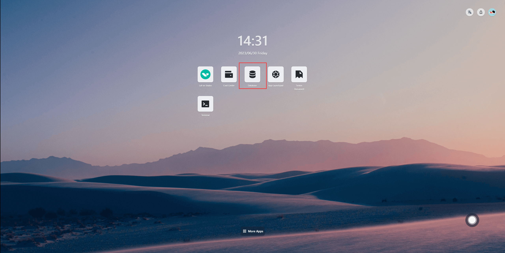
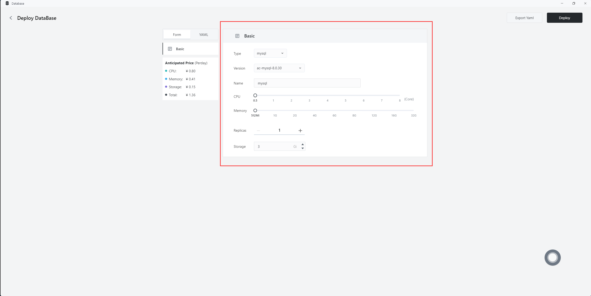
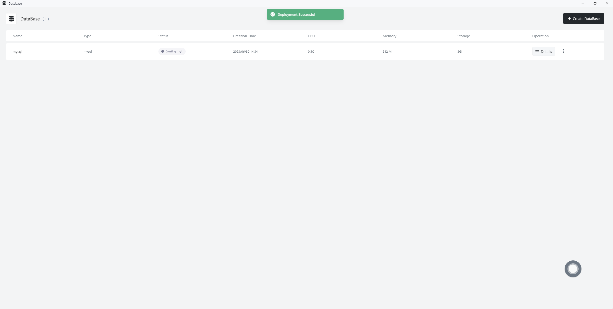
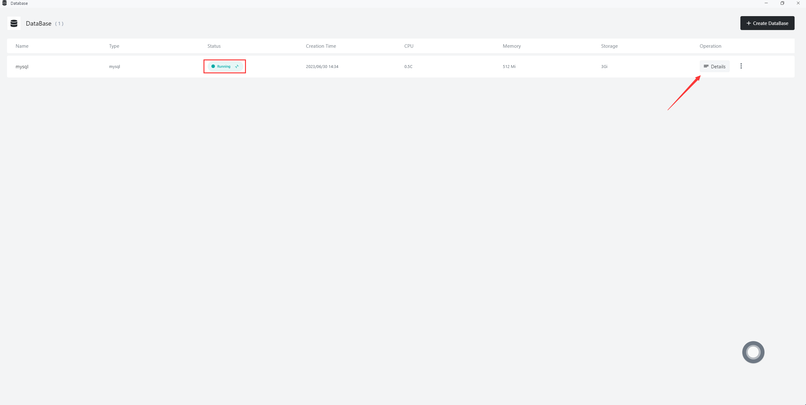
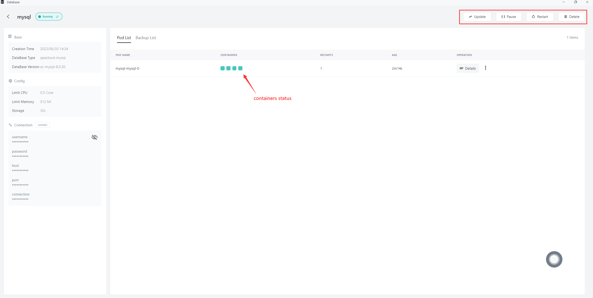
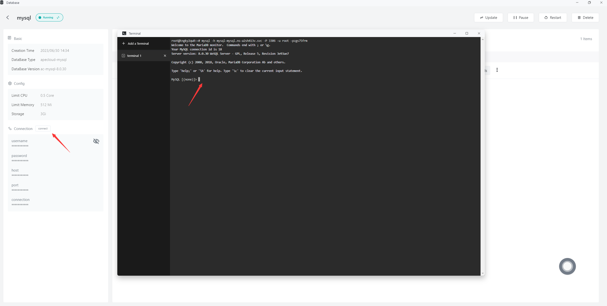

# Swiftly Install MySQL/PostgreSQL/MongoDB with Database

Databases are important means of data management and can be used to efficiently store and access data. MySQL, PostgreSQL, and MongoDB are all important database management systems.

* MySQL is an open-source relational database management system with high performance, reliability, and scalability. It also supports standardized SQL language and extended SQL syntax

* PostgreSQL is also an open-source relational database management system that supports transaction, concurrency control, and multi-version control. These features make PostgreSQL a reliable, efficient, and secure database solution

* MongoDB is a document-oriented NoSQL database management system that supports flexible data modeling, fast read and write speeds, and easy horizontal scaling for better performance and availability, as per the requirements

> Sealos has good support for quick installation and configuration of databases. The following example will demonstrate how to use Sealos to quickly install MySQL.

# Quick Install of MySQL

1. Open Database

2. Click on 'Create New Database' to complete the basic configuration setup

3. Click on 'Deploy Cluster' and wait for the cluster to be created successfully

4. After the cluster is successfully created, click on 'Details' to view more details

5. Click on 'One-Click Connection' to start using it in the Terminal

# Quick Install of PostgreSQL and MongoDB

Installing PostgreSQL and MongoDB databases is similar to MySQL. You need to select the type of database in the basic configuration interface

