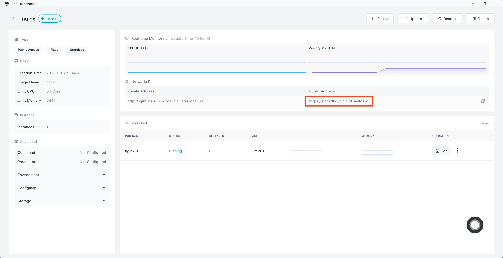

# Use App Launchpad

Sealos desktop is similar to that of PC operating systems, such as macOS or Windows. Each icon on the desktop represents an app, similar to the shortcuts in Windows. Like PC operating systems, Sealos also comes with built-in apps. To quickly install applications on this cloud operating system, you need to use the system's built-in **App Launchpad**.

> For more information about application management, please refer to [Introduction to App Launchpad](/guides/applaunchpad/applaunchpad.md)

This guide will show you how to quickly install some common applications on the Sealos cloud operating system.

## Deploy nginx

First, open App Launchpad in the [Sealos](https://cloud.sealos.io) desktop.

Click on "New Application".

Enter the application name and image name in sequence, enable external network access, and then click "Deploy Application" to proceed.

Once the deployment is finished, click "Details" to enter the application's detailed view.

you can view the operational metrics of the Nginx application, including CPU and memory usage. Click on the external link to open the Nginx interface directly via the external domain name.

