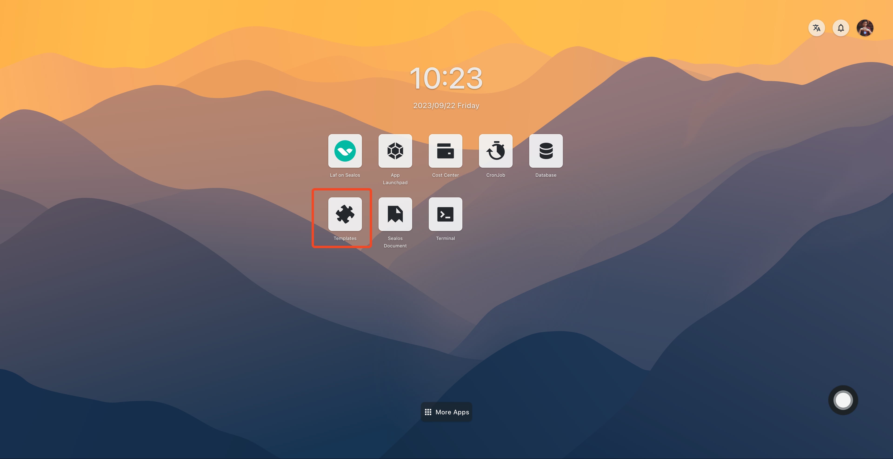
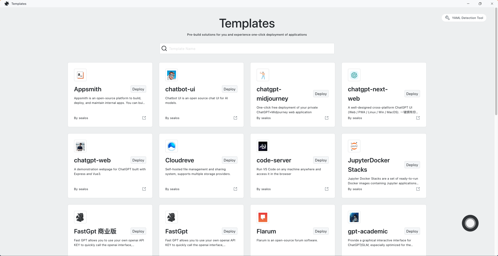
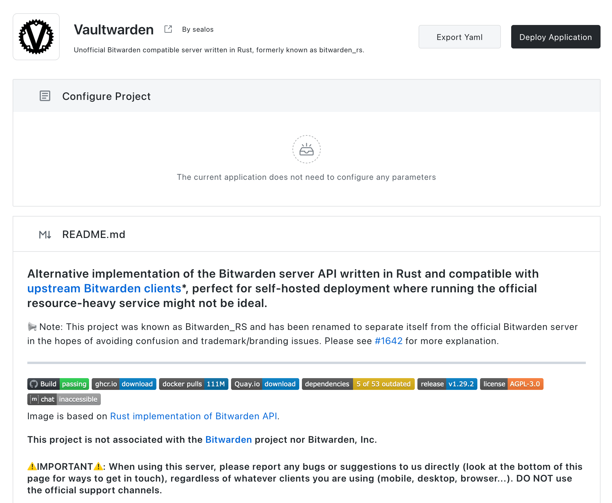
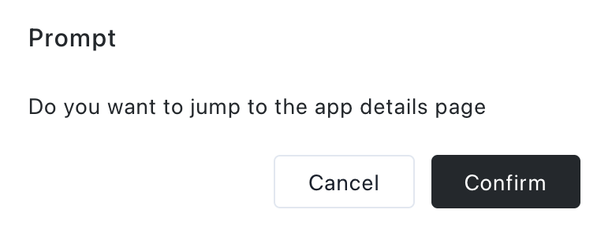
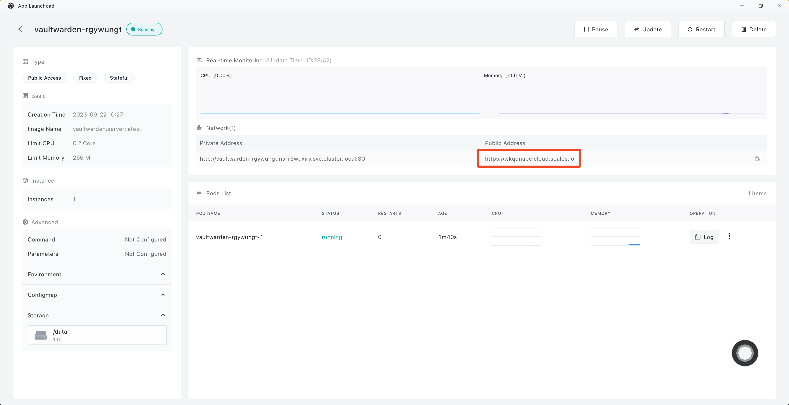

# Use Template

This guide will show you how to use templates to fast-track applications deployment. and maximize Sealos's features.

## 1. Find a template

Start by accessing the "**Templates**" in the Sealos desktop.

select the template you’d like to deploy

Not sure which one to use? How about [exploring FastGPT](/examples/ai-applications/install-fastgpt-on-desktop.md)

## 2. Deploy the template to Sealos

Once you've selected a template, configure the necessary parameters, then click **Deploy Application** on the template page to start deployment.

Once deployment concludes, click "Confirm" to navigate to the application's details.

Wait for the application's status to switch to running. Subsequently, click on the external link to launch the application's Web interface directly through the external domain name.

