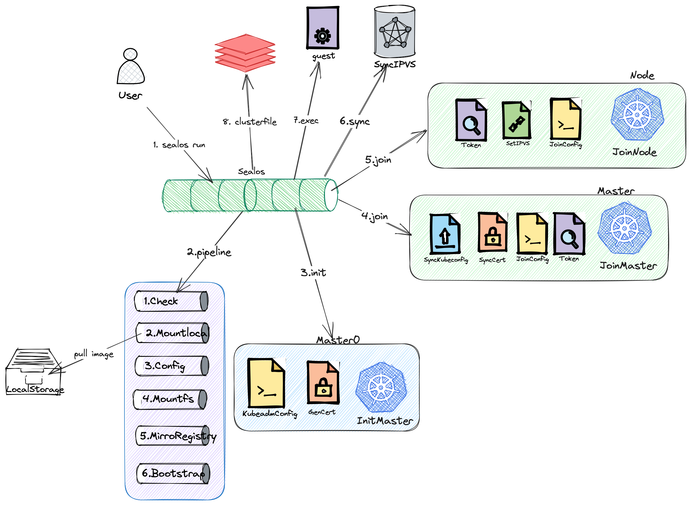

# How Sealos Run Works

Below is a detailed explanation of how the `sealos run` command works. To aid understanding, we break it down into nine main steps.

## 1. Execution of Command

Firstly, users launch Sealos by executing the following command:

```bash
sealos run kubernetes:v1.23.8
```

## 2. Execution of Pipeline

After the command is executed, Sealos starts to execute a series of related operational steps, which we call the "Pipeline". This process includes the following substeps:

### 2.1 Node Check

Sealos will check all nodes to ensure they are available. For example, checking for duplicate hostnames, and whether the time of all nodes has been synchronized.

### 2.2 Pulling Images

Next, Sealos pulls the Kubernetes images from the remote repository and loads them into local storage.

### 2.3 Configuration Rendering

Then, Sealos renders the configuration of the pulled image's rootfs (file system) to prepare for the subsequent node distribution.

### 2.4 Distribution of Image Files

Once the configuration rendering is complete, Sealos distributes the rendered rootfs files to each node.

### 2.5 Distribution of Registry Directory

In addition, Sealos also distributes the registry directory in the image to the corresponding registry role nodes. Sealos supports two modes:

- **scp mode**: Directly copy the directory to each node via scp, which consumes a lot of network bandwidth.
- **Image synchronization mode**: Using the skopeo sdk's image synchronization mechanism, incremental image synchronization can be achieved to save network bandwidth. This feature can be enabled with the environment variable `SEALOS_REGISTRY_SYNC_EXPERIMENTAL=true`.

### 2.6 Execution of Bootstrap

Bootstrap is a crucial step, including the following operations:

#### 2.6.1 Addition of Host Resolution

Sealos adds host resolution for the registry on each node.

#### 2.6.2 Execution of Registry-Init Script

After adding host resolution, Sealos executes the registry-init script.

#### 2.6.3 Execution of Init Script

Finally, Sealos executes the init script to start the Kubernetes service.

## 3. Execution of InitMaster0

After the Pipeline execution, Sealos enters the InitMaster0 phase. In this phase, Sealos performs the following operations:

### 3.1 Generation of Kubeadm Configuration

Firstly, Sealos generates the initialization configuration file for Kubeadm.

### 3.2 Generation and Distribution of Certificate Files

Then, Sealos generates all certificate files for the cluster and distributes them to each node.

### 3.3 Initialization of Master0

Finally, Sealos executes `kubeadm init` to initialize the Master0 node.

## 4. Execution of JoinMaster

After the initialization of the Master0 node, Sealos enters the JoinMaster phase. In this phase, Sealos performs the following operations:

### 4.1 Synchronization of Kubeconfig

Firstly, Sealos synchronizes the Kubeconfig file to each node.

### 4.2 Synchronization of Certificate Files

Next, Sealos synchronizes certificate files to each node.

### 4.3 Generation of Join Configuration

Then, Sealos generates the JoinMaster configuration file.

### 4.4 Generation of Join Token

Next, Sealos generates the Join token.

### 4.5 Execution of Join Master Process

Finally, Sealos executes the `kubeadm join` process to add other Master nodes to the cluster.

## 5. Execution of JoinNode

After all Master nodes have joined the cluster, Sealos enters

the JoinNode phase and performs the following operations:

### 5.1 Generation of Join Token

Firstly, Sealos generates the Join token again.

### 5.2 Generation of IPVS Rules

Then, Sealos generates IPVS rules.

### 5.3 Generation of Join Configuration

Next, Sealos generates the JoinNode configuration again.

### 5.4 Execution of Join Node Process

Finally, Sealos executes the Join Node process to add Worker nodes to the cluster.

## 6. Synchronization of IPVS

After all nodes have joined the cluster, Sealos synchronizes the IPVS rules of the Master to all nodes. This is mainly done through the lvscare static pod, which synchronizes the static pod configuration based on the number of Master nodes.

## 7. Execution of Guest Phase

After the IPVS rules are synchronized, Sealos executes the Guest phase. This is the stage to execute the cluster image command.

## 8. Writing to the Clusterfile

Finally, Sealos writes the final execution result to the Clusterfile.

This is how the `sealos run` command works. Through this article, we hope that you have a deeper understanding of the `sealos run` command. Below is the panorama we mentioned to help you better understand the entire process.


