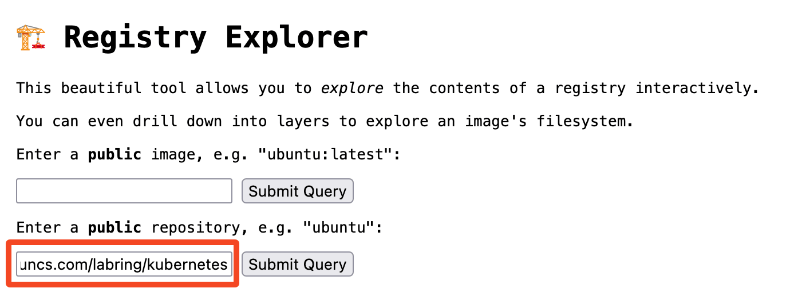

# Install Kubernetes

Sealos supports installing Kubernetes clusters on `amd64` and `arm64` architecture machines.

## Prerequisites

You'll first need to [download the Sealos CLI tool](/self-hosting/lifecycle-management/quick-start/install-cli.md). Sealos is a simple Golang binary that can be installed on most Linux operating systems.

Here are some basic installation requirements:

- Each cluster node should have a unique hostname without underscores.
- System times must be synchronized across all nodes.
- The `sealos run` command must be run on the **first master node** of the Kubernetes cluster. **Installation on nodes outside the cluster is not currently supported**.
- It is recommended to use a clean OS to create the cluster. **Do not install Docker manually!**
- Supports most Linux distributions like Ubuntu, CentOS, Rocky Linux.
- Compatible with all Kubernetes versions available on [Docker Hub](https://hub.docker.com/r/labring/kubernetes/tags).
- Supports Containerd as the container runtime.
- When installing on public clouds, use **private IP** addresses.

## View Available Cluster Images   

All Sealos cluster images are hosted in the [cluster-image-docs](https://github.com/labring-actions/cluster-image-docs) repository.   

You can browse all Sealos images on Docker Hub here: [https://hub.docker.com/u/labring](https://hub.docker.com/u/labring).  

Use [Registry Explorer](https://explore.ggcr.dev/) to view all versions of the Kubernetes cluster images by entering `labring/kubernetes` and clicking "Submit Query":  



This will display all available tags for that image.

:::info Note  

Kubernetes cluster stability improves with higher minor version numbers. For example in v1.28.x, x is the minor version. It is recommended to use versions with relatively high minor numbers. Currently, the highest v1.27 version is v1.27.7, while the highest v1.28 version is v1.28.3, so **v1.27.7 is recommended**. Choose the optimal Kubernetes version based on your needs.

:::

## Install Single-Node Kubernetes   

```shell
# sealos version must >= v4.1.0
$ sealos run labring/kubernetes:v1.27.7 labring/helm:v3.9.4 labring/cilium:v1.13.4 --single  
```

## Install Kubernetes Cluster  

```shell  
$ sealos run labring/kubernetes:v1.27.7 labring/helm:v3.9.4 labring/cilium:v1.13.4 \  
--masters 192.168.64.2,192.168.64.22,192.168.64.20 \
--nodes 192.168.64.21,192.168.64.19 -p [your-ssh-passwd]
```

Note: labring/helm must come before labring/cilium.   

Parameter descriptions:   

| Parameter | Example | Description |    
| --- | --- | --- |    
| --masters | 192.168.0.2 | List of master node IP addresses |   
| --nodes | 192.168.0.3 | List of worker node IP addresses |  
| --ssh-passwd | [your-ssh-passwd] | SSH password |  
| kubernetes | labring/kubernetes:v1.25.0 | Kubernetes cluster image |   

Running the above commands directly on clean servers will install a highly available Kubernetes cluster without any extra steps.  

## Install Various Distributed Apps

```shell  
sealos run labring/helm:v3.9.4 # Install Helm   

sealos run labring/openebs:v3.9.0 # Install OpenEBS   

sealos run labring/minio-operator:v4.5.5 labring/ingress-nginx:4.1.0
```  

This provides highly available apps like Minio without worrying about dependencies.

## Add Kubernetes Nodes   

Add worker nodes:  

```shell  
$ sealos add --nodes 192.168.64.21,192.168.64.19  
```  

Add master nodes:   

```shell   
$ sealos add --masters 192.168.64.21,192.168.64.19  
```  

## Delete Kubernetes Nodes  

Delete worker nodes:   

```shell
$ sealos delete --nodes 192.168.64.21,192.168.64.19  
```  

Delete master nodes:  

```shell  
$ sealos delete --masters 192.168.64.21,192.168.64.19   
```  

## Clean Up Kubernetes Cluster  

```shell  
$ sealos reset  
```  

## Offline Installation   

For offline environments, first import the images - subsequent steps are identical to online installation.  

First, export images from an online environment:    

```shell   
$ sealos pull registry.cn-shanghai.aliyuncs.com/labring/kubernetes:v1.27.7    

$ sealos save -o kubernetes.tar registry.cn-shanghai.aliyuncs.com/labring/kubernetes:v1.27.7  
```  

### Import and Install  

Copy kubernetes.tar to the offline environment and import it with:     

```shell  
$ sealos load -i kubernetes.tar  
```  

The rest of the installation process is identical to online installation:   

```shell   
$ sealos images # Verify import succeeded   

$ sealos run registry.cn-shanghai.aliyuncs.com/labring/kubernetes:v1.27.7 # Single node  
```  

### Quick Cluster Install  

You can also install Kubernetes by directly running:   

```shell  
$ sealos run kubernetes.tar   
```

## Cluster Image Version Compatibility

### Kubernetes Compatibility with Containerd

It's advised to use Containerd as the container runtime interface (CRI) in Kubernetes clusters. Containerd stands out for its lightweight structure and high efficiency, and it's fully compatible with Docker. Kubernetes images that utilize Containerd benefit from enhanced performance and optimized resource usage. Here are the specific supported versions:

| Kubernetes Version | Required Sealos Version | CRI Version | Cluster Image Version      |
| ------------------ | ----------------------- | ----------- |----------------------------|
| `<1.25`            | `>=v4.0.0`              | v1alpha2    | labring/kubernetes:v1.24.0 |
| `>=1.25`           | `>=v4.1.0`              | v1alpha2    | labring/kubernetes:v1.25.0 |
| `>=1.26`           | `>=v4.1.4-rc3`          | v1          | labring/kubernetes:v1.26.0 |
| `>=1.27`           | `>=v4.2.0-alpha3`       | v1          | labring/kubernetes:v1.27.0 |
| `>=1.28`           | `>=v5.0.0`              | v1          | labring/kubernetes:v1.28.0 |

The choice of Sealos and CRI versions is dependent on the Kubernetes version in question. For instance, Kubernetes v1.26.0 would require Sealos v4.1.4-rc3 or newer, along with the v1 CRI version.

### Kubernetes Compatibility with Docker

Alternatively, Docker can also be used as the container runtime. The following table provides a breakdown of compatible Kubernetes versions with their corresponding Sealos and CRI versions for Docker-based setups:

| Kubernetes Version | Required Sealos Version | CRI Version | Cluster Image Version             |
|--------------------|-------------------------| ----------- |-----------------------------------|
| `<1.25`            | `>=v4.0.0`              | v1alpha2    | labring/kubernetes-docker:v1.24.0 |
| `>=1.25`           | `>=v4.1.0`              | v1alpha2    | labring/kubernetes-docker:v1.25.0 |
| `>=1.26`           | `>=v4.1.4-rc3`          | v1          | labring/kubernetes-docker:v1.26.0 |
| `>=1.27`           | `>=v4.2.0-alpha3`       | v1          | labring/kubernetes-docker:v1.27.0 |
| `>=1.28`           | `>=v5.0.0`              | v1          | labring/kubernetes-docker:v1.28.0 |

As with the Containerd setup, the appropriate Sealos and CRI versions must be matched with the specific version of Kubernetes being used. For a Kubernetes v1.26.0 setup, this means selecting Sealos v4.1.4-rc3 or later, and a v1 CRI version.

### k3s Compatibility with Containerd

| k3s Version | Required Sealos Version | Cluster Image Version |
|-------------|-------------------------|-----------------------|
| `>=1.24`    | `>=v5.0.0`              | labring/k3s:v1.24.0   |

## Summary

You can choose from a variety of image types and versions to suit your individual needs and preferences. Don't forget to consult the [CHANGELOG](https://github.com/labring/sealos/blob/main/CHANGELOG/CHANGELOG.md) to stay informed about the latest updates and bug fixes for each version.
