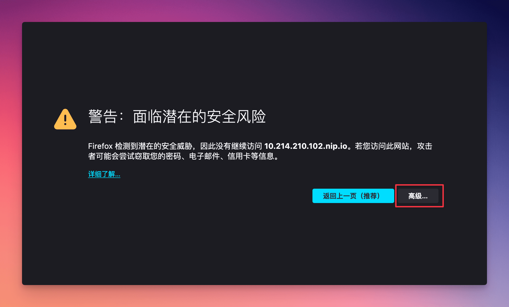

import Tabs from '@theme/Tabs';
import TabItem from '@theme/TabItem';

# Install Sealos Cluster

export const Highlight = ({children, color}) => (
  <span
    style={{
      backgroundColor: color,
      borderRadius: '2px',
      color: '#fff',
      padding: '0.2rem',
    }}>
    {children}
  </span>
);

:::tip

In the context of large-scale clusters and corporate production environments, [<Highlight color="#1877F2">the enterprise or bespoke editions of the Sealos private cloud</Highlight>](/self-hosting) come highly recommended.

:::

## Before You Begin

### Hardware

- Unique hostnames for each cluster node.
- Time synchronization across all nodes.
- Preferably use a fresh operating system for setting up the cluster. **Refrain from installing Docker yourself!**
- Compatible with numerous Linux versions like Ubuntu, Debian, CentOS, Rocky Linux.
- **Ensure a system kernel version of 5.4 or higher**.

Recommended System Configuration:

We advise using Ubuntu 22.04 LTS with a kernel version of 5.4 or higher. The specifications are as follows:

| Operating System | Kernel Version | CPU | Memory | Storage | Masters    | Nodes |
|------------------|----------------|-----|--------|---------|------------|-------|
| Ubuntu 22.04 LTS | ≥ 5.4          | 8C  | 16GB   | 100GB   | Odd Number | Any   |

:::info 
Kubernetes and Sealos Cloud Operating system require roughly 2 cores (2c) and 2GB of memory (2g) per Master node, and about 1 core (1c) and 1GB of memory (1g) per Node node. Ensure each node in your cluster is well-equipped for these system components. 
:::

### Network Considerations

- All nodes must be interconnected;
- Installation scripts should be run on the **first Master node** of the Kubernetes cluster; **nodes outside the cluster aren't set up for installations yet**;
- Make sure all nodes are capable of mutual communication.

### Domain Name Usage

- A domain name is necessary for accessing Sealos and its services;
- If you lack a domain name, `nip.io` offers a free domain name service.

### Certificate Requirements

Sealos uses certificates for secure communication. Without your certificates, [cert-manager](https://cert-manager.io/docs/) will be employed for auto-certification.

If you are providing your certificate, it should support the following domains (assuming your domain is cloud.example.io):

- `*.cloud.example.io`
- `cloud.example.io`

## Installation Steps

We offer a one-click installation script to streamline the deployment process. This script is capable of setting up a Sealos cluster from scratch or integrating it into an existing Kubernetes cluster (use with caution on pre-existing clusters).

:::info
This script is specifically designed for deploying Sealos clusters on "Kubernetes clusters installed via Sealos," and is not compatible with Kubernetes clusters set up in other ways.

For instructions on deploying Kubernetes clusters using Sealos, refer to: [Installing Kubernetes Clusters](/self-hosting/lifecycle-management/quick-start/deploy-kubernetes.md). This method is compatible with most Kubernetes versions available on [Docker Hub](https://hub.docker.com/r/labring/kubernetes/tags), except for version 1.28 and higher.
:::

If your system is new to Kubernetes, **we advise using this script to install both Kubernetes and the Sealos cluster simultaneously.**

There are different installation options based on your domain name needs:

### 1. No public domain, don't want custom domains

If you don't have a public domain or need custom domains, you can use the free `nip.io` wildcard DNS service. `nip.io` maps dynamic IP addresses to fixed subdomains, useful for local dev environments.  

It works by taking any IP address as part of a `nip.io` subdomain, and resolving requests back to that IP. For example, if your intranet IP is `192.168.1.10`, you can use the domain `192.168.1.10.nip.io`. Requests to this domain will resolve to `192.168.1.10`, eliminating the need to modify local hosts or set up intranet DNS.   

To use nip.io for Sealos, run the below on the first master node and enter prompts: 

```bash
$ curl -sfL https://raw.githubusercontent.com/labring/sealos/v5.0.0-beta5/scripts/cloud/install.sh -o /tmp/install.sh && bash /tmp/install.sh
```

When prompted for the Sealos Cloud domain name, use a format like `[ip].nip.io`, where [ip] is your Master node's IP.

After installation, the terminal will display the Sealos access domain and login credentials, as shown below:

```shell
Sealos cloud login info:
Cloud Version: latest
URL: https://10.214.210.102.nip.io
admin Username: admin
admin Password: sealos2023
```

### 2. Have public domain, want public access  

If you have a public domain and want public Sealos access, you'll need a trusted public SSL/TLS certificate. You can use acme.sh to automatically issue certs, or get free certs from your domain provider or purchase commercial certificates.

Place the certificate files in a directory on the first master, like `/root/certs/`.   

:::info

You'll also need to configure DNS records at your domain provider:  

```  
cloud.example.io A <Master Node Public IP>  
*.cloud.example.io A <Master Node Public IP>
```  

This maps your domain and subdomains to the first master's public IP.   

:::  

Then run below on the first master, entering prompts:  

```bash
$ curl -sfL https://raw.githubusercontent.com/labring/sealos/v5.0.0-beta5/scripts/cloud/install.sh -o /tmp/install.sh && bash /tmp/install.sh \  
--cloud-domain=<your_domain> \   
--cert-path=<your_crt> \  
--key-path=<your_key>
```  

+ `<your_domain>` is your public domain  
+ `<your_crt>` is the certificate file path (`.crt` or `.pem`) e.g. `/root/certs/example.crt`
+ `<your_key>` is the private key file path (`.key` or `.pem`) e.g. `/root/certs/example.key`

### 3. Have public domain, want internal access   

If you have a public domain but only internal IPs, or only want internal Sealos access, you just need to configure DNS records resolving to the first master's internal IP:  

```  
cloud.example.io A <Master Node Internal IP>  
*.cloud.example.io A <Master Node Internal IP>   
```  

Then run the below on the first master, entering prompts:  

```bash  
$ curl -sfL https://raw.githubusercontent.com/labring/sealos/v5.0.0-beta5/scripts/cloud/install.sh -o /tmp/install.sh && bash /tmp/install.sh \ 
--cloud-domain=<your_domain>  
```   

Where `<your_domain>` is your public domain.  

The installer will use [cert-manager](https://cert-manager.io/docs/) to automatically sign certificates.

### 4. No public domain, want custom domain   

If you don't have a public domain but need a custom domain, set up internal DNS resolving a custom domain to the first master's internal IP.   

:::note

Assuming the first master internal IP is `192.168.1.10`, and your custom domain is `cloud.example.io`.  

:::  

You can use CoreDNS, Reference configuration:

```  
(global_cache) {
  cache {
    # [5, 60]
    success 65536 3600 300
    # [1, 10]
    denial 8192 600 60 
    prefetch 1 60m 10%
  }  
}  

.:53 {
  errors
  health    
  ready  

  import global_cache
  
  template IN A cloud.example.io {
    answer "{{ .Name }} 60 IN A 192.168.1.10"
    fallthrough  
  }
   
  forward . 223.5.5.5
   
  log
  loop
   
  reload 6s
}
```  

This resolves `cloud.example.io` and subdomains to the first master internal IP.    

Then run below on the first master, entering prompts:  

```bash 
$ curl -sfL https://raw.githubusercontent.com/labring/sealos/v5.0.0-beta5/scripts/cloud/install.sh -o /tmp/install.sh && bash /tmp/install.sh \   
--cloud-domain=<your_domain>  
```  

Where `<your_domain>` is your custom domain.     

The installer uses [cert-manager](https://cert-manager.io/docs/) for certificates.

## Ensuring Browsers Trust Your Self-Signed Certificate

When using installation options 1, 3, or 4, as highlighted earlier, your browser won't automatically recognize and trust your certificate. This leads to a warning message when you try to enter Sealos Cloud:


Continuing to Sealos Cloud despite the warning results in issues like the App icons not appearing correctly, and Apps failing to launch.


To address this, you'll need to export the self-signed certificate and set up your system to trust it. Follow these steps to do so.

### Exporting Self-Signed Certificates

The process of exporting self-signed certificates differs slightly in various browsers. Here's a guide for exporting these certificates in some of the most commonly used browsers:

#### Chrome (includes browsers based on Chromium, like the updated Edge and Brave)

1. In the address bar, click the "Not Secure" warning on the left side.
2. Select "Certificate is invalid" to bring up a window with certificate information.
3. In this window, go to the "Details" tab.
4. Within "Details", find and click on the "Export" option.
5. Choose a file name and location for saving, then complete the exporting procedure.

#### Firefox

1. On the webpage, click on "Advanced".

   

2. Next, click "View Certificate".

   

3. On the certificate page, select "PEM (certificate)".

   

#### Safari

1. Select "Show Details" on the page.

   

2. Click on "View this Certificate".

   

3. You'll see a window displaying the certificate chain.

   

4. To export the certificate, drag the one highlighted in red to either your desktop or a specific folder.


### Trusting Self-Signed Certificates

#### macOS

To trust a self-signed certificate on macOS, use the following command:

```bash
# Assuming the certificate is stored at ~/Downloads/10.214.210.102.nip.io.cer
$ sudo security add-trusted-cert -d -r trustRoot -k /Library/Keychains/System.keychain ~/Downloads/10.214.210.102.nip.io.cer
```

You can also trust the certificate through these steps:

##### 1. Adding the Certificate to Keychain

1. Open **Keychain Access**, click on the "System" category under "System Keychains."
2. Navigate to the certificate's location in "Finder" and **double-click the certificate file** (usually `.cer`, `.crt`, or `.pem`).
3. Authenticate with your username and password to allow changes.
4. The certificate is now added to your keychain.

##### 2. Trusting the Certificate

1. In Keychain Access, locate and double-click the newly added self-signed certificate in the "System" category.
2. In the certificate window, expand the "Trust" section.
3. Change the setting next to "When using this certificate" from "Use System Defaults" to "Always Trust."
4. Close the window and authenticate if prompted to confirm the changes.
5. The certificate is now trusted.

:::info Note

Self-signed certificates, not issued by a third-party Certificate Authority (CA), won't be trusted by other devices. Manually perform these steps on each device within your company or organization that needs to trust the certificate.

:::

#### Windows

1. Right-click the root certificate file and select "Install Certificate."
2. Choose "Current User" or "Local Machine," then "Next."
3. Select "Place all certificates in the following store," click "Browse," choose "Trusted Root Certification Authorities," "OK," then "Next."
4. Click "Finish," "Yes," then "OK."


#### Linux

Linux distributions vary in updating the root certificate store and paths for private certificates. First, copy the self-signed CA certificate to the designated path, then run the command to update the root certificate store.

<Tabs>
  <TabItem value="Debian/Ubuntu/Gentoo">

  ```bash
  # Debian/Ubuntu/Gentoo
  $ sudo cp root_ca.crt /usr/local/share/ca-certificates/root_ca.crt
  $ sudo update-ca-certificates
  $ sudo rm /usr/local/share/ca-certificates/root_ca.crt
  $ sudo update-ca-certificates --fresh
  ```

  </TabItem>
  <TabItem value="CentOS/Fedora/RHEL">

  ```bash
  # CentOS/Fedora/RHEL
  $ yum install ca-certificates
  $ update-ca-trust force-enable
  $ cp root_ca.crt /etc/pki/ca-trust/source/anchors/
  $ update-ca-trust
  ```

  </TabItem>
  <TabItem value="Alpine">

  ```bash
  # Alpine
  $ apk update && apk add --no-cache ca-certificates
  $ cp root_ca.crt /usr/local/share/ca-certificates/
  $ update-ca-certificates
  ```

  </TabItem>
  <TabItem value="OpenSUSE/SLES">

  ```bash
  # OpenSUSE/SLES
  $ cp root_ca.crt /etc/pki/trust/anchors/
  $ update-ca-certificates
  ```

  </TabItem>
</Tabs>
