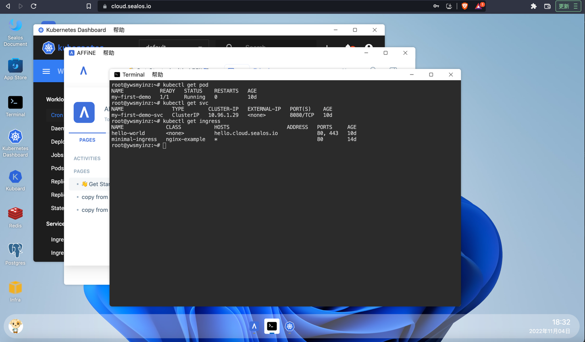

# 什么是 sealos

sealos 是一个以 kubernetes 为内核的云操作系统发行版。
sealos 希望做一个通用的云操作系统，让用户不管是私有云还是公有云都可以非常低门槛的用云。
sealos 可以把云的维护成本和使用门槛降的足够低。
sealos 目标是让企业完完全全拥有属于自己控制的 AWS 这样的公有云能力，可以运行在企业自己机房中，也可以运行在别的公有云基础设施之上。

sealos 相当于利用云原生的能力与架构完全实现一个 AWS 的替代品，不过在产品形态上会有所差异。 
如 AWS 上有数据库服务用户可以启动数据库服务。 在 sealos 中，一切皆应用，用户只需要安装一个数据库的应用即可使用数据库，像 PC 上安装一个软件一样简单。

sealos 是一个多租户云操作系统，可以完全满足大规模用户同时使用与协作，且能提供非常好的隔离性。

# 优势

> 简单

单机操作系统的安装和使用是比较简单的，绝大多数企业在 linux 发行版上每年付出的成本是很少的，基本安装上就可以使用，使用过程中也不太会出现太多问题。
对比云发现并没有达到这样的理想情况，企业不管是在使用公有云还是自建私有云上每年都会花费非常大的成本，其原因是好用的云操作系统发行版没有普及。

sealos 可以通过简单的命令运行起一个自定义的云操作系统，然后像使用 PC 上的软件一样用云，相当于把 PC 上的单机应用全部替换成了各种分布式应用。
通过 sealos 用户可以非常方便的运行开发者需要的各种分布式应用，如数据库，消息队列，AI 能力等。

> 开放，厂商兼容

sealos 完全开源，可以在物理机虚拟机以及各大公有云厂商上运行。企业完全不用担心强绑定问题，可以在各种环境中自由切换。

# 功能特性

## kubernetes 生命周期管理

sealos 的 boot 模块可以帮助用户非常好的管理整个集群的生命周期。

可以用 sealos 安装一个不包含任何组件的裸 kubernetes 集群。
也可以用 sealos 在 kubernetes 之上通过集群镜像能力组装各种上层分布式应用，如数据库消息队列等。

可以用 sealos 安装一个单节点的 kubernetes 开发环境。
也可以用 sealos 构建数千节点的生产高可用集群。

可以用 sealos 自由伸缩集群，备份恢复，释放集群等。
也可以即便在离线环境中也可以非常好的使用 sealos 来运行 kubernetes.


- [x] 支持 ARM，v1.20 以上版本离线包支持 containerd 与 docker 集成
- [x] 99年证书, 支持集群备份，升级
- [x] 不依赖 ansible haproxy keepalived, 一个二进制工具，0依赖
- [x] 离线安装，不同 kubernetes 版本使用不同的集群镜像即可
- [x] 高可用通过 ipvs 实现的 localLB，占用资源少，稳定可靠，类似 kube-proxy 的实现
- [x] 几乎可兼容所有支持 systemd 的 x86_64 架构的环境
- [x] 轻松实现集群节点的增加/删除
- [x] 数万用户在线上环境使用 sealos，稳定可靠
- [x] 支持集群镜像，自由组合定制你需要的集群，如 openebs 存储+数据库+minio 对象存储

## 运行 kubernetes 上的各种分布式应用

可以通过 `sealos run` 命令来运行 kubernetes 之上的各种分布式应用，像数据库，消息队列，AI 能力甚至企业级 SaaS 软件。

如：

```shell
# MySQL cluster
$ sealos run labring/mysql-operator:8.0.23-14.1

# Clickhouse cluster
$ sealos run labring/clickhouse:0.18.4

# Redis cluster
$ sealos run labring/redis-operator:3.1.4
```

## 自定义集群

对于 sealos 生态没有的集群镜像，用户可以使用非常方便的方式来自己构建和定制属于自己的集群镜像。

如：

[构建一个 ingress 集群镜像](https://www.sealos.io/docs/getting-started/build-example-cloudimage)

也可以定制一个完全属于自己的 kubernetes:

Sealfile:
```shell
FROM kubernetes:v1.25.0
COPY flannel-chart .
COPY mysql-chart .
CMD ["helm install flannel flannel-chart", "helm install mysql mysql-chart"]
```

```shell
sealos build -t my-kuberentes:v1.25.0 .
sealos run my-kuberentes:v1.25.0 ...
```

## sealos cloud

拥有了 sealos cloud 用户就拥有了一个完全属于自己的公有云能力，只是这个公有云有点特殊：

1. sealos cloud 非常简单，一键就可以运行
2. sealos cloud 非常强大，公有云有的很多能力 sealos cloud 也有，如 数据库 消息队列服务，不过 sealos cloud 完全使用云原生架构实现。
3. sealos cloud 可以跑在各大公有云平台上，也可以运行在用户自己机房中，公有云与私有云拥有完全一致的体验
4. sealos cloud 支持多租户，数万人的大企业所有的开发者都可以同时使用一个 sealos cloud 相互之间不会有影响。



各种分布式软件可以像使用 PC 软件一样简单！即便 kubernetes 单词都不会拼写的同学也可以拥有非常好的使用体验。

# 使用场景

> 企业使用公有云

公有云客户可以直接使用 [sealos 公有云](https://cloud.sealos.io)
* sealos 公有云支持打开浏览器直接使用，创建用户专属数据库与其他服务，直接把业务跑在 sealos cloud 上，无需用户创建 kubernetes 集群
* sealos 支持用户在公有云上创建一个完全用户专属的 sealos cloud，完全与其他用户隔离。
* sealos 公有云支持适配各大云厂商，自由选择，对公有云无感知。
* sealos cloud 拥有极致的产品体验！

> 企业私有云

* sealos cloud 支持部署到用户自己的机房中，形态与公有云版本完全一致，使用方式也完全一致，支持国产化，支持离线部署。
* 可以对能力进行自由裁剪，来满足企业各种不同的需求
* 私有云也是多租户设计，满足整个企业内部对云的诉求，包括计量等

> 应用交付

* sealos 真正可以做到在集群纬度保证一致性，构建集群镜像测试没问题到客户环境中运行就没问题
* sealos 完全支持一键交付，无需任何面向过程的操作，交付文档可精简到一条命令
* sealos 可以把应用和集群打包成为一个整体，包含所有依赖，即便离线环境中也能做到分钟级交付

> 各种云原生实践

* 学习 kubernetes 需要有实践环境...
* 需要构建云原生开发环境...
* 需要安装部署 kubernetes...
* 需要高可用的线上环境...
* 需要在 kubernetes 之上部署和运行各种分布式应用...

# FAQ

> sealos 是 kubernetes 安装工具吗？

安装部署是 sealos 一个最基本的小功能，就像单机操作系统也有 boot 模块一样，sealos 的 boot 模块可以很好的管理整个 kubernetes 在
任何场景下生命周期管理问题。

> 云操作系统和云平台有什么区别和联系？

云平台通常是一个具体东西，或者是一个正在运行的东西，而云操作系统是一系列抽象和具体的技术展的集合，可以通过云操作系统来构建一个
属于你自己的云平台，如果云平台是实例，那云操作系统就是类，或者可以说一个运行着的云操作系统就是一个云平台。

云操作系统比较抽象，最重要的能力是向下抽象资源，向上应用管理，而具体的能力都是通过云操作系统之上的应用来提供的，如分布式的数据库消息等

> 不是很懂 kubernetes 是否能很友好的使用 sealos？

可以的，就像是不懂 linux kernel 也能很容易的使用 ubuntu 一样，关键看使用者是什么样的角色，比如一个 DBA 只需要在 sealos 上
安装一个数据库应用即可来做数据库管理 SQL 调优等，而无需关心 kubernetes 的存在。

> sealos 和 rancher kubesphere 有什么区别？

定位不同，sealos 的设计理念是 "化整为零，自由组装，大道至简"，利用 kubernetes 的能力使用非常简单的方式提供给用户真正想要的东西。
也就是说用户想要的不一定是 kubernetes，大众用户需要的是一个具体的能力，而且可能都不一样。

操作系统的特点是用户需要什么它就是什么，极其灵活，不会给用户带来额外负担。

如 windows 对于一个游戏玩家来说就是个游戏机, 对于程序员来说就是用来写代码的工具，对于美工来说就是用来修图的。 操作系统的形态取决于使用者是谁，装了什么应用。

那 sealos 云操作系统也一样，sealos 本身通过 sealos core, sealos hub, sealos desktop 把分布式应用管理好即可， 剩下一切能力让应用层去扩展。

分布式应用是 sealos 上的一等公民，一切皆应用。

> sealos cloud 是给 kubernetes 做了个 UI?

GUI 是冰山上面的东西，对应的需要底层提供很多能力，比如 sealos 就写了很多的控制器来管理用户，集群镜像，应用，计量等。
同样 UserInterface API > CLI > GUI, sealos 的 API 就是 kubernetes 的 apiserver, 完全与 kubernetes 兼容。

> sealos appstore 与其它产品的 store 有什么区别和优势？

* sealos 中应用是一等公民，重视程度不一样，在使用 sealos 时更关注的是应用本身.
* 所有的应用都使用了 "集群镜像" 的封装技术，像 docker 一样管理分布式应用，本质上 sealos 的 appstore 是个 docker registry.

> sealos 云操作系统是不是很重？

sealos cloud，任何应用都是可选的，这样完全按照需求来自由组装。 所以系统大小完全取决于安装了多少应用，如果只是一个 kubernetes 本身
是非常小的不超过 500M 大小。

> 抛弃 IaaS PaaS SaaS 架构有什么好处？

IaaS 层相当于把以前数据中心里面的硬件全部用软件写了一遍，如路由器交换机，虚拟机等，以前从需求视角上看需要这些东西，而
kubernetes 诞生之后你会发现我们的目的是让分布式应用很好的跑起来就行，而不是非得跑在 IaaS 上。

举个例子，以网络来看，需求层面是能通能堵就行，而不是非得跑在模拟的一个独立子网中，这样在设计网络时就可以变得很简单。

而 PaaS 和 SaaS 又有什么本质区别呢？从容器视角来看都是一堆容器而已，所以也不用区分。

基于这个思考，就可以彻底抛弃三层架构而转向云内核架构，让系统更内聚更精简。

那 IaaS PaaS SaaS 架构 openstack 体系是个典型代表，导致整个体系非常复杂，而 sealos 是基于云内核设计，一个

入门的工程师一条命令就可以构建一个属于自己的云，这就是精简架构带来的好处。

只有足够抽象才能海纳百川。就和早期单机操作系统也是分层架构后来转化成内核架构一样。


