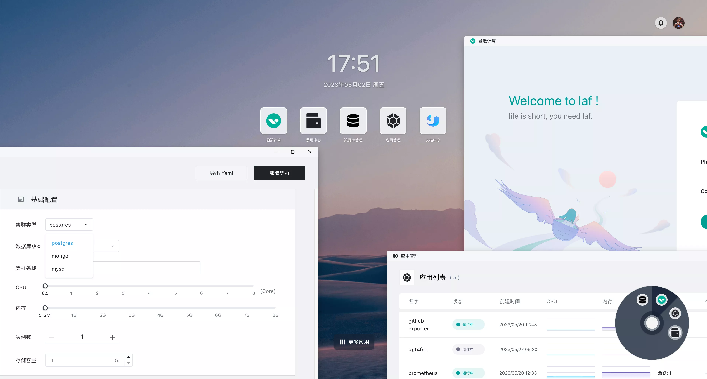

# 什么是 Sealos？

云原生生态之庞大与复杂，无疑让许多企业感到手足无措，这个生态依然缺乏好用的、开箱即用的发行版。在云原生市场还急需一款云操作系统以进一步降低云原生门槛与成本。

Sealos 的问世为企业开启了一扇新窗。它为企业与开发者提供了一种全新的选择，无论在公有云还是私有云中，都只需安装一个云操作系统。它能让各类应用在操作系统上稳定安全地运行，一并解决了应用所需的各种依赖问题。

Sealos 坚守的理念是：**云可以像 Linux 一样简单**。你可以像使用 Linux 一样安装后立即投入使用，使用过程无需过多纠结。唯一的差别仅在于，Linux 是安装在单一服务器上，而 Sealos 则是安装在整个数据中心。

在 Sealos 的架构中，**公有云与私有云并无本质上的差异**，他们应是同一套代码的不同实例，唯一的区别仅在于配置与所安装应用的差异。在内网安装即是私有云，而在公网对外提供服务则成为公有云。

我们坚信，随着 Sealos 的不断发展与进步，未来的云将更加开放，更加简单。云计算的美好将属于所有算力的提供者，云的价值将由所有云计算的参与者共享。**他们将能够在多元化的市场环境中，以更经济的方式享受云计算所带来的种种便利。**

## 概述

Sealos 是一款以 Kubernetes 为内核的**云操作系统发行版**。它以云原生的方式，抛弃了传统的云计算架构，转向以 Kubernetes 为云内核的新架构，使企业能够**像使用个人电脑一样**简单地使用云。

用户将可以像使用个人电脑一样在 Kubernetes 上一键安装任意高可用分布式应用，几乎不需要任何专业的交付和运维成本。同时，利用独特的集群镜像能力，用户可将任意分布式应用打包成 OCI 镜像，自由组合各种分布式应用，轻松订制所需的云。通过强大且灵活的应用商店功能，可满足各类用户的多样化需求。

## 适用场景 & 优势

Sealos 是一款强大的业务运行平台，它能完美支持 Java、Go、Python、PHP 等各类应用，不受编程语言限制。该平台为应用提供稳定的运行环境，并解决后端依赖问题，例如数据库、对象存储和消息队列等。更进一步，它还能灵活处理应用配置管理、服务发现、公网暴露，以及自动伸缩等问题。

### 公有云

如果您的业务需要运行在公有云环境中，那么您可以直接使用 [Sealos 提供的公有云服务](https://cloud.sealos.io)。

#### Sealos 的能力

+ **应用管理**：快速部署具有公网访问能力的任意分布式应用。
+ **数据库管理**：秒级创建高可用数据库，支持 MySQL、PostgreSQL、MongoDB 和 Redis。
+ **轻松实现公网访问**：业务自动分配二级域名，轻松实现公网访问，同时还支持自定义域名绑定。

#### Sealos 的优势

+ **节省资源，降低开销**：只需为容器付费，自动伸缩功能从根本上解决了资源浪费的问题，可以节省大量的成本。
+ **通用性强，无心智负担**：用户只需专注于自己的业务，无需被其他无关的复杂性所困扰。无论用户对 Kubernetes 的掌握程度如何，都可以轻松使用 Sealos。
+ **灵活性与安全性并重**：其独特的多租户共享机制，能在保障安全的前提下实现资源的有效隔离和协作。

### 私有云

Sealos 云操作系统 **100% 开源免费**，您可在 [GitHub](https://github.com/labring/sealos) 上找到所有源代码，因此 **Sealos 公有云**的全部功能也可以部署在私有云环境中，以满足您更多样化的业务需求。

### 强大的应用交付能力

- Sealos 具备优秀的 Kubernetes 生命周期管理能力，还可以自由定制 Kubernetes 环境。
- Sealos 可以将整个集群打包，并一键交付到客户环境中。所有服务和业务都可以整体交付。
- 不同于 Docker 主要关注单机镜像，Sealos 更进一步，可以将**整个集群**或者某个分布式应用进行打包。