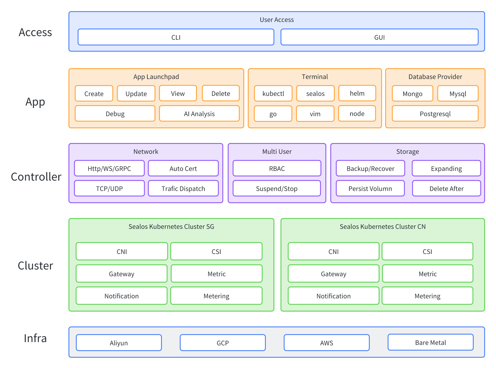
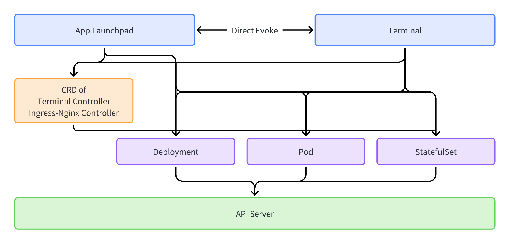

# 架构说明

Sealos 采用应用分离与应用互联的方式构建，不同应用可以独立部署，也可以与其他应用联合起来提供服务。
所有服务全部通过 `kubeconfig` 作为应用身份验证，使得不管是在浏览器，还是本地使用 `sealos` 命令行，甚至是本地的第三方客户端，都能够获得一致的使用体验。

## 整体架构

<picture>
  <source media="(prefers-color-scheme: dark)" srcset="./images/architecture_dark.png" />
  <source media="(prefers-color-scheme: light)" srcset="./images/architecture_light.png" />
  
</picture>

## 应用架构

Sealos 上的应用采用前后端分离的架构，同时前端能够提供 `SSR` 能力，使得应用也可以单独对外提供服务，而不需要绑定在 Sealos 单体上。

以下图为例：

**应用管理 App Launchpad** 是 Sealos 提供的一个单镜像部署工具， **终端 Terminal** 是 Sealos 云操作作系统的终端应用，提供和单机操作系统终端一致的命令行服务。
对于 Sealos 上的各种应用而言，它们可以直接与 `Kubernetes` 的服务进行交互，也可以与各种 CRD Controller 比如 Terminal Controller 和 Ingress-Nginx Controller 等等进行交互。
应用之间也可以互相调用，比如用户在**数据库**应用中新建的数据库,可以直接唤起**终端**应用并自动连接上数据库进行调试。

详细信息可以点击 [链接](../../platform-components) 文档了解更多。

<picture>
  <source media="(prefers-color-scheme: dark)" srcset="./images/application_dark.png" />
  <source media="(prefers-color-scheme: light)" srcset="./images/application_light.png" />
  
</picture>