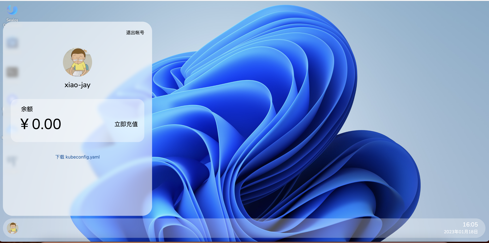
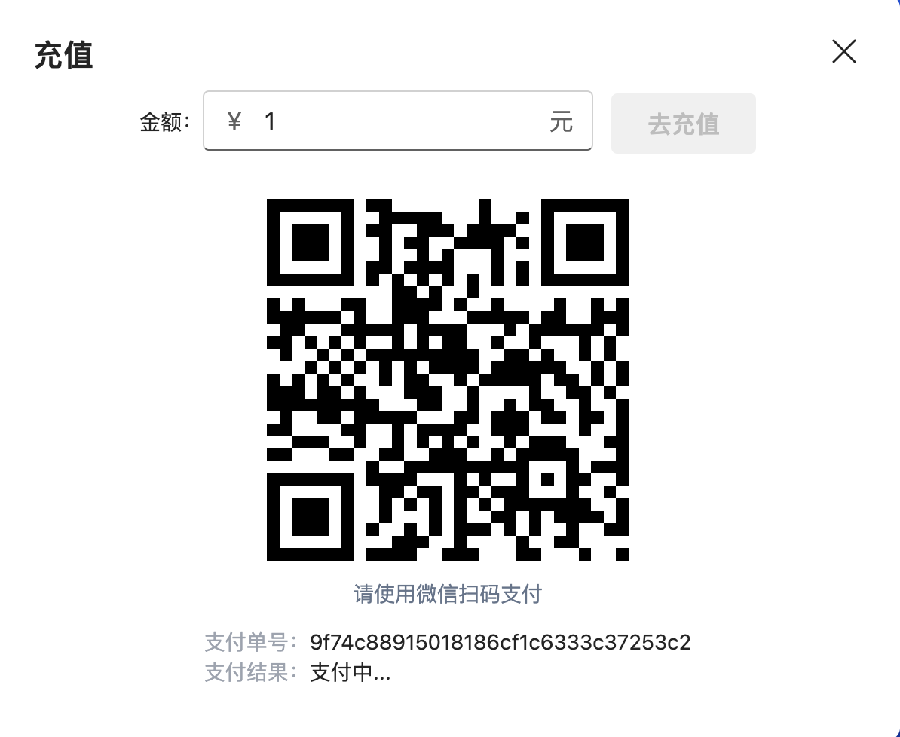
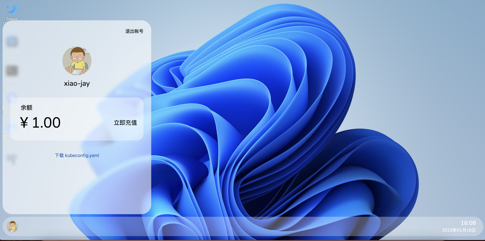

# Sealos Account

点击左下角头像可查看自己的账户

## 1、充值介绍

目前暂时只支持微信充值，点击立即充值和充值金额，微信扫码即可支付

支付完成即可关闭充值界面

**支付结果：**

## 2、扣费介绍

用户使用资源（比如cpu，memory），就需要在账户中扣除金额

**价格表:**

| 资源名字 | 单位 | 价格（每小时） |
| -------- | ---- | -------------- |
| cpu      | 1核  | 0.067元        |
| memory   | 1Gi  | 0.033元        |
| disk     | 1Gi  | 0.0021         |

如果用户欠费，会影响正常使用，如果欠费太多，则会自动清除用户资源。