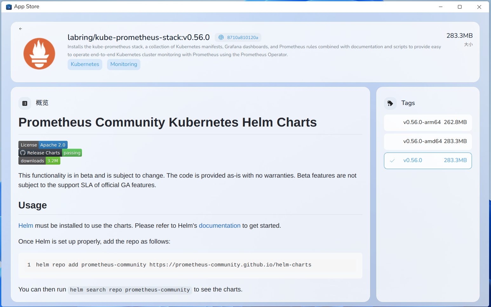

# sealos app store

sealos app store 是用来展示和分享存储在 sealos registry `hub.sealos.cn` 中的镜像的app。



关于 sealos registry 可以参考 [use-sealos-registry.md](use-sealos-registry.md)。

## 创建和管理你的组织

在当前阶段我们只支持通过创建 organization cr来实现，我们很快会实现图形化管理 organization。

下面是一个例子，你可以在sealos cloud terminal app 中编辑此yaml文件:

```yaml
apiVersion: imagehub.sealos.io/v1
kind: Organization
metadata:
  name: your-organization-name
spec:
  name: your-organization-name # same as metadata.name
  creator: your-uuid # find at sealos cloud page
  manager: [ your-uuid ] # you can add other users as manager
```

## 如何在 appstore 上展示你的镜像

在默认情况下，如果你push了一个镜像到sealos registry `hub.sealoc.cn`上时， sealos会自动生成一个image cr并将其apply到sealos cloud上；

你可以通过修改image cr yaml文件来自定义这个image cr，同时镜像的 `README.md` 会被自动解析成为 image cr 的一个元素。

你需要让你的镜像目录如下结构:

```text
├── etc
├── metadata
│           └── config.yaml
└── README.md
```

其中 image cr yaml 文件命名为 `config.yaml`， 下面是例子：

```yaml
apiVersion: imagehub.sealos.io/v1
kind: Image
metadata:
  name: labring.cert-manager.v1.8.0 # stay unique
spec:
  detail:
    description: Cloud native certificate management. X.509 certificate management for Kubernetes and OpenShift
    docs: # will be generated by `README.md` in your image. 
    icon: https://cert-manager.io/images/cert-manager-logo-icon.svg # we only support image url at this stage.
    keywords: # keywords of your image
      - Network
  name: labring/cert-manager:v1.8.0
```
