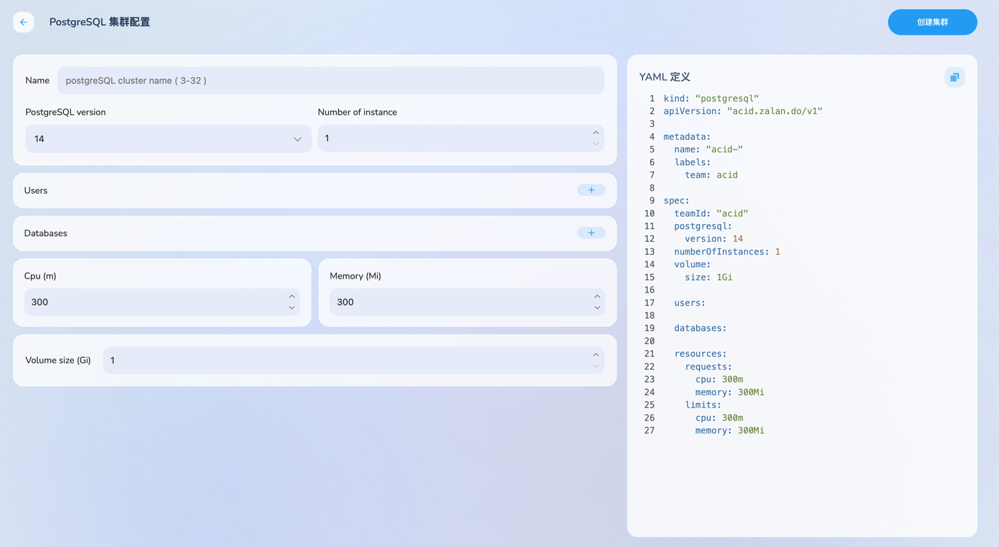
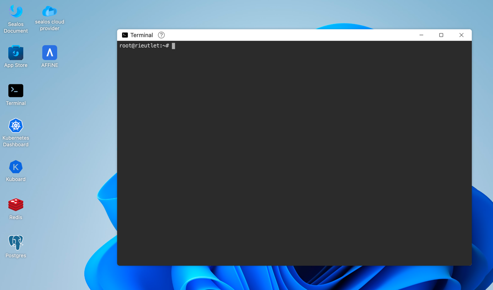
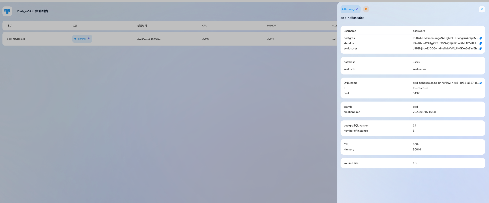
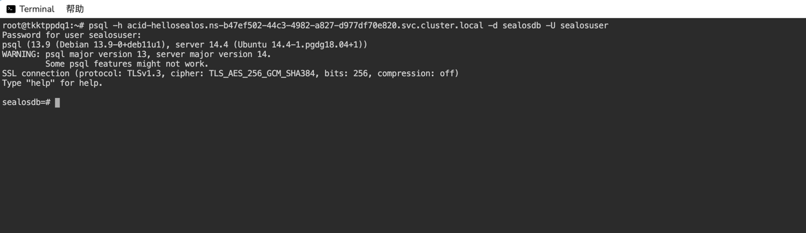

# sealos postgres sql 使用说明


sealos postgres sql可以让用户轻松实现在各大公有云平台上启动一个自定义的 postgres sql 集群。 基于开源社区组织zalando所开发的postgres-operator进行深度定制，并基于openebs存储引擎，提供分布式数据库的一键式启动，部署，备份，数据转移，数据恢复等功能。

## 产品优势


* **一键式部署**，只需进行节点数量，节点容量等基本配置，即可快速启动一个高可用的postgres sql集群。
* **价格便宜**，比直接使用公有云的存储集群服务便宜15%费用。
* **操作简单**，数据备份，数据恢复，数据迁移等操作，只需要点击相应按钮即可完成。
* **资源弹性**，支持快速拓展节点数量，节点容量。
* **可靠性高**，数据库架构支持主从备份，数据自动同步，数据自动备份，数据自动恢复等功能。
* **易用性**，可以对接bytebase等数据库操作平台，提供可视化的数据库操作界面。

## 产品使用


登录 [sealos cloud](https://cloud.sealos.io),点击桌面上的postgres sql图标，即可进入postgres sql的集群管理界面。


在该界面下可以管理和创建自己的postgres集群。

点击创建集群按钮，只需配置postgres sql的版本，节点数量，节点容量，数据库用户即权限，即可快速创建一个postgres sql集群。



## 通过命令行来建立集群


在[sealos cloud](https://cloud.sealos.io)上使用Termianl应用创建postgres sql集群

创建一个文件，里面包含 在postgres集群创建时的基本配置，sealos会帮助你自动启动相对应的PG Cluster。
以下是一个例子：

```yaml
kind: "postgresql"
apiVersion: "acid.zalan.do/v1"

metadata:
  name: "acid-hellosealos"
  labels:
    team: acid

spec:
  teamId: "acid" #默认，请勿修改
  postgresql:
    version: "14" #pgcluster版本
  numberOfInstances: 3 #实例数量
  volume:
    size: 1Gi #实例存储磁盘容量

  users:
    sealosuser: [superuser,createdb] #用户以及对应的权限

  databases:
    sealosdb: sealosuser #用户可以访问的数据库

  resources: #资源配置
    requests:
      cpu: 300m
      memory: 300Mi
    limits:
      cpu: 300m
      memory: 300Mi
```
直接在 cloud terminal 中执行：
```cmd
kubectl apply -f pgtest.yaml
```
自己的PG Cluster就创建好了。

## 获取登录密码进行登录


PG在创建时会对每个用户默认生成相应的密码，可以通过获取secret的方式来获取密码,然后经过base64转码后使用。
```cmd
kubectl get scret ${UserName}.${CRDName}.credentials.postgresql.acid.zalan.do -o yaml
```
也可以通过集群管理界面手动复制用户名和密码。


## 使用psql 连接到PG Cluster


打开Terminal，执行以下命令，并填入在申请集群时所创建的集群名称和用户的私有uid,以及数据库用户和密码即可连接数据库进行使用：
```cmd
psql -h ${pgclusterName}.${uid}.svc.cluster.local -d ${dbname} -U ${username}
```


你也可以在sealos上部署自己的业务来对pgsql进行访问。
