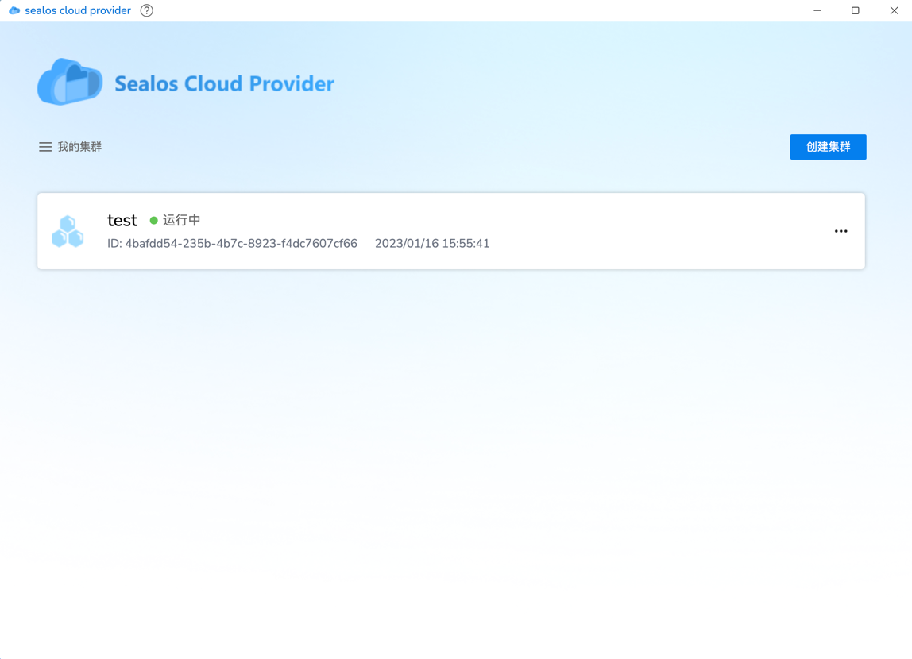
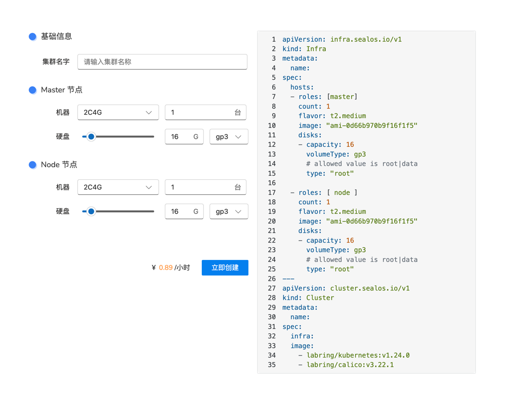
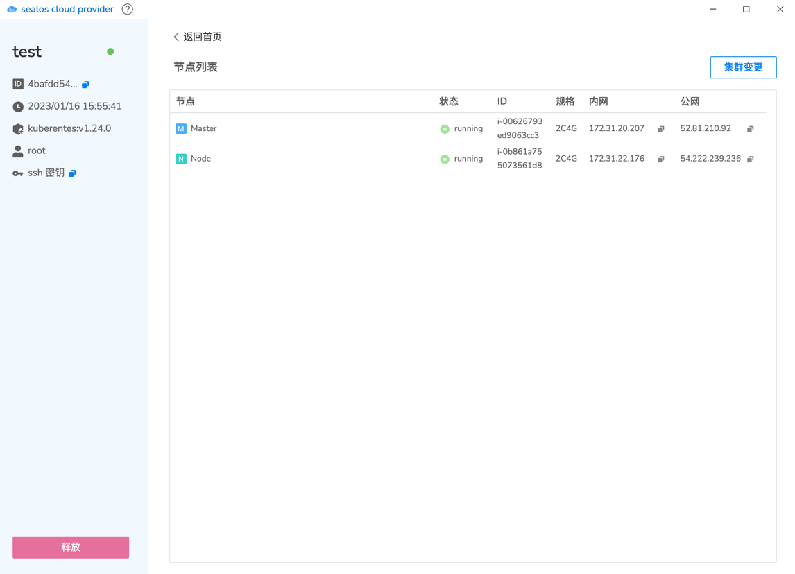
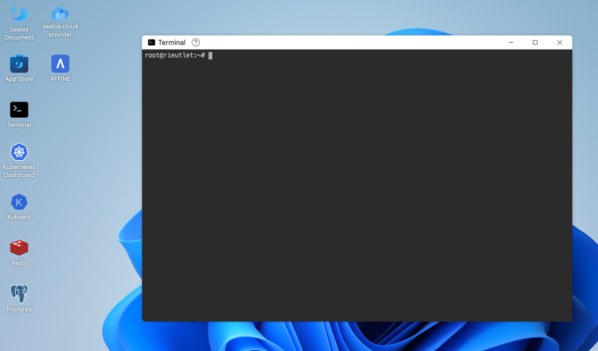
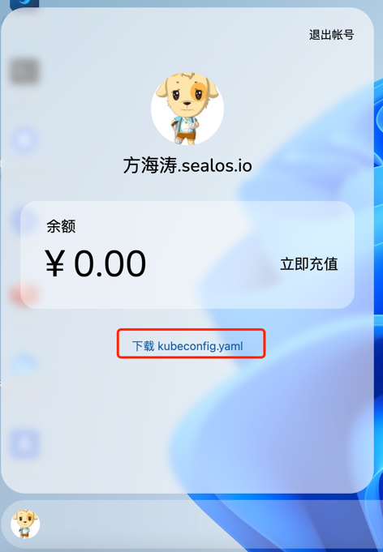

# sealos Cloud Provider

sealos Cloud Provider （以下简称 SCP）
可以让用户轻松实现在各大公有云平台上启动一个自定义的 kubernetes 集群。
当前支持 AWS, 未来会支持阿里云、腾讯云、华为云、GCP、Azure、Baremetal。

## 产品优势

* **速度快**，分钟级云上构建自定义 kubernetes 集群
* **配置灵活**，通过更改配置文件自由伸缩集群
* **价格便宜**，比直接启动云服务器便宜 10% 费用
* **操作简单**，产品体验如同在 PC 上安装和使用一款应用一样简单
* **兼容性**，API 完全兼容 kubernetes CRD 设计，支持远程调用，支持对接到任何其它系统，如 CI/CD 系统自动创建/销毁集群
* **自定义**，支持自定义集群，通过集群镜像能力自由选择需要安装的 kubernetes 版本，以及上层 addon, 支持现有 sealos 仓库中的所有集群镜像
* **跨平台**，自由切换云厂商，多家云厂商资源统一纳管


## 通过 SCP 用户界面使用

登录 [sealos cloud](https://cloud.sealos.io), 点击桌面上的sealos cloud provider图标，进入创建集群界面。



在此界面指定节点类型、节点数量、磁盘容量、磁盘类型等信息，即可分钟级别启动一个 kubernetes 集群。可自定义希望在集群中运行的组件，比如 calico dashboard mysql 甚至 sealos cloud 等。



在此界面查看集群id、创建时间、ssh 密钥，以及各节点内网、公网 IP 及运行状态，并支持修改集群及一键释放集群，从而轻松实现集群生命周期的管理和变更。



集群成功运行后，通过 master 节点的公网 IP 和 ssh 密钥即可访问集群。

复制 ssh 私钥保存到 .ssh/cloud.key 文件中, 然后：
```shell
chmod 0400 .ssh/cloud.key  #更改密钥文件权限
ssh -i ~/.ssh/cloud.key root@master-ip  #root用户登录master节点
# 登陆成功后即可访问集群
kubectl get pod -A
```

## 通过Cloud Terminal使用

在 sealos cloud 上使用 cloud terminal 创建 infra



创建一个yaml文件，里面包含 infra 和 cluster, 可自由定义集群规格及配置，infra 会帮助你在公有云上启动虚拟机，而 cluster 会在这些虚拟机上安装运行指定集群镜像的 kubernetes 集群。

test.yaml:
```yaml
apiVersion: infra.sealos.io/v1
kind: Infra
metadata:
  name: infra-apply-test
spec:
  hosts:
  - roles: [master] # Required
    count: 1 # Required
    flavor: "t2.large"
    image: "ami-0d66b970b9f16f1f5" 
  - roles: [ node ] # Required
    count: 1 # Required
    flavor: "t2.medium"
    image: "ami-0d66b970b9f16f1f5"
---
apiVersion: cluster.sealos.io/v1
kind: Cluster
metadata:
  name: infra-apply-test
  annotations:
    sealos.io/version: "4.1.4"
spec:
  infra: infra-apply-test
  images:
    - labring/kubernetes:v1.24.0
    - labring/calico:v3.22.1
```

直接在 cloud terminal 中执行：
```shell
kubectl apply -f test.yaml
```

获取集群访问信息, 里面包含了各服务器的公网地址以及 ssh 访问密钥信息：
```shell
kubectl get infra infra-apply-test  -oyaml
```

通过编辑 infra 文件为集群添加、删除节点，实现集群自动伸缩：
```shell
kubectl edit infra infra-apply-test
```

和用户界面使用方法一样，可以通过 infra 返回的集群信息获取 ssh 私钥，访问集群的 master0 节点，然后使用所有的 kubectl 命令。


## 在本地使用 sealos cloud provider

前置条件：本地已经安装了 kubectl

从 sealos cloud 上下载用户专属的 kubeconfig 文件：



拷贝到 .kube/config 文件，如 `cp kubeconfig.yaml .kube/config`

这个授权文件是用户专属的，可以在任何地方通过此授权文件访问所有 API，不仅仅是访问和使用 sealos cloud provider.

配置完成后其他步骤同上

```shell
kubectl get pod
kubectl get infra
kubectl get cluster
kubectl apply -f infra.yaml
```

## API reference

Infra CRD 只负责启动虚拟机
```shell
apiVersion: infra.sealos.io/v1
kind: Infra
metadata:
  name: test-infra
spec:
  hosts:
    - roles: [ master ]
      count: 1
      flavor: t2.large # 虚拟机机型
      image: "ami-0d66b970b9f16f1f5" # 虚拟机镜像
      disks:
        - capacity: 40 # 系统盘大小
          volumeType: gp3
          type: "root" # 系统盘配置
        - capacity: 40
          volumeType: standard
          type: "data" # 数据盘配置
    - roles: [ node ]
      count: 1
      flavor: t2.medium
      image: "ami-0d66b970b9f16f1f5"
      disks:
        - capacity: 40
          volumeType: gp3
          type: "root"
        - capacity: 40
          volumeType: gp3
          type: "data"
```

Cluster CRD 如果定义了就会在其指定的 Infra 上启动 kubernetes 集群

```shell
apiVersion: cluster.sealos.io/v1
kind: Cluster
metadata:
  name: test-cluster
  annotations:
    sealos.io/version: "4.1.4" # 指定使用 sealos 的版本
spec:
  infra: my-cluster # 指定 infra 的名称，会在对应的 infra 上启动 kubernetes 集群
  image: # 集群镜像列表，根据自己需求自定义 kubernetes 版本 或者其它组件
  - labring/kubernetes:v1.24.0
  - labring/calico:v3.22.1
```