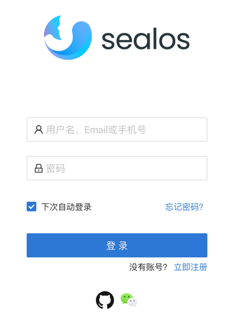

# 开始使用 sealos Cloud

## 登录

直接访问 [sealos cloud](https://cloud.sealos.io), 目前体验版本请勿上生产业务

目前支持 wechat 和 github 登录

## 使用教程

强烈推荐体验在 sealos cloud 上部署 [hello world](https://www.sealos.io/docs/cloud/apps/terminal/use-sealos-cloud-hello-world) 本教程
创建了一个 hello world 的 pod 并且创建 svc 与 ingress 分配独立二级域名提供公网访问。 要求用户了解 kubernetes 的基本使用与基本概念。

[cloud terminal](https://www.sealos.io/docs/cloud/apps/terminal/) 很适合开发者使用，也是通过 CLI 操作 sealos cloud 的首选工具，
也可以通过 terminal 调试其它 pod svc 等。

如果你需要一个单独的数据库实例，[sealos pgsql](https://www.sealos.io/docs/cloud/apps/postgres/) 是个很好的选择，可以分钟级创建 pgsql 数据库

如果你需要一个单独的自定义的 kubernetes 集群，可以使用 [sealos cloud provider](https://www.sealos.io/docs/cloud/apps/scp/) 只需要五分钟
即可创建一个高可用 kubernetes 集群，创建性能是同类产品的 2 到 3 倍！