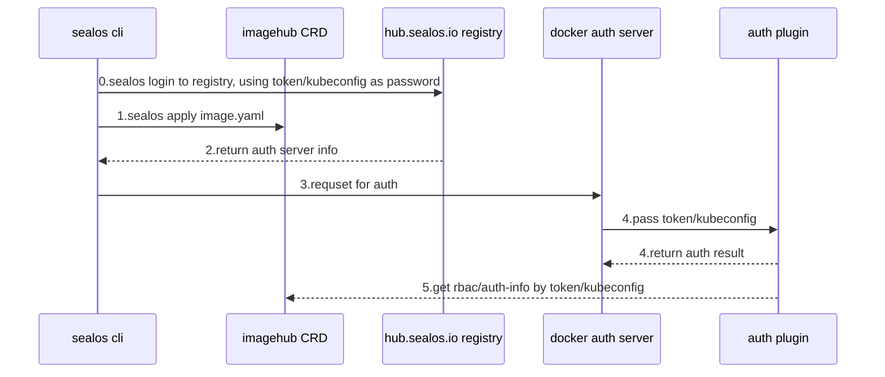

# hub.sealos.io

组件：
1. imagehub crd
2. sealos cli
3. docker registry v2
4. docker auth server
5. auth plugin

## docker registry

需求：

1. [hub.sealos.io](http://hub.sealos.io) 存放用户的镜像
2. 同步imagehub权限
3. sealos login [hub.sealos.io](http://hub.sealos.io) by token/kubeconfig.yaml
4. sealos push 同步到image hub

## docker registry auth steps

需求：提供细粒度的auth，支持org共享，需要和image hub同步

设计/步骤：

- sealos login 解析token 拿到user 并将 token当成password向registry地登录
- registry会返回docker auth server的信息
- 再由buildah login自己控制向docer auth发起申请
- docker auth再调用plugin鉴权
- plugin拿到token/kubeconfig之后能连接k8s apiserver获取imagehub的权限信息
- plugin返回鉴权

优点：

- 完全原生支持docker login、buildah login，不需要重新在sealos login时处理和registry api的交互
- 能复用docker auth代码，只需要精简docker auth到service auth
- plugin实现鉴权，将自定义鉴权部分剥离出docker auth，自由度max

缺点：

- cloud的token当成密码在token失效时需要重新sealos login
- token过长 或许按file传kubeconfig是最优解 但也存在密码过长的问题 在io上有消耗？

