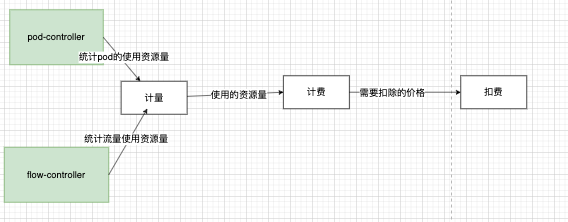
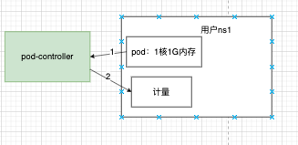
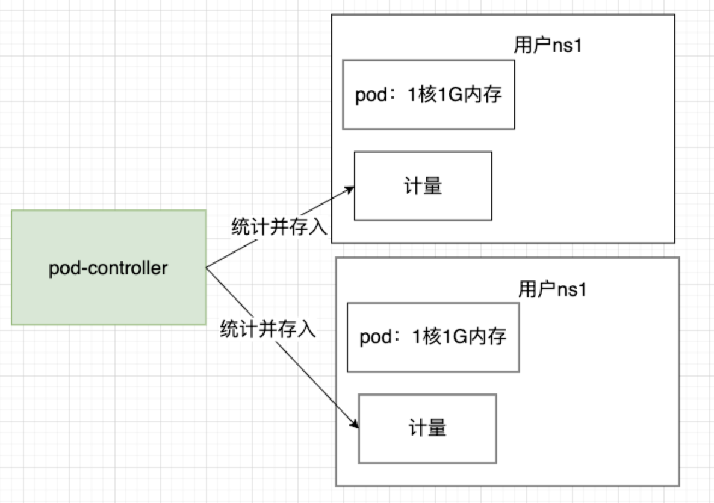
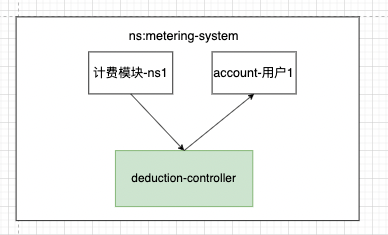

# Metering 设计文档

## **一、背景**

sealos cloud  是一个多租户的，以 k8s 为内核的云操作系统，传统的资源隔离级别是虚拟机，而 sealos cloud  的资源隔离级别是 namespace ，每个用户都至少有一个自己的 namespace  用来使用，这样就给怎么计费带来挑战。怎么样计费 k8s 中用户使用的 cpu 、 memory 等资源？怎么样计费流量等  Metering 不可见的资源。

## 二、需求

计费正在使用的 pod 的 cpu、memory 等资源，可以计量计费 Metering 感知不到的第三方资源(如流量)

## 三、设计思路

### 3.1、各模块介绍

计量计费扣费解耦开，设计第三方资源计量计费接入方案

计量：计量使用的资源量

计费：根据资源价格和使用的资源量计算出价格

扣费：从账户中扣除计算出的价格

resource-controller：统计资源使用量，并且把值放入计量模块（可以有多个）

计量和计费模块是以 namespace 为单位进行计算的。

### 3.2 、pod-controller角度描述计量计费流程

3.2.1 计量模块流程

用户声明了一个1核1g 内存资源的 pod 在自己的 Namespace，pod-controller统计了用户的pod的资源使用量，把1核1g使用量存入计量模块（pod-controller自定义统计触发条件，现在是间隔60分钟触发一次）。

pod-controller 统计的是所有用户ns下的pod资源，并存入对应的计量 crd 中。

3.2.2 计费模块

计费模块应扣款=（资源价格单价 * 计量模块中资源使用量）

计量和计费模块是1对1的，创建用户 Namespace 的时候会自动在用户 Namespace 创建计量模块，在系统 Namespace 创建计费模块。

3.2.3 扣款模块

扣费控制器从计费模块中获得应扣款，然后在用户的 account 中扣除。

