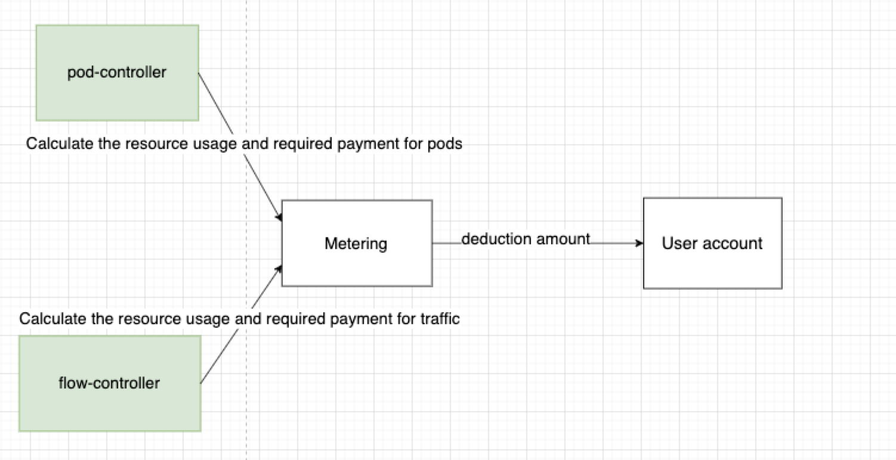
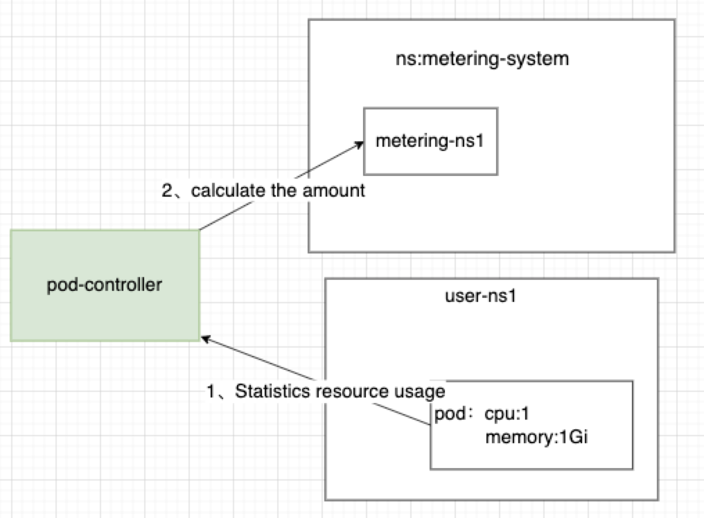
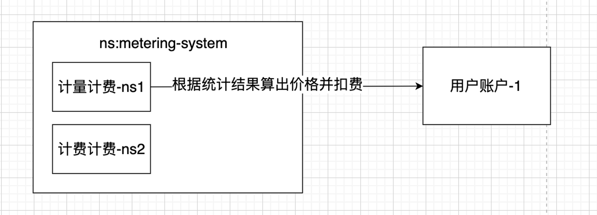
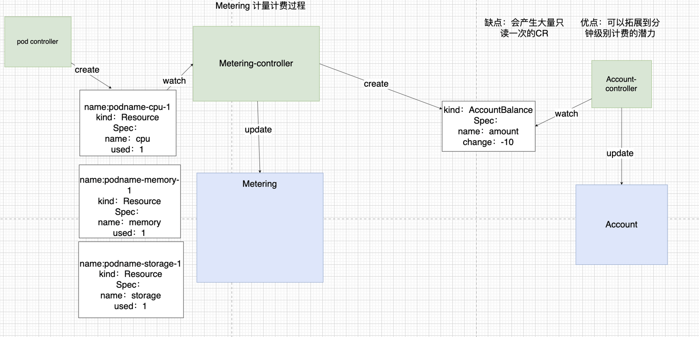

# Metering 设计文档

## **一、背景**

sealos cloud  是一个多租户的，以 k8s 为内核的云操作系统，每个用户都至少有一个自己的 namespace  用来使用，这样就给怎么计费带来挑战。怎么样计费 k8s 中用户使用的 cpu 、 memory 等资源？怎么样计费流量等  Metering 不可见的资源。

## 二、需要满足的场景

1、计量计费正在使用的 pod 的 cpu、memory 等资源

2、可以计量计费 Metering 感知不到的第三方资源(如流量)，需要资源接入方案

3、需要要创建用户Namesapce的时候自动创建好Metering和他计费所需要的字段

3、每个controller需要实现幂等

4、有突发情况，比如Meterng-controller挂了2天，这两天扣的价格是否能正常恢复

5、能否随着用户Namespace的创建自动创建Metering

## 三、设计思路

### 3.1、各模块介绍

资源控制器：统计资源使用量

计量计费系统：在一个计费周期内根据统计的资源使用量和价格表计算出价格一次，让用户账户扣除这些钱，并且会清空统计的资源使用量。

### 3.2 、计量计费流程

3.2.1 资源控制器统计过程

3.2.2 计量计费系统根据使用量计算出价格

会在一个计费周期内统计一次并且算出价格，并且会清空计量计费内的资源使用量，最后后在用户账户中扣除计算出来需要支付的钱。

## 四、遇到的问题

一个controller需要同时更新多个cr导致无法做到幂等

详细介绍：https://github.com/labring/sealos/discussions/2231

#### 解决方案：

**原则：一个CR只有一个controller更新**

绿色代表controller，蓝色代表CR（即CRD的实例化）

1、pod-controller统计资源过程：pod-controller统计资源使用量后，不再是更改现有CR，而是 create 一个资源使用量CR。

2、Metering-controller计量过程：watch Resource的产生，产生之后会把其中的资源使用值放入Metering的 CR 中。

3、Metering-controller计费过程：根据Metering CR中统计的资源使用量和价格表计算出价格，并且会清空统计的资源使用量，生成一个AccountBalance的CR，里面会存放需要扣除的金额（计算公式：used/unit *price）。

4、扣费过程：Account 监听了Accountbalance CR的产生，并且读取需要扣费的值，进行扣费。