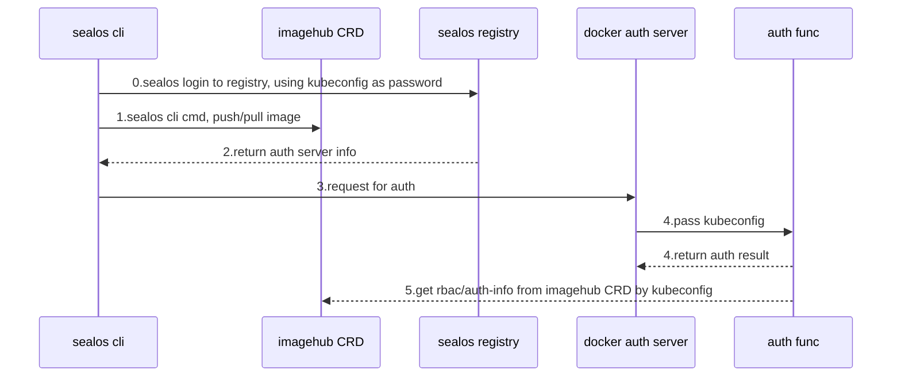

# sealos registry 设计

sealos registry 使用 docker v2 registry， 我们设计用来专门存储和分发集群镜像的仓库。

镜像仓库域名是`hub.sealos.cn`。

## registry server

Registry 使用开源项目 [docker v2 registry](https://github.com/distribution/distribution).

参考[部署文档](https://github.com/labring/sealos/blob/main/deploy/registry/README.md).

## registry auth server

### 基于 sealos imagehub CRD, 提供细粒度授权.

使用用户的 kubeconfig yaml 文件作为密码。 当用户使用 `sealos login` 到 `hub.sealos.cn`时, auth server 会使用它进行授权。

下面是完整流程图。

### 使用kubeconfig作为密码有以下优势

1. 完全原生支持docker login、buildah login，不需要重新在sealos login时处理和registry api的交互
2. 认证服务器将使用用户kubeconfig来连接sealos云，而非使用kubernetes-admin

*但是也有以下缺点*
1. kubeconfig作为密码可能过长, 在io上有消耗