# 快速安装 Halo 博客平台

在 Sealos 上快速部署 Halo 博客平台

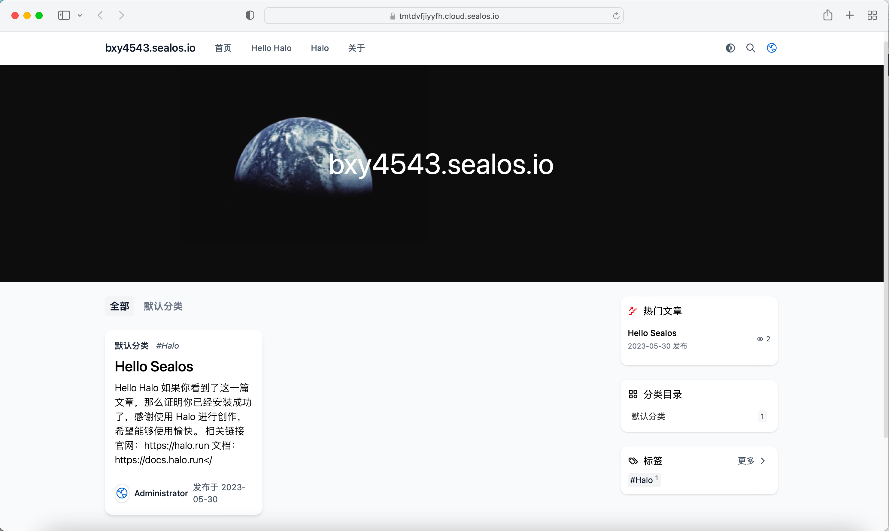

Halo 是一款强大易用的开源建站工具，本文将介绍如何在 Sealos 上部署 Halo，同时在 Sealos 上部署 PostgreSQL 可以帮助你轻松地管理和维护数据库，以满足不同的业务需求。

## 步骤 1：在 Sealos 中部署 PostgreSQL

### 首先，打开 Sealos 并点击「更多应用」，进入 PostgreSQL 的部署界面：

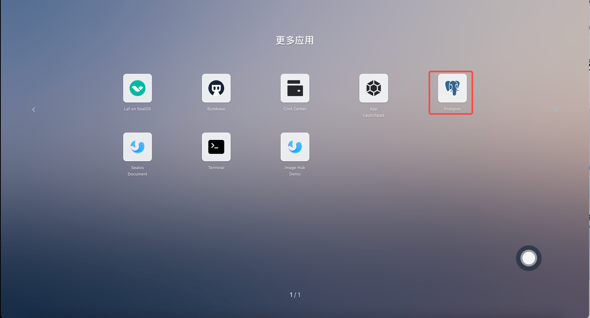

### 填写配置

在 PostgreSQL 的部署界面中，点击「创建集群」，按照提示填写相关配置信息。

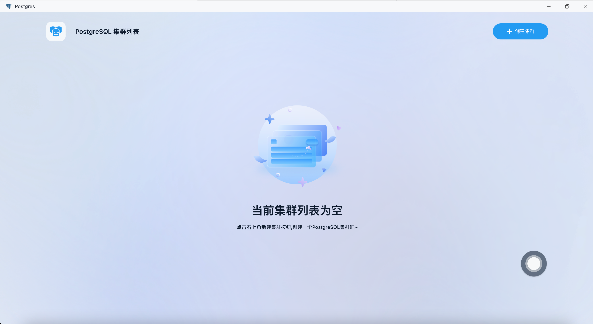

依次输入对应配置后点击创建集群:

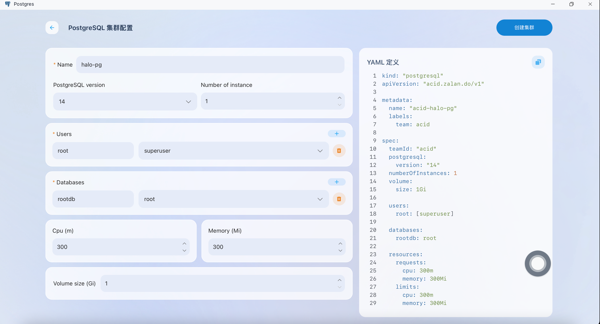

### 查看数据库配置：

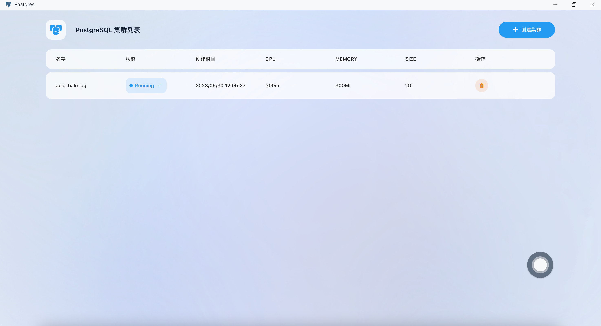

保存这里生成的配置中包含数据库的用户名密码以及数据库连接方式，用于下文 Halo 中配置：


> 图中可以看到 PostgreSQL 配置如下：
>
> Username:root
>
> Password: jxidRwmY82eeuFa01tHN28msb86woounM0QMbyl1jhwzKxT9IDqlNkFfyy4R34G3 
>
> pg DNS name: acid-halo-pg.ns-sy32q9p9.svc.cluster.local:5432

## **步骤 2: 在 Sealos 中部署 Halo**

### **打开 App Launchpad**


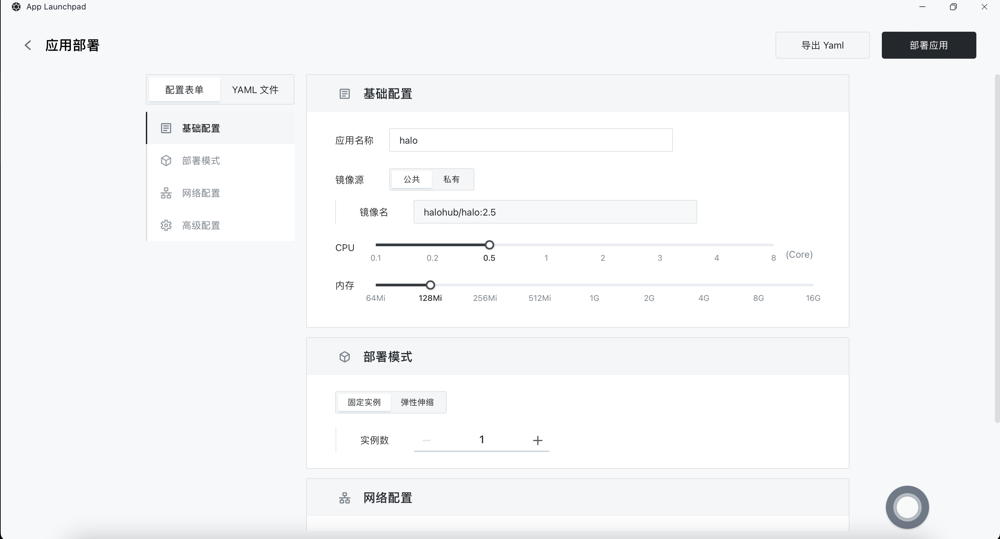

### 填写配置

- 自定义应用名称

- 镜像名称设置为 `halohub/halo:2.5`

- CPU 和存储应根据实际情况进行配置，memory 需要 `500Mi` 的内存才能启动 Halo，这里可以参考官方 prepare：https://docs.halo.run/getting-started/prepare

- 暴露端口应为 `8090`。同时，设置为外网访问将自动为应用配置一个出口域名用于外网访问，同时需要在 Halo 中进行配置该地址

- 环境变量包括数据库配置和其他相关配置。需要注意的是，你需要根据你在 [步骤 1](#1) 中设置的用户名、密码和 DNS 来配置数据库连接信息。同时，你还需要为 Halo 配置超级管理员的用户名和密码。

配置 Halo 环境变量

```Bash
spring.sql.init.platform=postgresql
spring.r2dbc.url=r2dbc:pool:postgresql://acid-halo-pg.ns-sy32q9p9.svc.cluster.local:5432/halo
spring.r2dbc.username=root
spring.r2dbc.password=jxidRwmY82eeuFa01tHN28msb86woounM0QMbyl1jhwzKxT9IDqlNkFfyy4R34G3
halo.external-url=tmtdvfjiyyfh.cloud.sealos.io
halo.security.initializer.superadminusername=root
halo.security.initializer.superadminpassword=sealos
```

环境变量配置详解：

| 参数名                                       | 描述                                                     |
| -------------------------------------------- | -------------------------------------------------------- |
| spring.r2dbc.url                             | 数据库连接地址，详细可查阅下方的 数据库链接格式          |
| spring.r2dbc.username                        | 数据库用户名                                             |
| spring.r2dbc.password                        | 数据库密码                                               |
| spring.sql.init.platform                     | 数据库平台名称，支持 postgresql、mysql、h2               |
| halo.external-url                            | 外部访问链接，如果需要在公网访问，需要配置为实际访问地址 |
| halo.security.initializer.superadminusername | 初始超级管理员用户名                                     |
| halo.security.initializer.superadminpassword | 初始超级管理员密码                                       |

数据库的链接格式（这里我们使用 postgresql 的格式）：

| 链接方式    | 链接地址格式                                                 | spring.sql.init.platform |
| ----------- | ------------------------------------------------------------ | ------------------------ |
| PostgreSQL  | r2dbc:pool:postgresql://{HOST}:{PORT}/{DATABASE}             | postgresql               |
| MySQL       | r2dbc:pool:mysql://{HOST}:{PORT}/{DATABASE}                  | mysql                    |
| MariaDB     | r2dbc:pool:mariadb://{HOST}:{PORT}/{DATABASE}                | mysql                    |
| H2 Database | r2dbc:h2:file:///${halo.work-dir}/db/halo-next?MODE=MySQL&DB_CLOSE_ON_EXIT=FALSE | h2                       |

### 网络配置

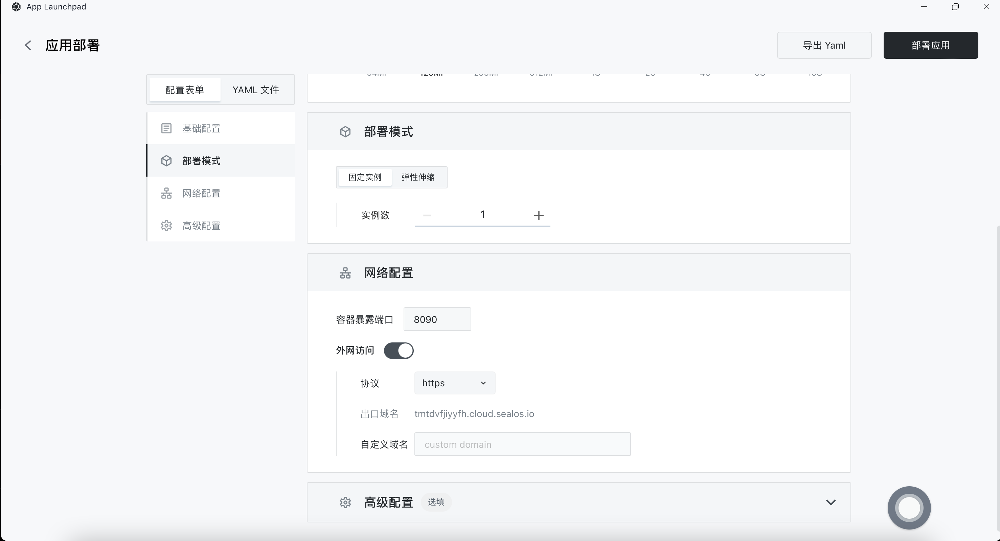

### 环境变量配置


### **配置持久化存储卷**

挂载 `/root/.halo2` 目录来持久化 halo 数据 :

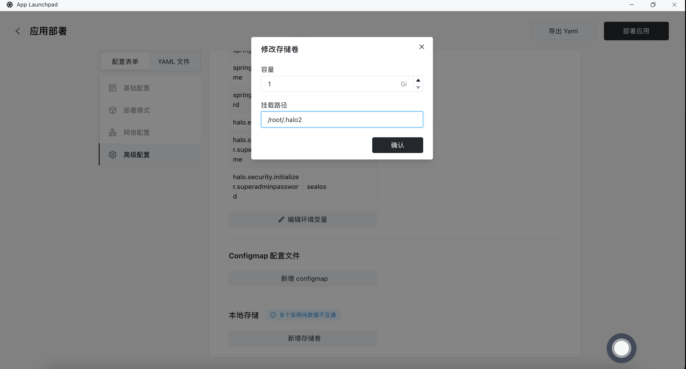

## 步骤 3: 使用外网访问 Halo

成功启动应用后，即可通过外网访问地址访问 Halo 进行配置：

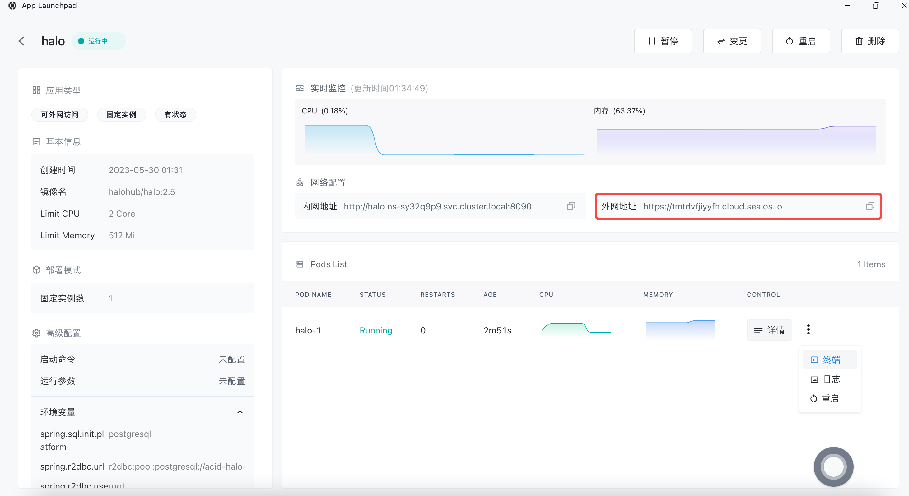


### **初始化 Halo**

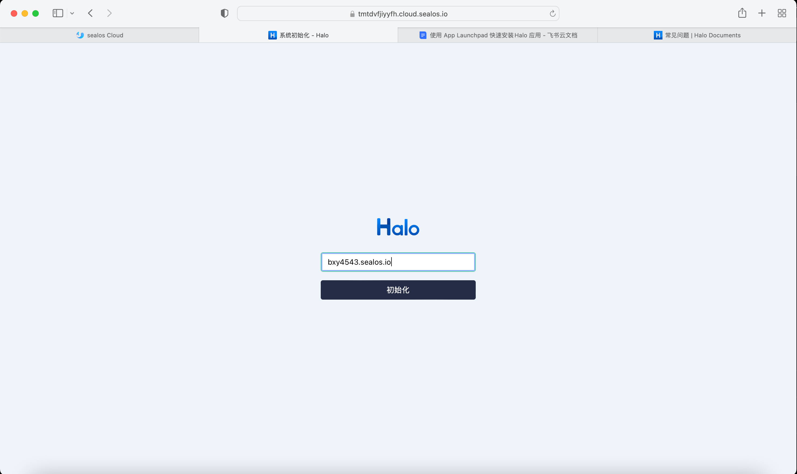

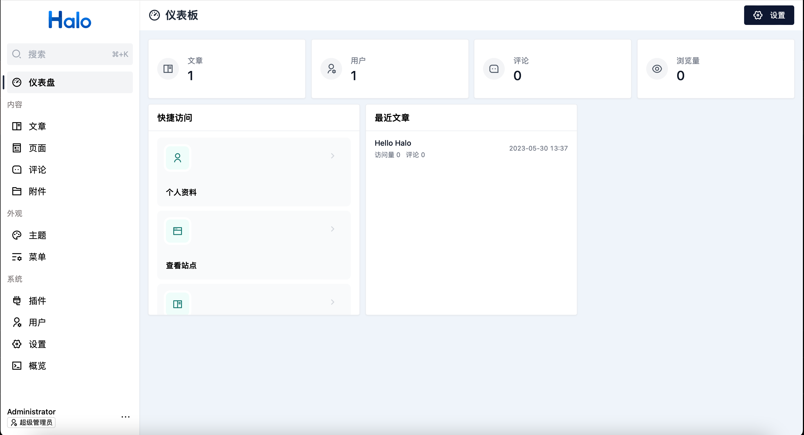

### **First Halo**

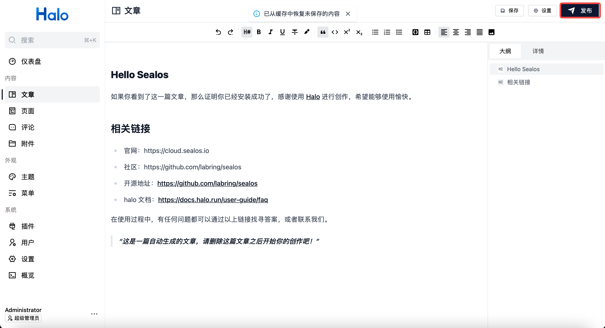

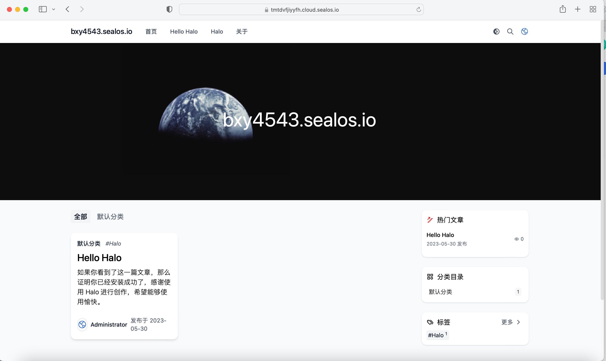

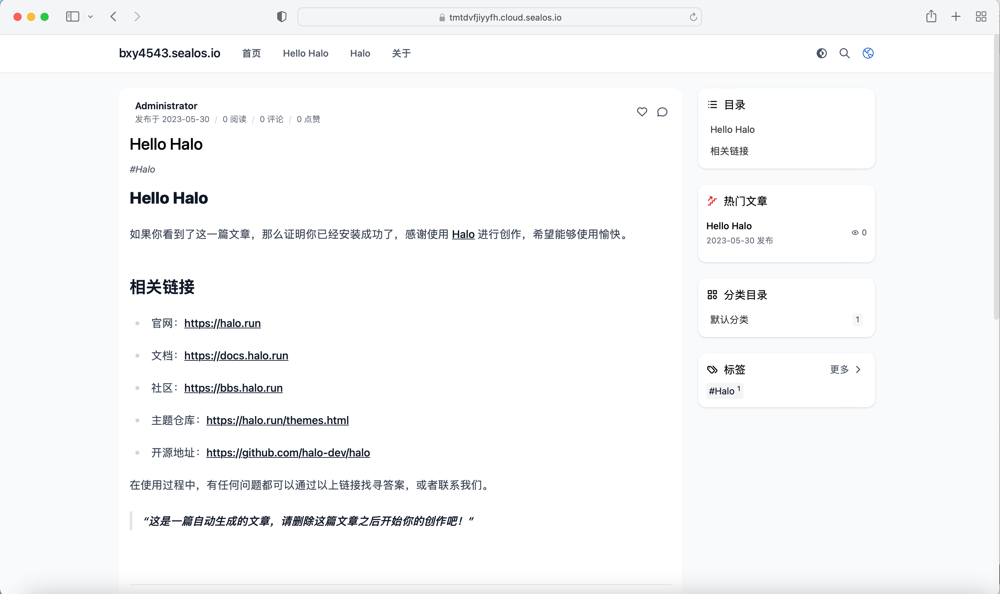

## FAQ

### 忘记密码

#### 进入 App Launchpad，点击日志查看

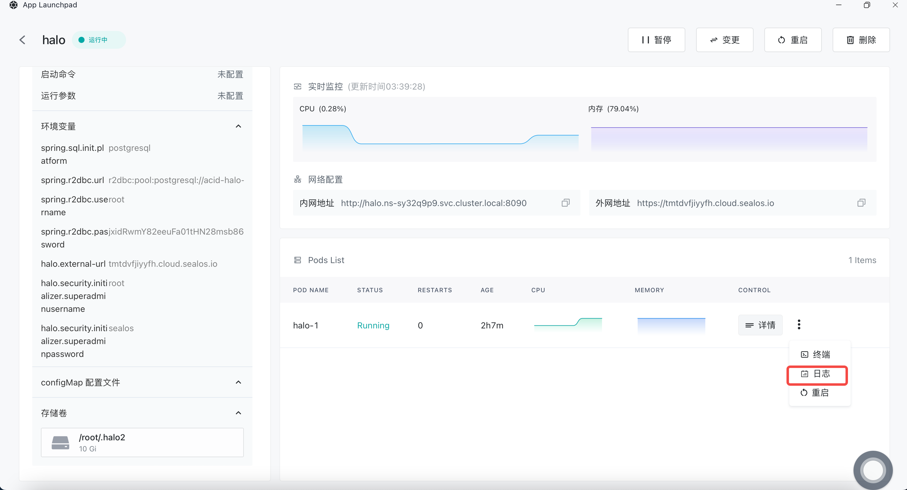

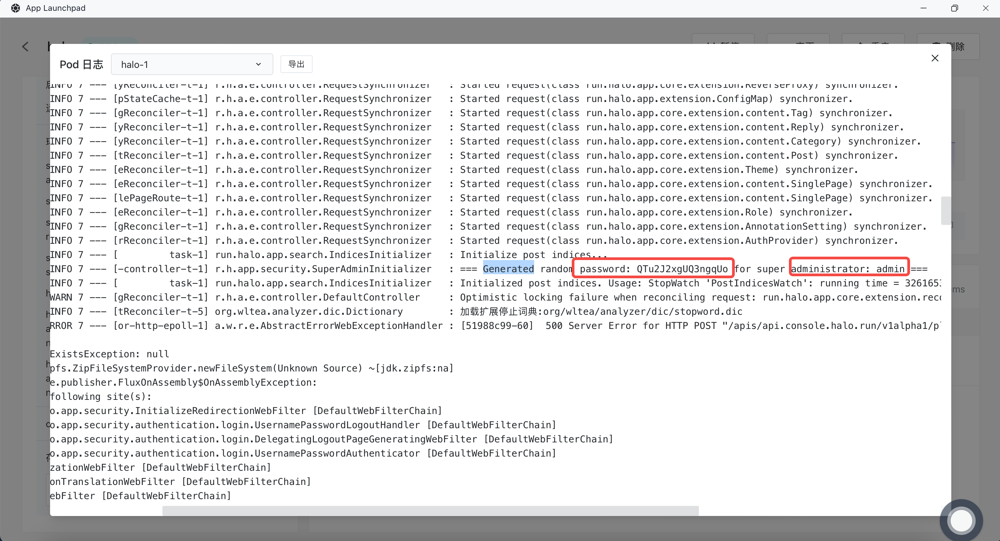

可以看到这里的日志中：用户名：`admin`    密码：`QTu2J2xgUQ3ngqUo`

#### 或终端执行如下命令查看日志

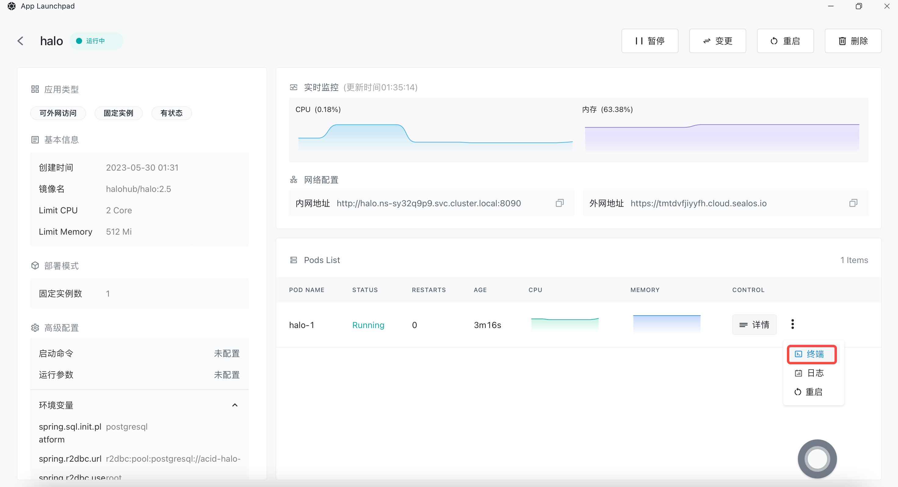

```
root@td3q8uc46:~# kubectl logs halo-0 | grep 'Generated random password:' | tail -1
2023-05-30T13:32:16.942+08:00  INFO 7 --- [-controller-t-1] r.h.app.security.SuperAdminInitializer   : === Generated random password: QTu2J2xgUQ3ngqUo for super administrator: admin ===
```

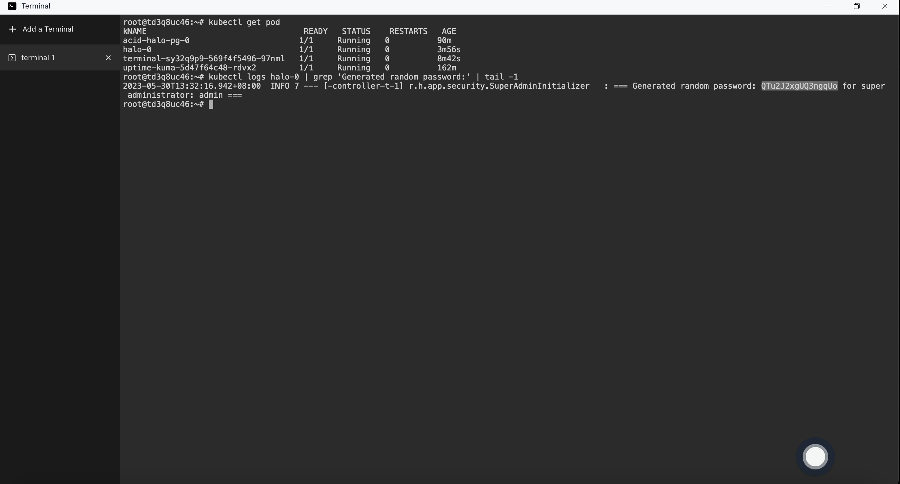