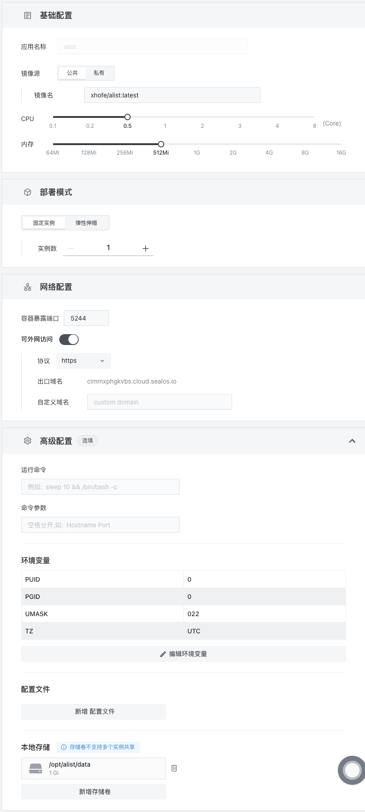
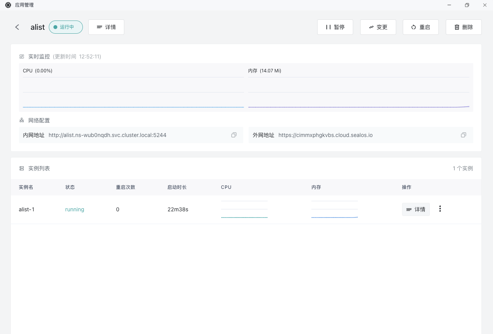
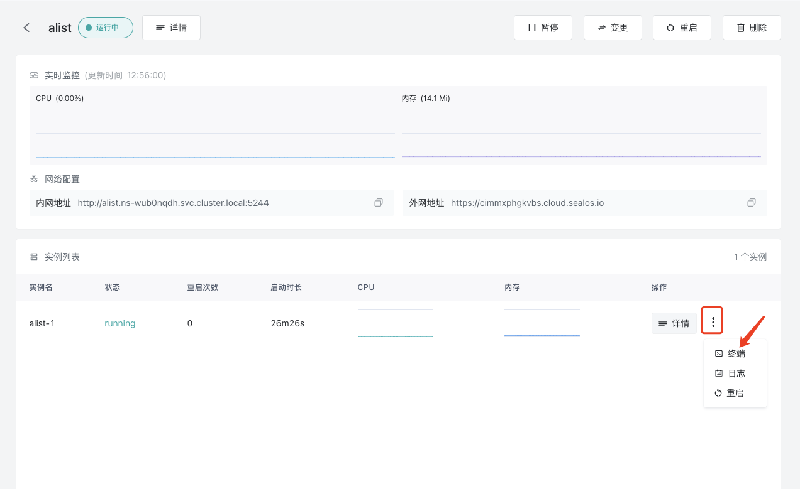
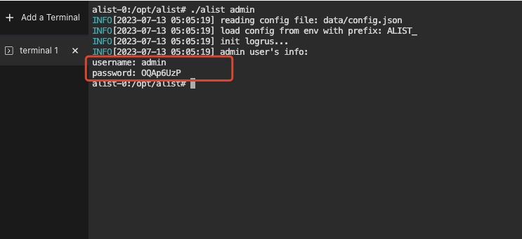
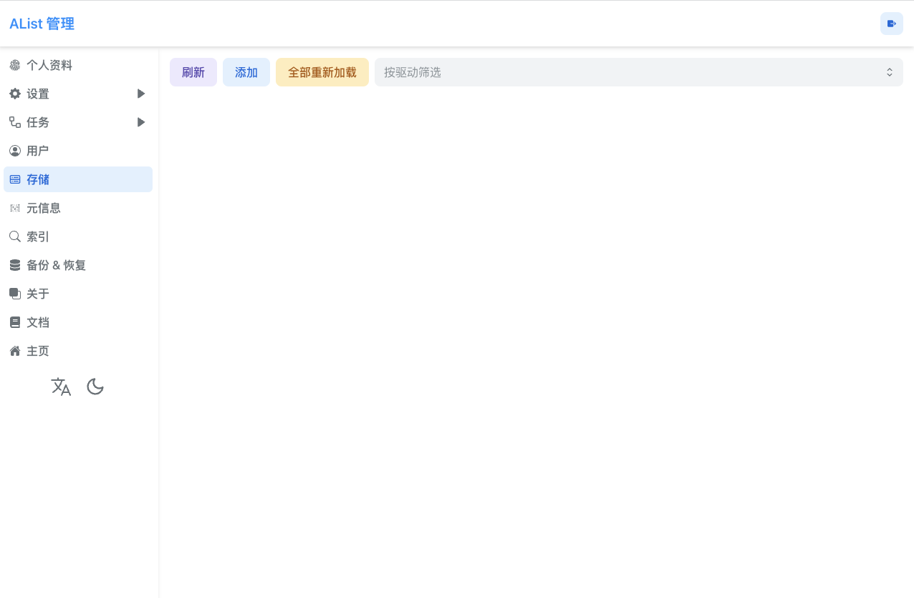

# 快速安装 alist

[alist](https://alist.nn.ci/zh/) 是一款人们的文件管理应用，可以挂载多种存储，并且支持标准的 WebDAV 协议。

中文部署视频教程：<https://www.bilibili.com/video/BV1rk4y1V7nb>

## 首先进入 Sealos 并打开「应用管理」

## 新建应用


### 安装 alist

`alist` 有专门的镜像文件，并且安装非常简单。

现在我们来部署 `alist` 吧。

`alist` 所需要的配置如下。

- 使用镜像：`xhofe/alist:latest`
- 容器暴露端口：`5244`(记得要打开外网访问)
- 配置环境变量如下：

```env
PUID=0
PGID=0
UMASK=022
TZ=UTC
```

- 本地存储：`/opt/alist/data`

最终效果如下：



耐心等待一段时间后可以看到`alist` 服务已经启动起来了


## 进入 alist

点击外网地址，可以直接访问自己的 alist 服务了

## 获取 admin 账号密码

点击详情旁边的三个点，进入终端。





输入`./alist admin`获取 admin 的密码，从网址登录后可以修改初始密码

## 添加存储

登录后点击底部管理按钮，可以进入 alist 管理后台



alist 支持各种网盘、对象存储的接入

具体可以查看官方文档

[alist](https://alist.nn.ci/zh/)
