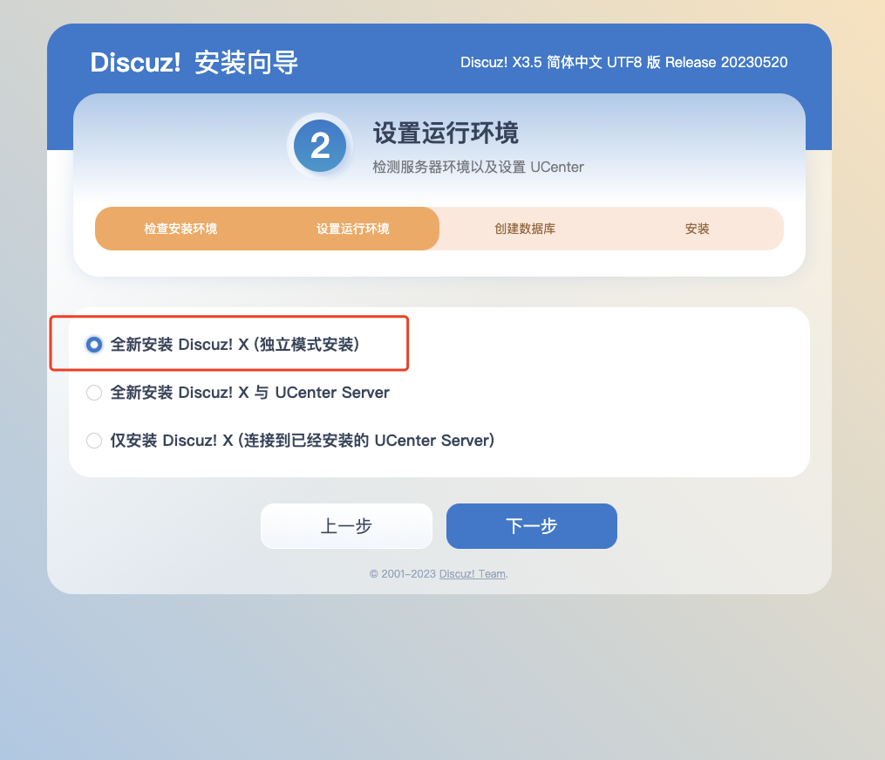
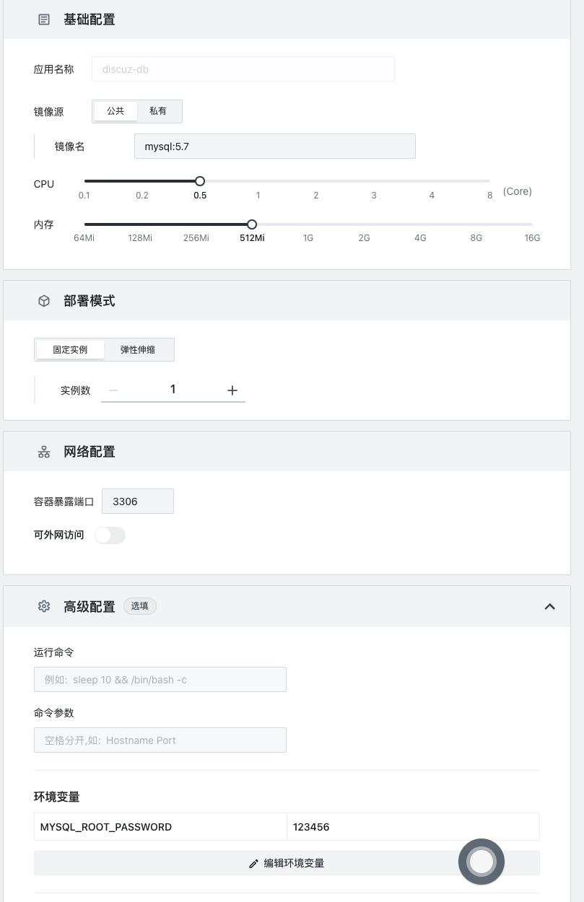
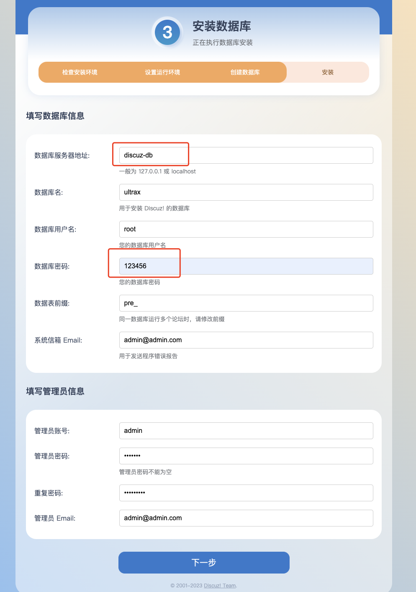

# 快速安装 discuz

[discuz](https://gitee.com/Discuz/DiscuzX) 是一款开源的论坛程序，提供了丰富的功能和插件，被广泛应用于各种网站和社区。

中文部署视频教程：<https://www.bilibili.com/video/BV1KF411Q7iF/>

## 首先进入 Sealos 并打开「应用管理」

## 新建应用


### 安装 discuz

`discuz` 有专门的镜像文件，并且安装非常简单。

现在我们来部署 `discuz` 吧。

`discuz` 所需要的配置如下。

- 使用镜像：`tencentci/discuz`
- 容器暴露端口：`80`(记得要打开外网访问)

最终效果如下：


耐心等待一段时间后可以看到`discuz` 服务已经启动起来了


点击同意，下一步



## 安装 discuz 的 Mysql 数据库

`Mysql` 所需要的配置如下。

- 应用名称：`discuz-db`
- 使用镜像：`mysql:5.7`
- 容器暴露端口：`3306`
- 环境变量：

```env
MYSQL_ROOT_PASSWORD=123456
```

最终效果如下：



此处数据库服务器地址直接填写刚刚安装的数据库容器名：

## 初始化 discuz

回到 discuz 应用，点击外网地址进入 discuz 初始化页面




- 数据库服务器地址：`discuz-db`（这里可以直接填写数据库名）

- 数据库密码：`123456`

其他配置项自己按需修改。点击下一步，即完成部署
