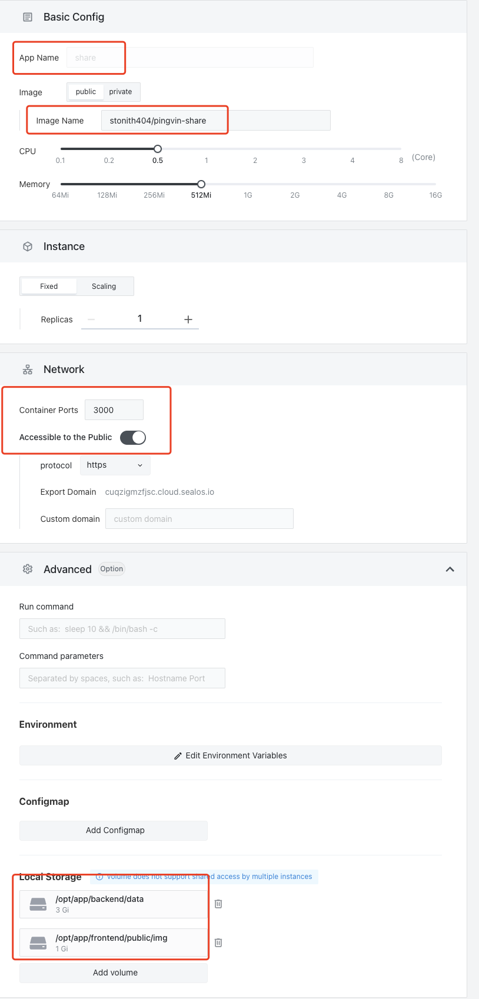

# 快速安装 pingvin-share

[pingvin-share](https://github.com/stonith404/pingvin-share) 是一款私人的文件分享工具

中文部署视频教程：<https://www.bilibili.com/video/BV13V4y1b7My/>

## 首先进入 Sealos 并打开「应用管理」

## 新建应用

按照如下配置填写



```shell
应用名称： `pingvin-share`
镜像名称： `stonith404/pingvin-share`
端口： 3000
外网访问： 开
本地存储：
  /opt/app/backend/data
  /opt/app/frontend/public/img
```

## 部署并上线

点击右上角部署应用。稍等几分钟就可以正常进入该网站和分享文件了。首次分享需要先注册账号。
