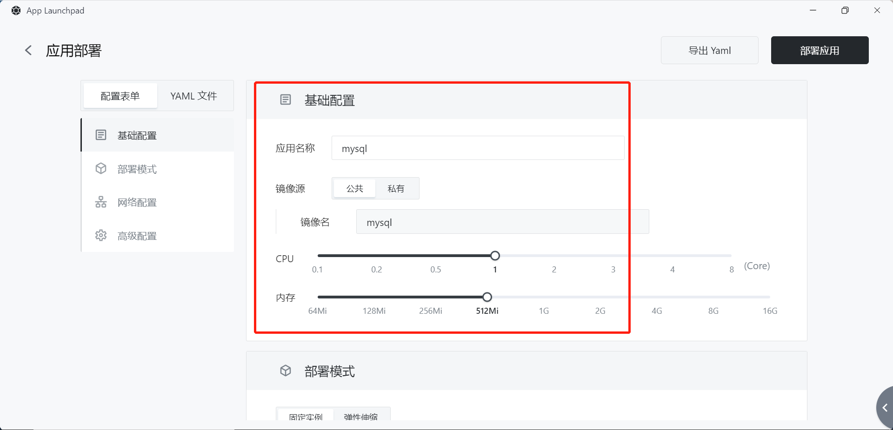
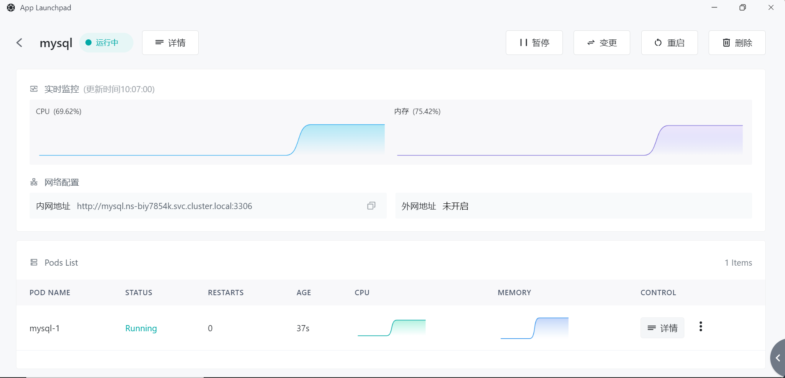

# 快速安装 WordPress

WordPress 是一款功能强大、易用、开源的内容管理系统 (CMS), 可以用于在互联网上发布网站、新闻、博客等内容。它提供了便捷的内容编辑、发布和更新方法 , 同时也可以通过主题和插件进行高度自定义。WordPress 已经成为非常成功和普及的 CMS 系统 , 在全球有超过 3 千万个网站使用 WordPress 搭建。

> 使用 Sealos 安装 WordPress，可以大幅度减少安装时间，极速开启用户的内容输出之旅。

WordPress 需要搭配 MySQL 数据库一同安装使用，在本示例中，将首先演示如何安装 MySQL 数据库，然后演示安装 WordPress 的流程，以及如何连接已安装的 MySQL 数据库。

## 步骤 1：安装 MySQL 数据库

### App Launchpad


### 基础配置

点击新建应用，进入应用安装的配置界面，完成基础配置设置

- 应用名称为自定义用户名
- 镜像源支持公用镜像源与私有镜像源，本示例选用官方镜像源，不指定版本时默认拉取最新版本
- 具体应用的资源配置可参考官方文档，MySQL 数据库需要配置 CPU 1c，内存 512Mi




### 网络配置

将网络配置的容器暴露端口设置为 3306，为 MySQL 默认端口号


### 高级配置

高级配置模块中，需要配置数据库的环境变量、添加数据卷

> 推荐设置的环境变量为 MYSQL_ROOT_PASSWORD、MYSQL_USER、MYSQL_PASSWORD、MYSQL_DATABASE
>
> MYSQL 官方镜像的数据卷挂载地址为 /var/lib/mysql，不同镜像可能存在差异，可在镜像仓库中查看

```Plain
MYSQL_ROOT_PASSWORD     设置root密码
MYSQL_USER              设置用户名
MYSQL_PASSWORD          设置用户密码
MYSQL_DATABASE          设置初始化时创建的数据库
```

下面，给出一个配置示例

```Plain
MYSQL_ROOT_PASSWORD=123456    
MYSQL_USER=sealos
MYSQL_PASSWORD=123456
MYSQL_DATABASE=wordpress
```


至此，配置表单基本已经完成，开始安装应用。

### 安装应用

完成配置表单后，点击应用安装，等待应用安装成功



至此，MySQL 已经完成安装，下面，将开始正式安装 WordPress

**备注：若安装数据库时操作失败，建议直接删除当前实例，重建新实例，而不是在此基础上做变更操作**

## 步骤 2：安装 WordPress

WordPress 的整体安装流程与 Msyql 基本一致，镜像源推荐使用官方镜像源，不指定镜像版本，默认为 latest；在硬件资源需求方面，WordPress 十分轻量级，0.1c 的 CPU 与 64Mi 的内存就可以保证应用成功安装。


网络配置方面，打开外网访问，Sealos 会为用户自动分配出口域名用作外网访问，如果用户已经注册了自己的自定义域名，那么可以将自定义域名 cname 到该出口域名，这样就可以使用该自定义域名访问用户安装的应用。

注：后续演示，使用的是 Sealos 随机生成的出口域名。


高级配置中，为 WordPress 配置环境变量与本地存储。WordPress 常见环境变量如下所示：

```Plain
WORDPRESS_DB_HOST     数据库ip地址
WORDPRESS_DB_USER     数据库用户名
WORDPRESS_DB_PASSWORD 数据库登录密码
```

根据之前安装的 MySQL 示例，可以这样配置环境变量：

```Plain
WORDPRESS_DB_HOST=mysql.ns-biy7854k.svc.cluster.local:3306
WORDPRESS_DB_USER=sealos
WORDPRESS_DB_PASSWORD=123456
WORDPRESS_DB_NAME=wordpress
```

WordPress 官方镜像的存储卷挂载地址为：`/var/www/html`，用户根据需求为应用分配存储空间。

这样，WordPress 也一并安装成功，点击详情，通过外网地址就可以成功访问。


点击该链接，如下页面，证明安装成功


**注：若安装失败，首先排查网络问题，其次排查环境变量设置问题，若数据库环境变量设置错误，请重新创建数据库实例，而非执行变更操纵**
