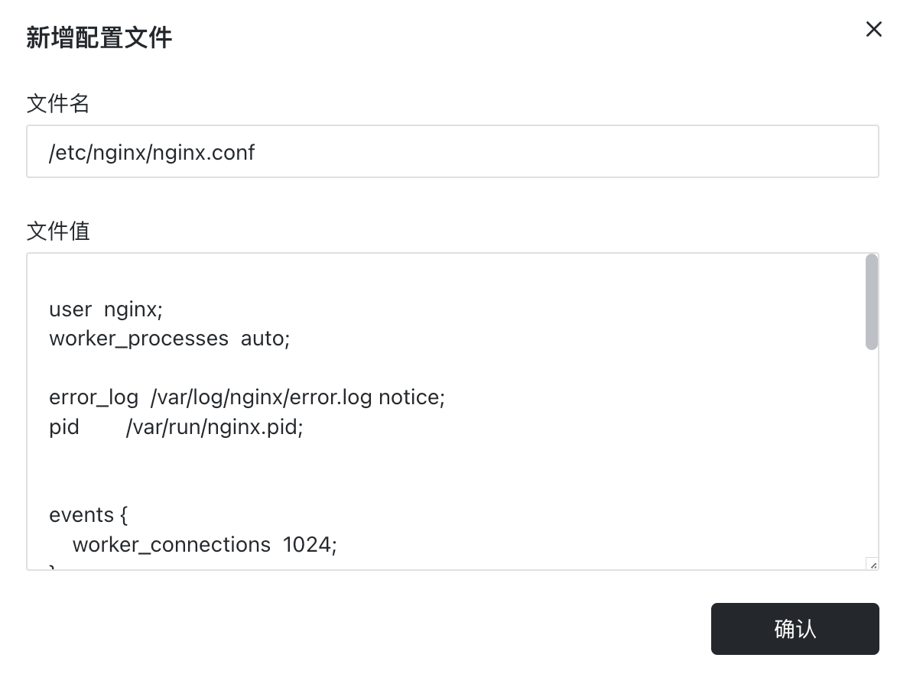

# 配置文件

在 [Sealos](https://cloud.sealos.io) 应用程序中，配置文件的使用非常重要，尤其是当应用程序需要处理大量或复杂的配置信息时。与环境变量相比，配置文件可以提供一种更灵活、更可靠的配置管理方式。环境变量更适合用于传递少量、简单的配置数据。

配置文件的主要优势在于其能够存储和管理复杂的配置数据，这些配置数据可以包含配置文件、命令行参数、环境变量等信息。这些数据可以在应用容器启动时注入到容器中，从而允许你对应用程序的行为进行调整，而无需重新构建镜像。

下面以 Nginx 容器为例，说明如何使用配置文件来调整应用的行为：

- **文件名**: 对应 Nginx 容器里的文件，可以参考镜像提供者给出的说明。
- **文件值**: 文件对应的内容。如果内容过于复杂，建议在本地编辑完成后，再复制粘贴到相应位置。
- **注意事项**：配置文件是挂载单个文件，而不是挂载目录。你需要明确指定要挂载的具体文件，而非仅仅指定一个目录路径。

