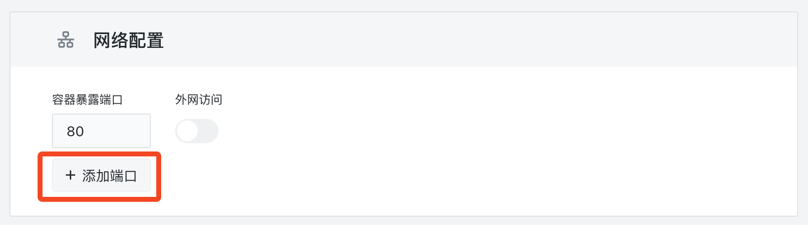

# 暴露多端口

在复杂的应用环境中，经常需要应用服务同时暴露多个端口以满足不同的需求。这种需求可能出现在多种场景下：

+ **多协议支持**：例如，一个应用可能同时支持 HTTP 和 HTTPS 协议，需要暴露 80 和 443 端口。
+ **应用的多功能**：例如，一个应用可能有一个 Web 服务和一个 Admin 服务，它们分别监听不同的端口。
+ **兼容性考虑**：为了与旧版本或其他服务兼容，可能需要同时暴露新旧两种接口的端口。
+ **Prometheus 监控和应用服务**：如果你的应用既有业务端口，又有一个用于 Prometheus 监控的 `/metrics` 端口，你可能需要同时暴露两者。
+ **GRPC 和 RESTful 服务并存**：如果你的应用同时提供 GRPC 和 RESTful 服务，你可能需要为每种服务类型暴露不同的端口。

[Sealos](https://cloud.sealos.io) 在使用「[应用管理](/guides/applaunchpad/applaunchpad.md)」部署应用时，可以轻松地选择暴露多个端口。在部署应用的过程中，用户只需要点击「网络配置」选项，然后选择「添加端口」，即可实现多端口的配置。

此外，Sealos 平台还提供了端口的外网访问功能。一旦暴露到公网，每一个暴露的端口都会被分配一个独立的二级域名，使得用户可以更方便地进行远程访问和管理。