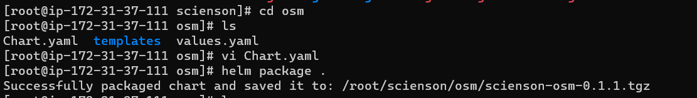
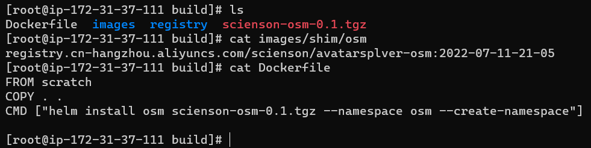

# 使用私有镜像构建一个完整应用服务

## 构建服务镜像

### helm 安装

[https://github.com/helm/helm/releases](https://github.com/helm/helm/releases)

安装 helm v3.9（需要代理）。

### 登陆镜像仓库

这一步是为了打包时拉得到镜像：

```shell
sealos login registry.cn-hangzhou.aliyuncs.com -u username -p password
```

### 修改 helm chart

下载 helm chart 模板：

```shell
git clone https://github.com/luanshaotong/scienson_osm.git
```

```yaml title="templates/deploy.yaml"
apiVersion: apps/v1
kind: Deployment
metadata:
  labels:
    run: avatarsolver-osm
  name: avatarsolver-osm
spec:
  replicas: { { .Values.osm.replicas } }
  selector:
    matchLabels:
      run: avatarsolver-osm
  template:
    metadata:
      labels:
        run: avatarsolver-osm
    spec:
      containers:
        - image: registry.cn-hangzhou.aliyuncs.com/scienson/avatarsplver-osm:2022-07-11-21-05
          name: app
          ports:
            - containerPort: 7001
              protocol: TCP
            - containerPort: 8080
              protocol: TCP
          resources:
            limits:
              cpu: 2
              memory: 6144Mi
            requests:
              cpu: 1
              memory: 4096Mi
```

用域名的方式解析服务：

```yaml title="templates/service.yaml"
apiVersion: v1
kind: Service
metadata:
  name: osm-service
spec:
  type: ClusterIP
  selector:
    run: avatarsolver-osm
  ports:
    - name: osm
      port: 7001
      targetPort: 7001
```

对公网暴露服务：

```yaml title="templates/ingress.yaml"
apiVersion: networking.k8s.io/v1
kind: Ingress
metadata:
  name: osm-ingress
spec:
  ingressClassName: nginx
  rules:
    - host: www.abc.com
      http:
        paths:
          - pathType: Prefix
            path: /
            backend:
              service:
                name: osm-service
                port:
                  number: 80
```

主要用于渲染副本数：

```yaml title="values.yaml"
osm:
  replicaCount: 1
```

### 打包 helm chart

```shell
helm package .
```



### 修改 image list

```shell
cat images/shim/osm
registry.cn-hangzhou.aliyuncs.com/scienson/avatarsplver-osm:2022-07-11-21-05
```

### 修改 Dockerfile

```dockerfile
FROM scratch
COPY . .
CMD ["helm install osm scienson-osm-0.1.1.tgz --namespace osm --create-namespace"]
```



### 构建镜像

```shell
sealos build -f Dockerfile -t docker.io/luanshaotong/osm:v0.1.1 .
```

## 测试部署

```shell
sealos run labring/kubernetes:v1.25.0 labring/helm:v3.8.2 labring/calico:v3.24.1  --masters 172.31.37.111
kubectl taint no node-role.kubernetes.io/master:NoSchedule-
kubectl taint no node-role.kubernetes.io/control-plane:NoSchedule-
sealos run labring/ingress-nginx:4.1.0
sealos run docker.io/luanshaotong/osm:v0.1.1
```

注意：labring/helm 应当在 labring/calico 之前。
如果每一步的应用安装顺利，即可，否则可能需要调试并清理集群重新安装。

## 其他问题

### 清理集群

如果出现问题需要清理集群：

```shell
sealos reset
rm /root/.sealos -rf
```

重新安装即可。
