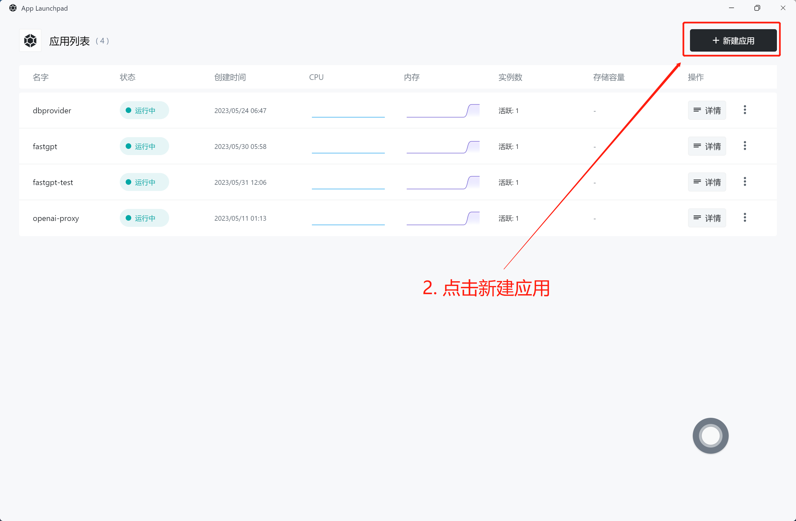
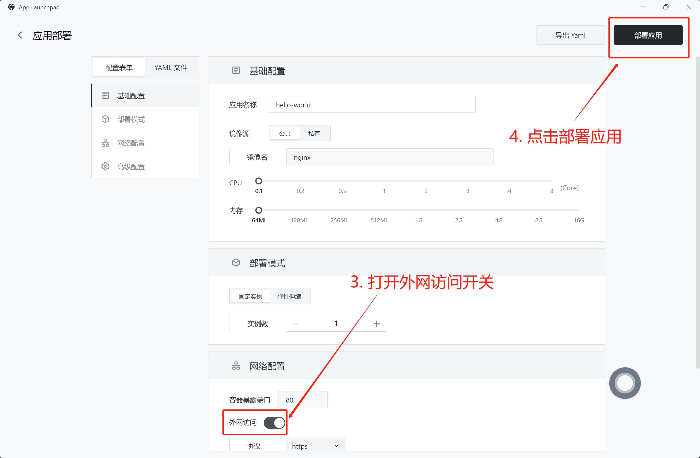
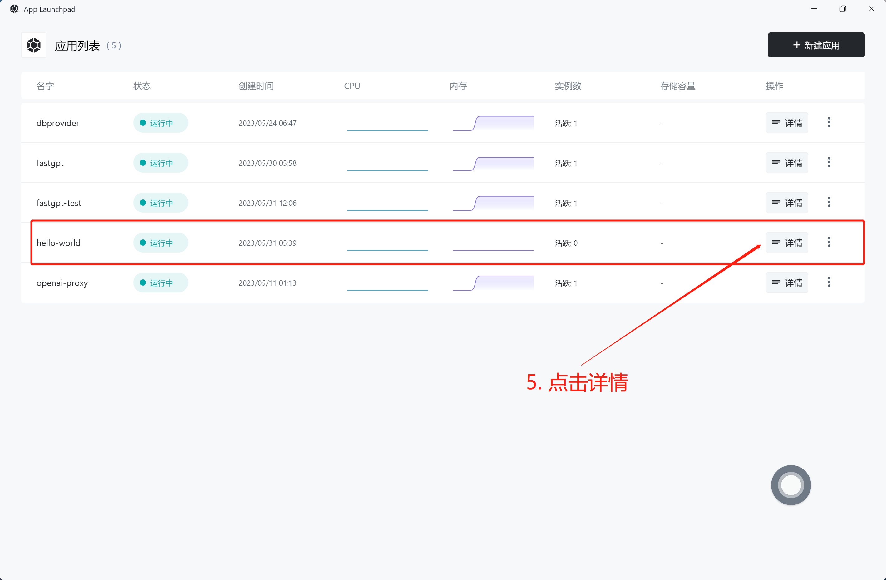
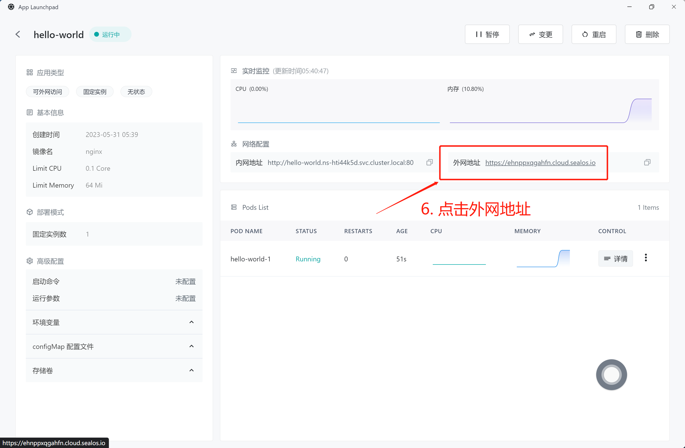
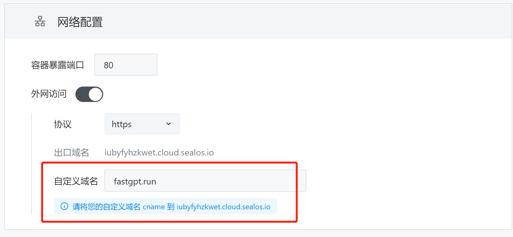
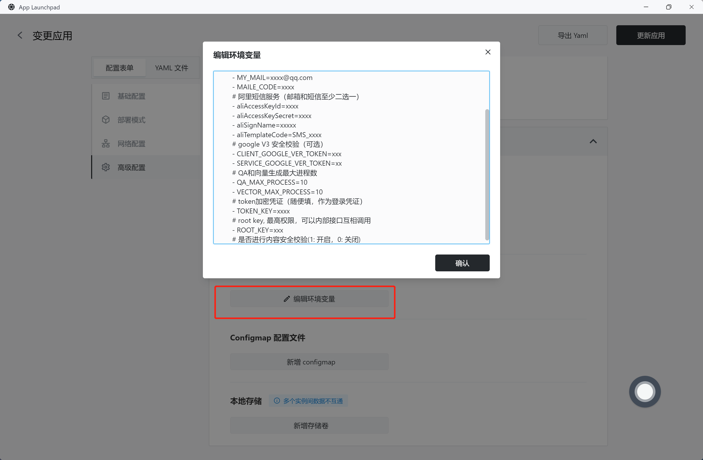
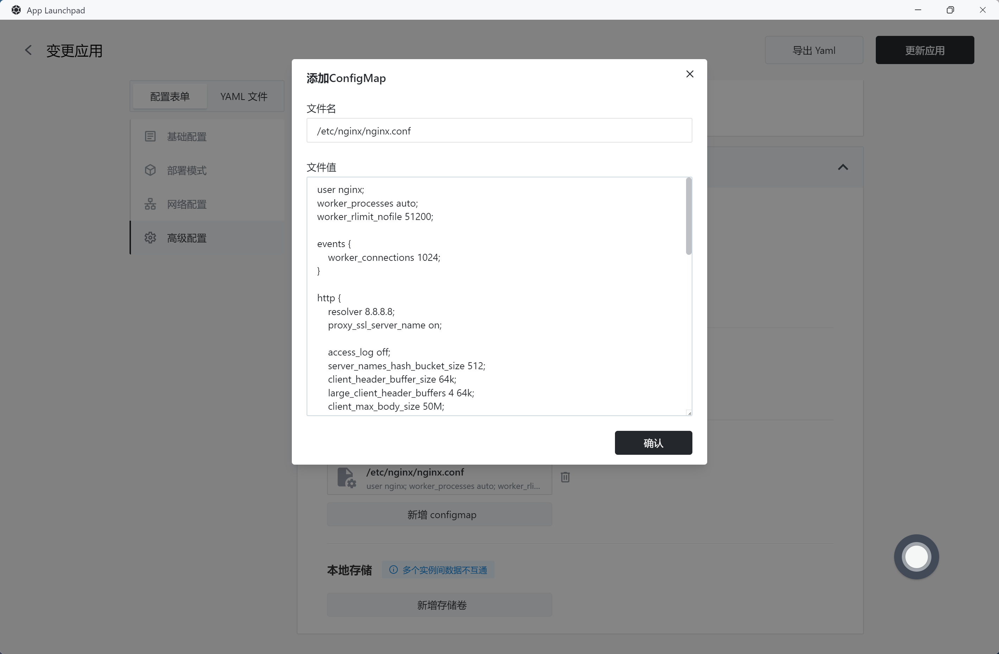
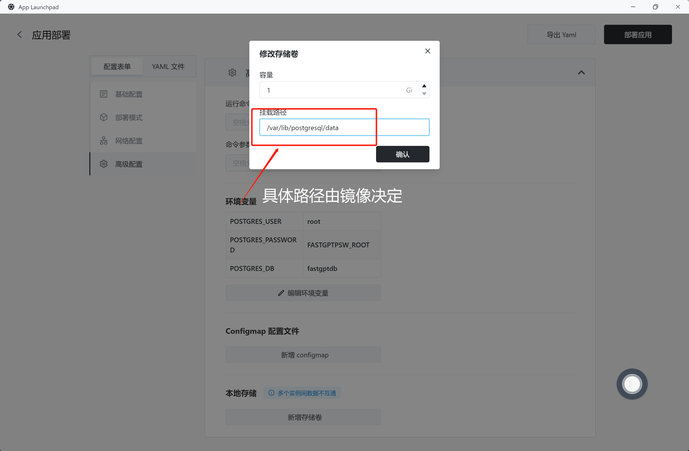

# 应用管理

**应用管理** 是 Sealos 提供的一个单镜像部署工具，可以帮助你在 5 分钟内完成镜像部署上线。

- [x] 私有镜像
- [x] 自定义 CPU 和内存
- [x] 多副本
- [x] HPA
- [x] 外网访问地址
- [x] 自定义域名
- [x] ConfigMap 配置文件
- [x] 持久化存储
- [x] APP 和 Pod 监控
- [x] 日志
- [x] events 分析
- [x] 一键进入容器
- [ ] 一键部署至 Sealos 桌面
- [ ] 可编辑 Yaml
- [ ] 支持多个外网暴露端口

## 快速开始

以部署一个简单的 Nginx 为例，体验容器部署和 **应用管理** 的便捷性。

只需 6 步即可完成部署和访问：

1. 从 Sealos 桌面进入 **应用管理** 应用。


2. 点击新建应用。



3. 打开**外网访问**开关。默认已经填写了 Nginx 镜像，无需修改。



4. 点击部署。



5. 进入 App 详情.



6. 点击外网访问地址，即可访问 Nginx.


## 功能详解

### 弹性伸缩

在应用创建/变更时，均可以随意切换固定实例或弹性伸缩模式。


- 固定实例：永久创建固定数量的 Pod，不受实际流量影响。
- 弹性伸缩：可以选择根据 CPU 或 Memory 百分比值动态调整 Pod 数量。配置弹性伸缩要求你对自身业务流量有一定了解。当然，你也可以直接选择 1~20 个实例数，因为计费系统仅会计算实际运行的实例数，未活跃的实例不会被计费。

### 自定义域名

**应用管理** 默认会为你提供了一个带 SSL 证书的外网访问域名。当然，在对外服务时，你可能希望用户访问你的域名，此时你可以在 **应用管理** 上设置自己的域名。需要做 2 个调整：

1. 在**网络配置**栏，自定义域名输入框填入自己的域名。
2. 根据提示，到域名服务商修改 DNS，cname 解析到提示域名。
3. 确认创建/更新应用。




### 环境变量

**应用管理** 采用批量输入的形式输入环境变量，按行， **=** 号和 **:** 号进行拆分，并且会把 key 中无效的字符去掉。



**可正常解析的环境变量格式：**

```
host=127.0.0.1
port:3000
name: sealos
- username=123
- password:123
# 这类注释会被忽略。因为不包含 = : 两种标记字符。
```

**不可解析的环境变量格式：**

```
# 这行会被解析:因为包含了:或=
host=127.0.0.1 # 这个注释也会被解析，因为前面已经有 = 号了
```

### ConfigMap 配置文件

可以把 ConfigMap 文件理解为 docker 里的 volumes。将一个自定义文件挂载进容器里，从而实现修改容器配置的功能。下面是一个修改 Nginx 配置文件的例子。

- 文件名: 对应 Nginx 容器里的文件，可以参考镜像提供者给出的说明。
- 文件值: 文件对应的内容。如果内容过于复杂，可以在本地编辑好后，再粘贴上来。
- 注意：ConfigMap 是挂载单个文件，而不是挂载目录。



### 持久化存储

任何保存在 Pod 里的内容都是临时的，务必不要将需要持久化的内容直接保存到 Pod 里！！！如果你想为 Pod 开辟一块持久化存储的空间，可以添加一个**存储卷**。

假设你需要部署一个 postgresql 数据库，你必须创建一个存储卷，将数据库里的内容持久存储。



当然，我们更推荐你使用 [数据库管理](../dbprovider/dbprovider.md) 来部署和管理数据库。
