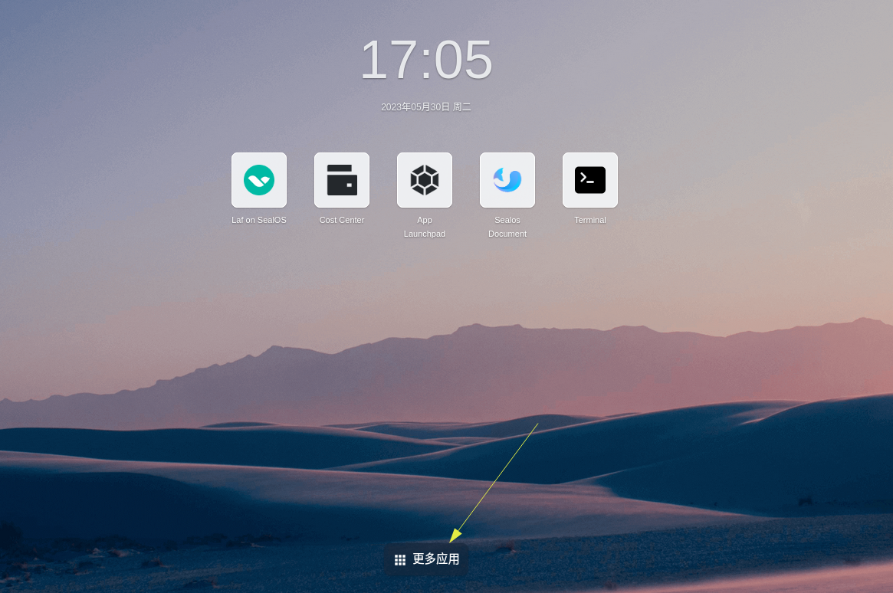
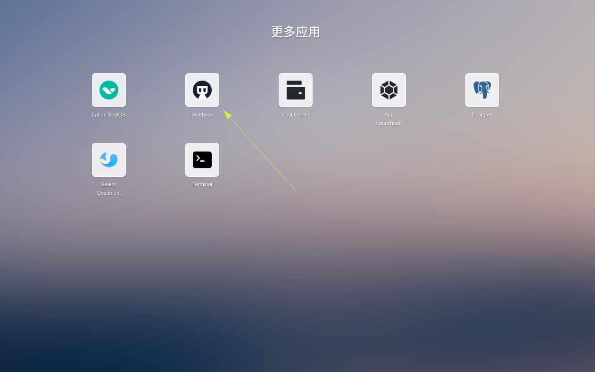
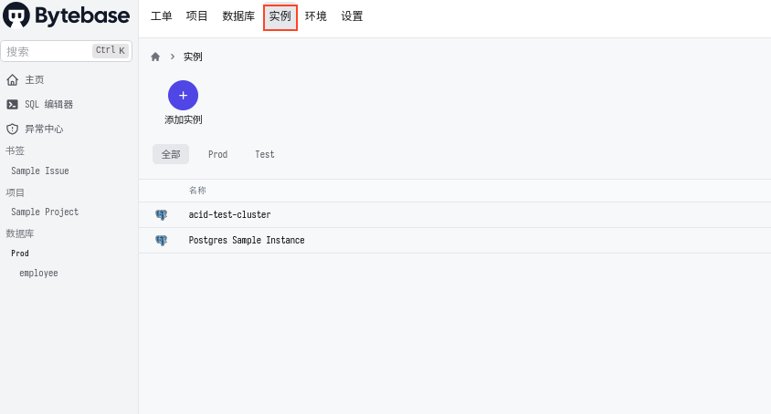
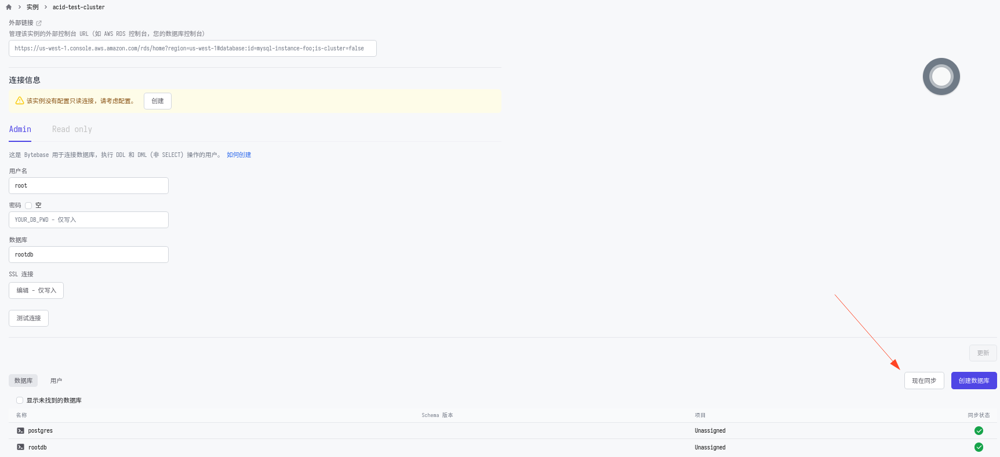

# Bytebase

Bytebase 是一个开源的数据库管理工具。在整个项目周期中，可将其类比于负责管理数据库的 GitLab 。DBA 和开发者可直接于它提供的网页工作环境中，有效率及安全地进行协作及数据库管理。

更多 Bytebase 的相关信息和用法请参考其[官方网站](https://www.bytebase.com/docs/).

## 特性
* Bytebase 提供的强大数据库管理能力
* 快速管理所有您在 Sealos 中创建的数据库实例(目前仅支持通过 Sealos database adminer 创建的实例)

## 在 Sealos 上使用 Bytebase
### 在桌面上找到并点击 “更多应用”
在桌面最下方，请点击 “更多应用”。

### 点击 Bytebase 图标
在弹出的应用抽屉中，点击 Bytebase 图标。

如果您是第一次使用，或有一段时间未曾使用过 Bytebase ，它可能会需要 1~2 分钟时间的加载时间。
### 找到并点击 “实例” 分页
点击 “实例” 分页 ，您创建的所有数据库实例将会在此处列出 (目前仅支持透过 Sealos database adminer 创建的数据库) 。

随后您便可以点击每个实例的名字并检视其状态。
### 点击 “现在同步”，并享受 Bytebase!
在数据库实例的状态页中，点击 “现在同步” 以同步实例中的所有数据库。接着您便可以开始使用 Bytebase 了。

## FAQ
### 点击 Bytebase 图标后出现了程序没有响应，窗口空白的情况。
您的 Bytebase 应用可能在初始化中，目前仍在加载，请等待 3 到 5 分钟后重试。