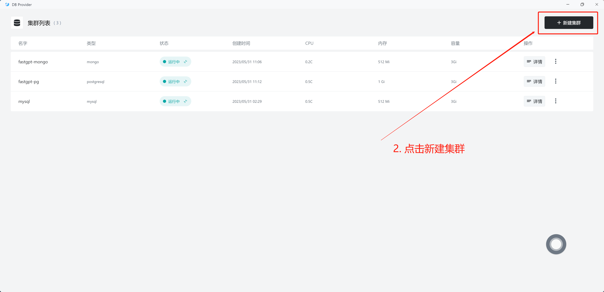
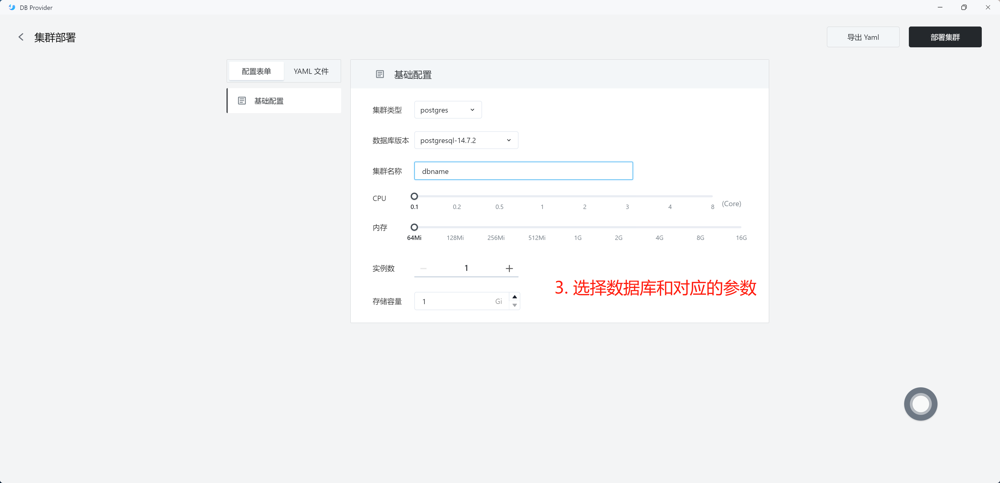
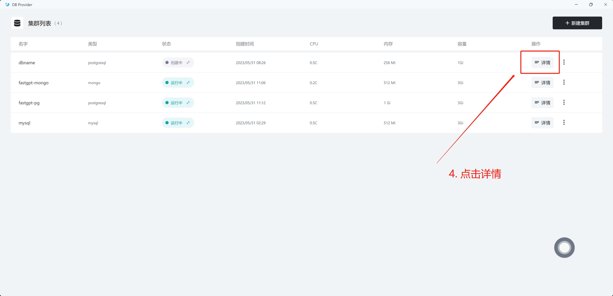
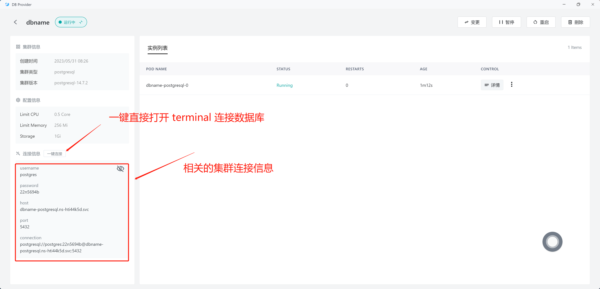
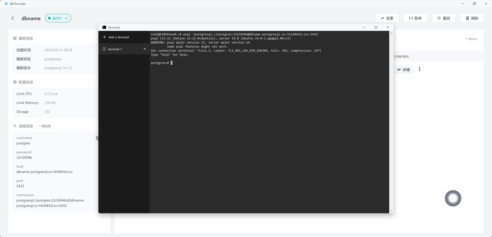

# 数据库

**数据库** 是一个应用的核心组成，Sealos 提供了一个数据库集群部署管理工具，可以帮助你快速部署数据库集群。目前支持 MySQL, PostgreSQL 和 MongoDB。目前 **数据库** 属于测试版本。

- [x] 集群 CRUD
- [x] 一键直连数据库
- [ ] 手动备份
- [ ] 自动备份
- [ ] 弹性伸缩
- [ ] 创建只读集群
- [ ] 可视化配置用户组和数据库组
- [ ] 可视化数据库管理
- [ ] 支持更多数据库和版本

## 快速开始

以部署一个 PostgreSQL 数据库为例，体验 **数据库** 的便捷性。

只需 6 步即可完成部署和访问：

1. 在 [Sealos](https://cloud.sealos.io) 桌面环境中进入 **数据库** 应用。

2. 点击新建集群。

3. 选择对应的数据库和参数。

4. 点击部署。
5. 进入 DB 查看详情。

6. 获取数据库访问参数。

7. 体验一键连接数据库。

