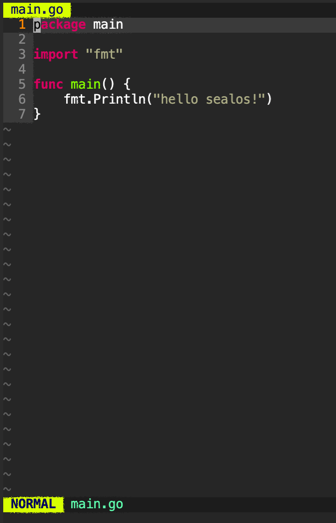

# cloud terminal 使用教程

cloud terminal 是一个跑在容器内的 web terminal, terminal 中已经配置好了用户的 .kube/config,
也包含了一些常用命令，几乎可以用来访问所有 sealos 已经提供的应用的 API.

tips: 目前 terminal 中不支持持久化文件，请务必保存好在里面编辑的一些文件。

## 访问 API server

terminal 中已经安装 kubectl, 也配置好用户的 kubeconfig.

```shell
root@thpqxr0bh:~# kubectl get pod
NAME                                                             READY   STATUS    RESTARTS   AGE
acid-test-0                                                      1/1     Running   0          37m
terminal-8b66134e-5294-480f-b6c4-00243fc2488e-5cdc66697c-d5tss   1/1     Running   0          40m
```

查看 .kube/config

```shell
root@thpqxr0bh:~# cat .kube/config 
apiVersion: v1
clusters:
- cluster:
    server: https://kubernetes.default.svc.cluster.local:443
  name: kubernetes
contexts:
- context:
    cluster: kubernetes
    user: 8b66134e-5294-480f-b6c4-00243fc2488e
    namespace: ns-8b66134e-5294-480f-b6c4-00243fc2488e
  name: 8b66134e-5294-480f-b6c4-00243fc2488e
current-context: 8b66134e-5294-480f-b6c4-00243fc2488e
kind: Config
preferences: {}
users:
- name: 8b66134e-5294-480f-b6c4-00243fc2488e
  user:
    token: eyJhbGciOiJSUzI1NiIsImtpZCI6IjItUWxyLUc3X0FiNjF...
```

这里如果把 server 地址修改成 https://cloud.sealos.io:6443 就可以远程访问 apiserver, 如使用你本地的 terminal,
或者集成到任意的 CI/CD 系统中，只需要把文件内容拷贝到客户端的  ~/.kube/config 目录即可

## 权限控制

当你尝试越权行为时：

```shell
root@thpqxr0bh:~# kubectl get node
Error from server (Forbidden): nodes is forbidden: 
User "system:serviceaccount:user-system:8b66134e-5294-480f-b6c4-00243fc2488e" 
cannot list resource "nodes" in API group "" at the cluster scope
```

用户是没有权限访问 node 的.

## 访问其它资源

可以通过 terminal 访问 数据库实例， 或者 sealos cloud provider 提供的多集群

```shell
root@thpqxr0bh:~# kubectl get infra
NAME    STATUS    AGE     AZ
aaa     Running   3d23h   cn-north-1b
fanux   Running   4d3h    cn-north-1b
test    Running   13d     cn-north-1b
root@thpqxr0bh:~# kubectl get cluster
NAME    AGE
aaa     3d23h
fanux   4d3h
test    13d
root@thpqxr0bh:~# kubectl get infra
NAME    STATUS    AGE     AZ
aaa     Running   3d23h   cn-north-1b
fanux   Running   4d3h    cn-north-1b
test    Running   13d     cn-north-1b
```

当然也可以删除或者编辑这些资源。

## 调试

terminal 还是非常好的调试工具，因为其本质也是运行在用户 ns 下的一个 pod，而且里面自带很多网络工具.

```shell
root@thpqxr0bh:~# nslookup acid-test
Server:         10.96.0.10
Address:        10.96.0.10#53

Name:   acid-test.ns-8b66134e-5294-480f-b6c4-00243fc2488e.svc.cluster.local
Address: 10.96.2.134

root@thpqxr0bh:~# ping 10.96.2.134
PING 10.96.2.134 (10.96.2.134) 56(84) bytes of data.
64 bytes from 10.96.2.134: icmp_seq=1 ttl=64 time=0.048 ms
64 bytes from 10.96.2.134: icmp_seq=2 ttl=64 time=0.069 ms
```

## 甚至可以在 terminal 中写代码


```shell
root@thpqxr0bh:~# vim main.go
root@thpqxr0bh:~# go run main.go 
hello sealos!
```