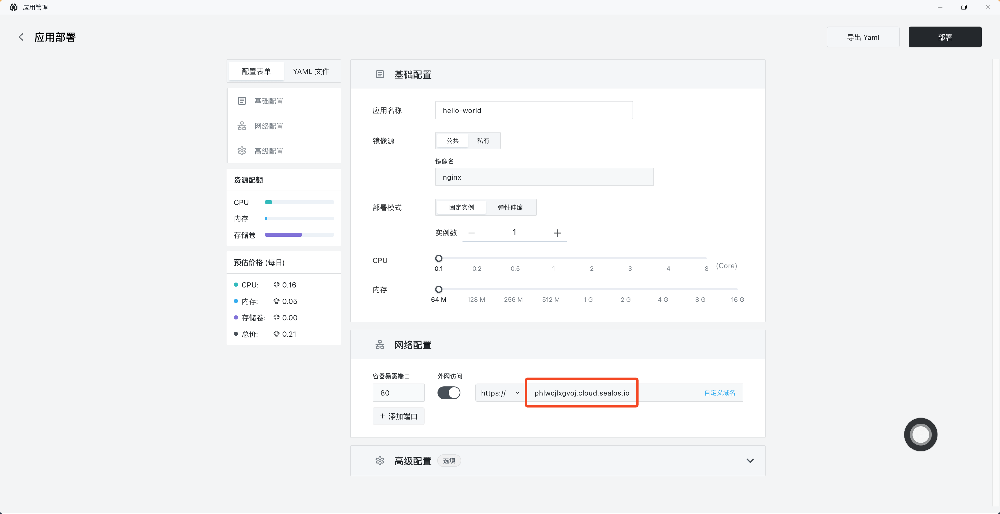

# 自定义域名

想让您的用户能够享受与您的品牌一致的专属体验？只需要在 [Sealos](https://cloud.sealos.io) 中为你的项目指定一个自定义域名。

## 部署时接入

如果您在部署应用时接入自定义域名，只需要在部署应用时打开「外网访问」，Sealos 会给您的应用自动分配一个外网域名。

然后需要到您的域名服务商处，添加该域名的 `CNAME` 解析到上面分配的外网域名。以阿里云为例：

等待解析生效后即可回到 Sealos 中绑定自定义域名，直接点击右侧的「自定义域名」：

在弹出的界面中输入您的自定义域名，然后点击确认即可。

最终点击右上角的「部署」开始部署应用，部署完成后点击外网地址即可通过自定义域名访问应用。

## 部署完成后接入

已经部署完成的应用可以在应用详情页面的右上角点击「变更」，然后参考之前的步骤接入自定义域名即可。