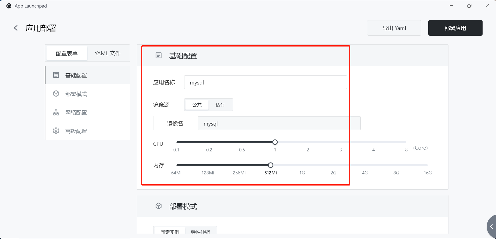
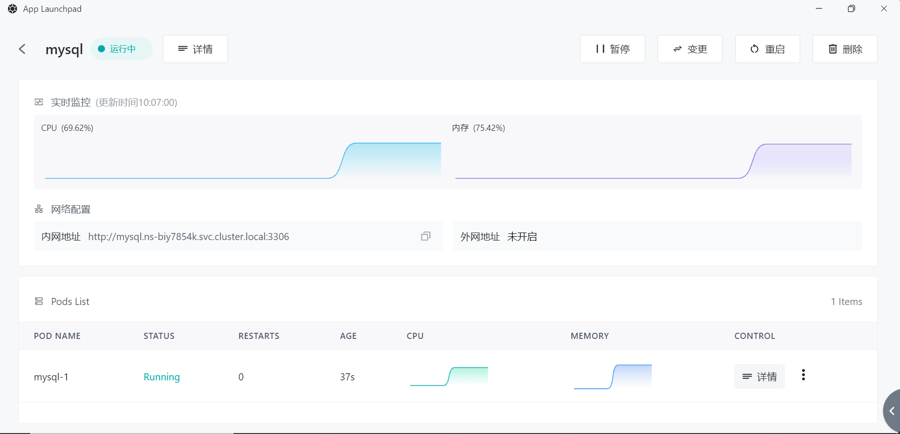
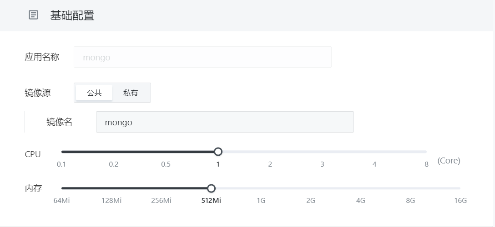

# 快速安装数据库——MySQL、MongoDB

数据库是数据管理的重要手段 , 可用于高效地存储和访问数据。MySQL 和 MongoDB 都是重要的开源数据库管理系统。MongoDB 是流行的 NoSQL 非关系数据库 , 提供高性能、高扩展性和自动冗余。 MongoDB 擅长存储文档型数据 , 处理半结构化数据 , 非常适合需要高性能读写的应用程序 , 例如用户存储、内容管理、日志存储等。

> Sealos 对数据库的快捷安装与配置具有良好的配置，下面将分别演示 Sealos 如何快速安装 MySQL 与 MongoDB

# 快速安装 MySQL

1. 打开 App Launchpad


2. 点击新建应用，进入应用安装的配置界面，完成基础配置设置



3. 将网络配置的容器暴露端口设置为 3306


4. 高级配置模块中，需要配置数据库的环境变量、添加数据卷

> 推荐设置的环境变量为 MYSQL_ROOT_PASSWORD、MYSQL_USER、MYSQL_PASSWORD、MYSQL_DATABASE
>
> MySQL 官方镜像的数据卷挂载地址为 /var/lib/mysql，不同镜像可能存在差异，可在镜像仓库中查看

需要注意的是，数据库实例的环境变量在创建时被设置，不会随后续变更操作而改变

```Plain
MYSQL_ROOT_PASSWORD     设置root密码
MYSQL_USER              设置用户名
MYSQL_PASSWORD          设置用户密码
MYSQL_DATABASE          设置初始化时创建的数据库
```

下面，给出一个配置示例

```Plain
MYSQL_ROOT_PASSWORD=123456    
MYSQL_USER=sealos
MYSQL_PASSWORD=123456
MYSQL_DATABASE=wordpress
```


5. 完成配置表单后，点击应用安装，等待应用安装成功



# 快速安装 MongoDB

1. 基础配置设置，示例选用官方镜像，默认版本为 latest，CPU 推荐配置 1c 以上，内存配置 521Mi 以上。



2. 网络配置中，设置 MongoDB 的端口号


3. 配置 MongoDB 存储空间

数据卷挂载地址为 `/data/db ` 与 `/data/configdb`


4. 安装 MongoDB


MongoDB 安装成功

**注：数据库的环境变量设置只在实例初次创建时被设置，无法通过变更操作来修改环境变量，若需要，请重新创建数据库实例。**