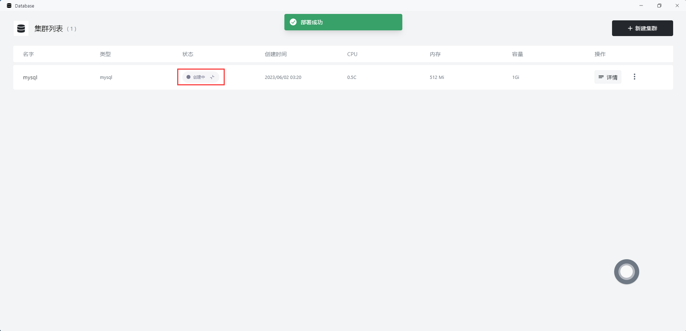
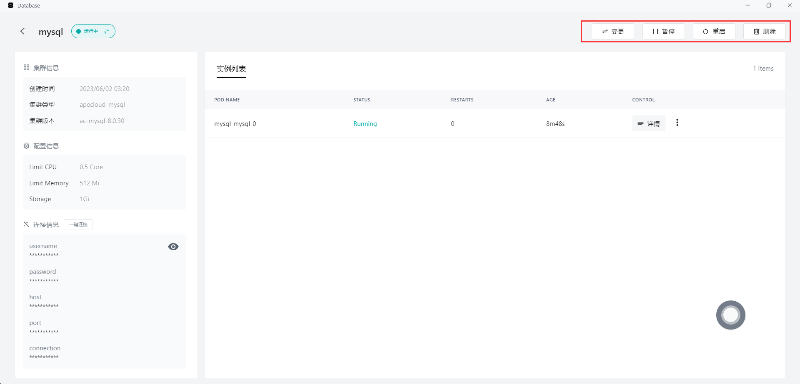

# 使用数据库快速安装 MySQL/PostgreSQL/MongDB

数据库是数据管理的重要手段 , 可用于高效地存储和访问数据。MySQL、PostgreSQL 和 MongoDB 都是重要的数据库管理系统。

* MySQL 是一个开源的关系型数据库管理系统，具有高性能、高可靠性和可扩展性的特点，同时也支持标准化的 SQL 语言和扩展的 SQL 语法。

* PostgreSQL 也是一个开源的关系型数据库管理系统，可以进行事务、并发控制和多版本控制，这些特性让 PostgreSQL 成为一个可靠、高效、安全的数据库解决方案。

* MongoDB 是一个基于文档存储的 NoSQL 数据库管理系统，支持灵活的数据建模、快速的读写速度，而且易于水平扩展，可以根据需求进行横向扩展，提供更好的性能和可用性。

> Sealos 对数据库的快捷安装与配置具有良好的支持，下面将用例子来演示 Sealos 如何快速安装 MySQL

# 快速安装 MySQL

1. 打开数据库

2. 点击新建数据库，完成基础配置设置

3. 点击部署集群，等待集群创建成功

4. 集群创建成功后，点击详情查看更多细节

5. 点击一键连接，就可以在命令行使用了

# 快速安装 PostgreSQL 和 MongoDB

PostgreSQL 和 MongoDB 数据库的安装和 MySQL 类似，需要在基础配置界面选择数据库的类型

