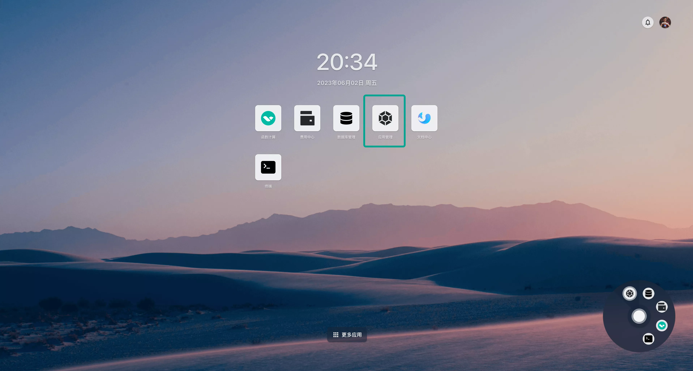
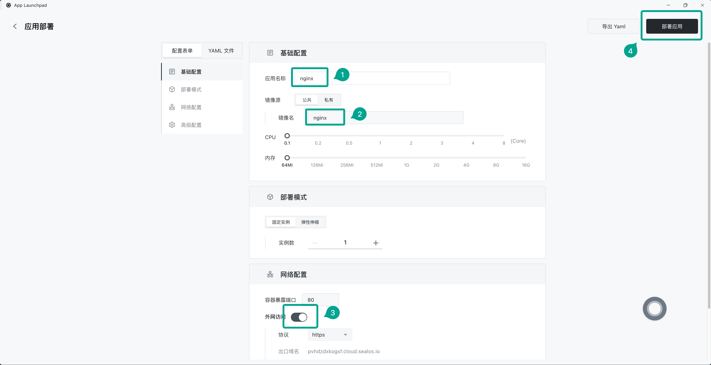
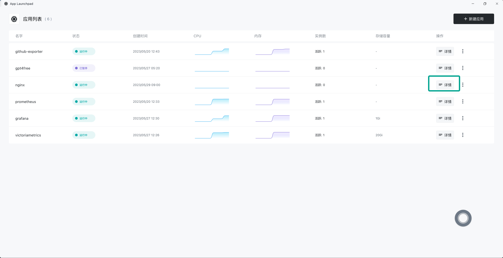
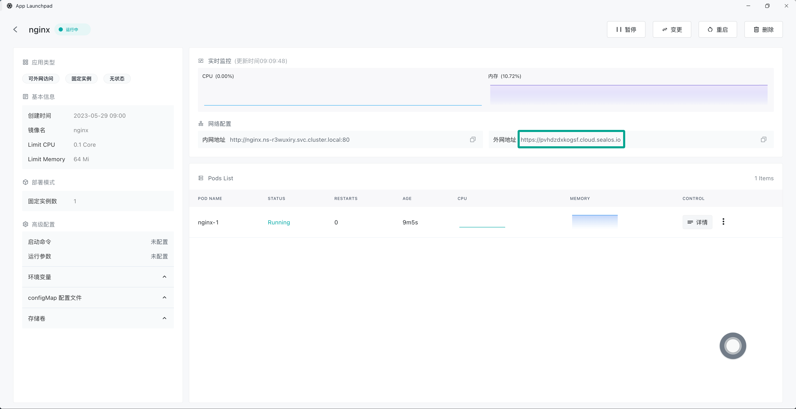
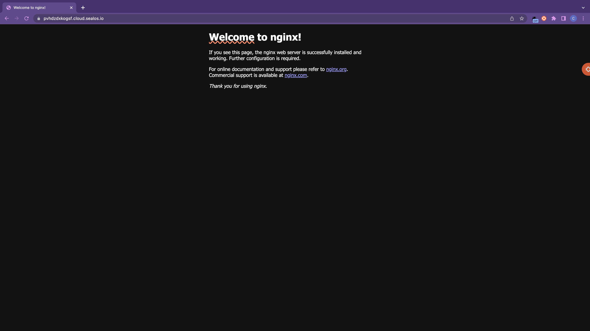
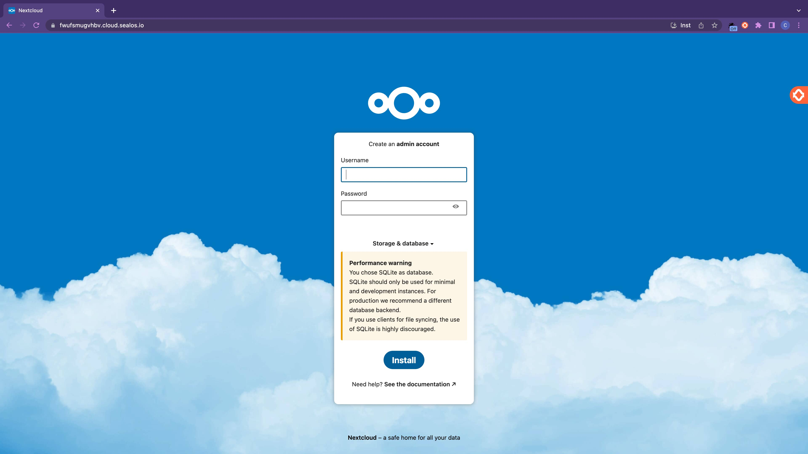
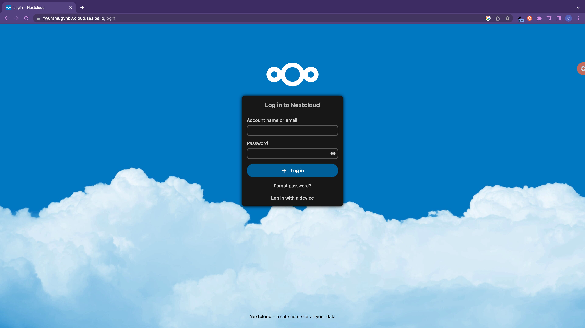

# 使用应用管理

Sealos 的桌面环境类似于单机操作系统 macOS 或 Windows 的桌面环境，桌面上的每个图标都是一个 App，类似于 Windows 的快捷方式。与单机操作系统一样，Sealos 也有系统自带的 App，要想在这个云操作系统中快速安装应用，就需要用到系统自带的 App：**应用管理**。

> 关于应用管理的详细信息请参阅 [应用管理介绍](/guides/applaunchpad/applaunchpad.md)

下面将演示如何在 Sealos 云操作系统中快速安装一些比较常见的应用。

## 快速安装 Nginx

首先在 [Sealos](https://cloud.sealos.run) 桌面环境中打开**应用管理**。

点击「新建应用」。

依次输入应用名和镜像名，并开启外网访问，最后点击「部署应用」即可。

部署完成后点击「详情」进入应用详情界面。

可以看到 Nginx 应用的运行情况，包括 CPU 占用、内存占用等。点击外网地址即可通过外网域名直接打开 Nginx 界面。

## 快速安装 Nextcloud

再来看一个例子，在**应用管理**中快速安装开源的私人网盘应用 Nextcloud。

与之前的例子一样，在**应用管理**中点击「新建应用」。依次输入应用名和镜像名，选择合适的 CPU 和内存，并开启外网访问。

Nextcloud 容器的所有数据都存储在 `/var/www/html` 这个目录下，因此我们需要将该目录下的数据通过外挂存储进行持久化。

继续往下，展开「高级配置」，在「本地存储」中点击「新增存储卷」。

选择外挂存储的容量，并填入存储挂载到应用中的路径，然后点击「确认」。

最后再点击右上角的「部署应用」，应用就安装完成了。

点击「应用详情」进入 Nextcloud 应用的详情页面，确认应用处于 Running 状态，然后点击外网地址直接打开 Nextcloud 的 Web 界面。

设置用户名和密码之后点击「Install」开始安装。稍等片刻安装完成后直接刷新页面。

输入用户名密码即可登录成功。

