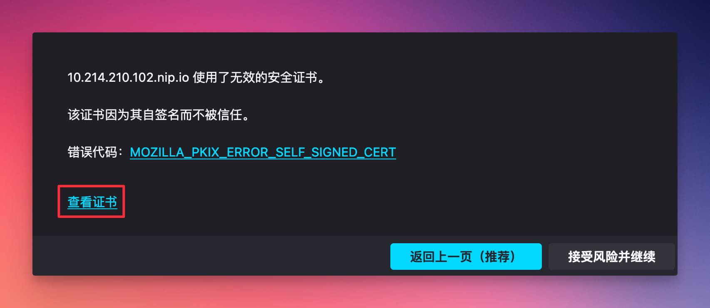
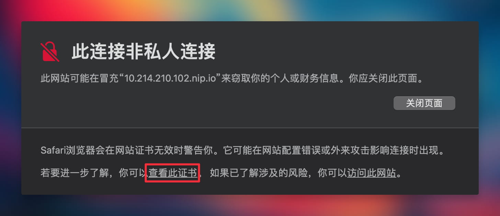
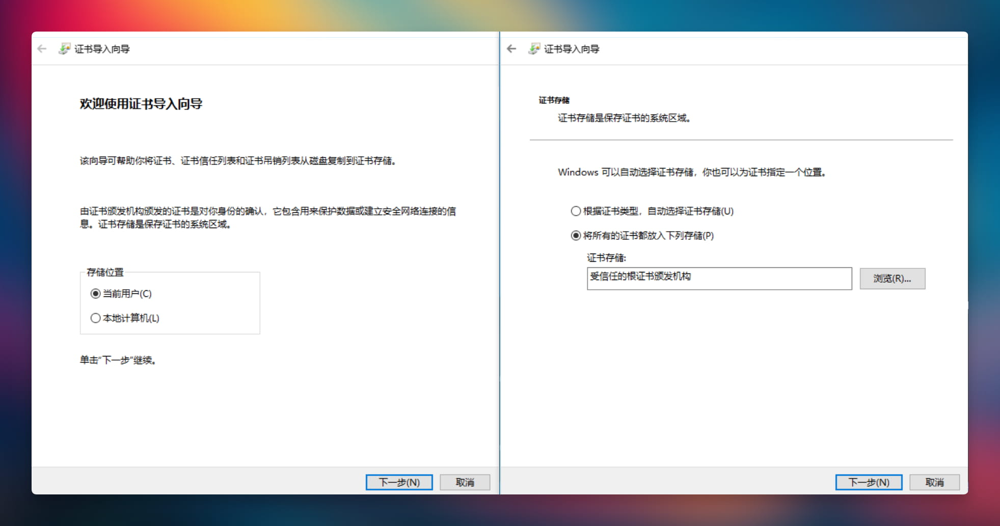
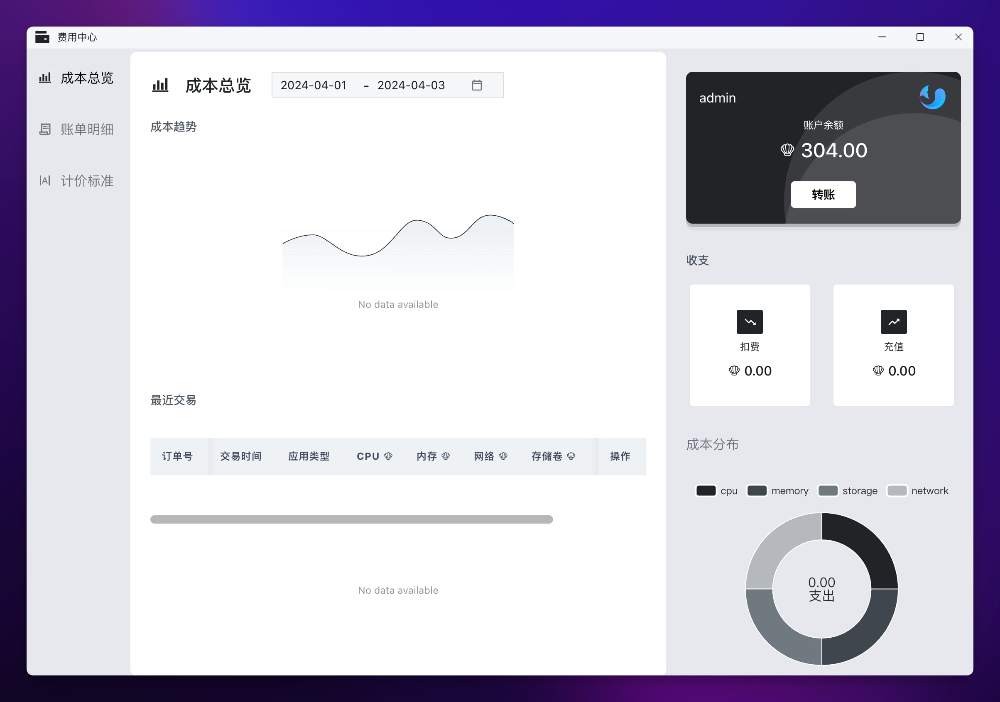

import Tabs from '@theme/Tabs';
import TabItem from '@theme/TabItem';

# Sealos 集群部署

export const Highlight = ({children, color}) => (
  <span
    style={{
      backgroundColor: color,
      borderRadius: '2px',
      color: '#fff',
      padding: '0.2rem',
    }}>
    {children}
  </span>
);

:::tip

大规模集群以及企业生产环境强烈建议使用 [<Highlight color="#1877F2">Sealos 私有云的企业版或者定制版</Highlight>](/self-hosting)。

:::

## 准备工作

### 服务器

以下是一些基本的要求：

- 每个集群节点应该有不同的主机名。
- 所有节点的时间需要同步。
- 建议使用干净的操作系统来创建集群。**不要自己装 Docker！**
- 支持大多数 Linux 发行版，例如：Ubuntu、Debian、CentOS、Rocky linux。
- **系统内核版本在 5.4 及以上**。
- **必须使用 root 用户安装！**

推荐配置：

推荐使用 Ubuntu 22.04 LTS 操作系统，内核版本在 5.4 及以上，配置如下：

| 操作系统             | 内核版本  | CPU | 内存   | 存储    | Masters | Nodes |
|------------------|-------|-----|------|-------|---------|-------|
| Ubuntu 22.04 LTS | ≥ 5.4 | 8C  | 16GB | 100GB | 奇数台     | 任意    |

:::info注意
Kubernetes 和 Sealos Cloud 的系统组件在每个 Master 节点上大约需要 2 核心（2c）和 2GB 内存（2g），在每个 Node 节点上则需要大约
1 核心（1c）和 1GB 内存（1g），请确保集群中每个节点都有足够的计算资源以支持系统组件的运行。
:::

### 网络

+ 所有节点之间网络互通；
+ 需要在 Kubernetes 集群的**第一个 Master 节点**上执行脚本，目前**集群外的节点不支持集群安装**；
+ 所有节点之间可以互相通信。

### 域名

+ 需要一个域名用于访问 Sealos 及相关服务；
+ 如果您没有域名，可以使用 `nip.io` 提供的免费域名服务。

### 证书

Sealos 需要使用证书来保证通信安全，默认在您不提供证书的情况下我们会使用 [cert-manager](https://cert-manager.io/docs/) 来自动签发证书。

如果您能提供证书，证书需要解析下列域名 (假设您提供的域名为：cloud.example.io)：

- `*.cloud.example.io`
- `cloud.example.io`

## 安装步骤

为了便于部署，我们提供了一个一键安装脚本。该脚本可以从零开始部署 Sealos 集群，也可以在已有的 Kubernetes 集群上部署 Sealos
集群（在已有集群上执行时请谨慎操作）。

:::info注意

该脚本只支持在 “使用 Sealos 安装的 Kubernetes 集群” 上部署 Sealos 集群，暂不支持其他方式部署的 Kubernetes。

关于如何使用 Sealos 部署 Kubernetes
集群，可以参考：[安装 Kubernetes 集群](/self-hosting/lifecycle-management/quick-start/deploy-kubernetes.md)
，支持 [Docker Hub](https://hub.docker.com/r/labring/kubernetes/tags) 中的几乎所有 Kubernetes 版本（**暂不支持 1.28 及以上版本
**）。

:::

如果您的机器还没有安装过 Kubernetes，**建议直接使用该脚本连同 Kubernetes 和 Sealos 集群一起安装。**

根据您的域名情况，可以分为以下几种安装方式：

### 1、无公网域名，也不想自定义域名

如果您没有公网域名，也不需要自定义域名，可以选择直接使用 `nip.io` 提供的免费域名服务。`nip.io` 是一个免费的通配符 DNS 服务，它可以将动态分配的 IP 地址映射到一个固定的子域名上，特别适合用于本地开发环境。具体的工作原理为：

您可以使用任何 IP 地址作为 `nip.io` 子域名的一部分，而 `nip.io` 会将它解析回相应的 IP 地址。例如，如果你有一个内网 IP 地址 `192.168.1.10`，你可以使用 `192.168.1.10.nip.io` 作为域名，所有向这个域名发送的请求都会被解析到 `192.168.1.10` 这个 IP 地址上。这样就无需修改本地 hosts 文件，也不需要搭建内网 DNS 服务，直接通过这个域名就能访问内网服务了。

使用 nip.io 作为 Sealos 的域名非常简单，只需在第一个 Master 节点上执行以下命令，并根据提示输入参数：

```bash 
$ curl -sfL https://mirror.ghproxy.com/https://raw.githubusercontent.com/labring/sealos/v5.0.0/scripts/cloud/install.sh -o /tmp/install.sh && bash /tmp/install.sh \
  --cloud-version=v5.0.0 \
  --image-registry=registry.cn-shanghai.aliyuncs.com --zh \
  --proxy-prefix=https://mirror.ghproxy.com
```

当需要你输入 Sealos Cloud 域名时，你需要输入这种格式的域名：`[ip].nip.io`，其中 [ip] 是你的 Master 节点 IP。

安装完成后，终端会输出 Sealos 访问域名以及用户名和密码，例如：

```bash
Sealos cloud login info:
Cloud Version: latest
URL: https://10.214.210.102.nip.io
admin Username: admin
admin Password: sealos2023
```

### 2、有公网域名，想公网访问

如果你有自己的公网域名，并且想通过公网访问 Sealos，那你就需要准备好公网受信任的 SSL/TLS 证书。你可以通过 acme.sh 等工具自动签发证书，也可以从域名提供商处下载免费证书或者购买商业证书。

:::info注意
如果你的公网 IP 在国内，那么域名必须要备案！
:::

准备好域名证书后，需要将证书放到第一个 Master 节点的某个目录中，例如 `/root/certs/`。

:::info注意

您还需要在域名服务商处添加一条该域名的 A 记录，地址解析到第一个 Master 节点的公网 IP 地址。同时还需要添加一条泛解析记录，将该域名的子域名也解析到第一个 Master 节点的公网 IP 地址。

例如 (假设你的域名是 `cloud.example.io`，假设你的 Master 节点公网地址是 `192.168.1.10`)：

```bash
cloud.example.io   A   192.168.1.10
*.cloud.example.io   A   192.168.1.10
```

:::

然后在第一个 Master 节点上执行以下命令，并根据提示输入参数：

```bash
$ curl -sfL https://mirror.ghproxy.com/https://raw.githubusercontent.com/labring/sealos/v5.0.0/scripts/cloud/install.sh -o /tmp/install.sh && bash /tmp/install.sh \
  --cloud-version=v5.0.0 \
  --image-registry=registry.cn-shanghai.aliyuncs.com --zh \
  --proxy-prefix=https://mirror.ghproxy.com \
  --cloud-domain=<your_domain> \
  --cert-path=<your_crt> \
  --key-path=<your_key>
```

+ `<your_domain>` 需要替换成你自己的公网域名。
+ `<your_crt>` 需要替换成你的证书位置，通常是 `.crt` 或 `.pem` 文件。例如：`/root/certs/example.crt`。
+ `<your_key>` 需要替换成你的私钥位置，通常是 `.key` 或 `.pem` 文件。例如：`/root/certs/example.key`。

### 3、有公网域名，想内网访问

如果您有自己的公网域名，但是只有内网 IP，或者只想在内网访问 Sealos，那您只需要在域名服务商处添加一条该域名的 A 记录，地址解析到第一个 Master 节点的内网 IP 地址。同时还需要添加一条泛解析记录，将该域名的子域名也解析到第一个 Master 节点的内网 IP 地址。

例如 (假设你的域名是 `cloud.example.io`，假设你的 Master 节点内网地址是 `192.168.1.10`)：

```bash
cloud.example.io   A   192.168.1.10
*.cloud.example.io   A   192.168.1.10
```

然后在第一个 Master 节点上执行以下命令，并根据提示输入参数：

```bash
$ curl -sfL https://mirror.ghproxy.com/https://raw.githubusercontent.com/labring/sealos/v5.0.0/scripts/cloud/install.sh -o /tmp/install.sh && bash /tmp/install.sh \
  --cloud-version=v5.0.0 \
  --image-registry=registry.cn-shanghai.aliyuncs.com --zh \
  --proxy-prefix=https://mirror.ghproxy.com \
  --cloud-domain=<your_domain>
```

其中 `<your_domain>` 需要替换成你自己的公网域名。

安装过程中 Sealos 会使用 [cert-manager](https://cert-manager.io/docs/) 来自签名证书。

### 4、无公网域名，但想自定义域名

如果您没有公网域名，但是需要自定义域名，那么就需要在内网自建 DNS，然后将自定义域名解析到第一个 Master 节点的内网 IP 地址。

:::note

假设您的第一个 Master 节点的内网 IP 地址为 `192.168.1.10`。假设您的域名为 `cloud.example.io`。

:::

可以考虑使用 CoreDNS 来自建 DNS 服务，参考配置：

```nginx
(global_cache) {
    cache {
        # [5, 60]
        success 65536 3600 300
        # [1, 10]
        denial 8192 600 60
        prefetch 1 60m 10%
    }
}

.:53 {
  errors
  health
  ready

  import global_cache

  template IN A cloud.example.io {
    answer "{{ .Name }} 60 IN A 192.168.1.10"
    fallthrough
  }

  forward . 223.5.5.5

  log
  loop
  reload 6s
}
```

这样不管您访问 `cloud.example.io` 还是 `*.cloud.example.io` 都会解析到第一个 Master 节点的内网 IP 地址。

然后在第一个 Master 节点上执行以下命令，并根据提示输入参数：

```bash
$ curl -sfL https://mirror.ghproxy.com/https://raw.githubusercontent.com/labring/sealos/v5.0.0/scripts/cloud/install.sh -o /tmp/install.sh && bash /tmp/install.sh \
  --cloud-version=v5.0.0 \
  --image-registry=registry.cn-shanghai.aliyuncs.com --zh \
  --proxy-prefix=https://mirror.ghproxy.com \
  --cloud-domain=<your_domain>
```

其中 `<your_domain>` 需要替换成你自己的自定义域名。

安装过程中 Sealos 会使用 [cert-manager](https://cert-manager.io/docs/) 来自签名证书。

## 信任自签名证书

如果您选择了上面提供的安装方式中的 1 或 3 或 4，那么您的证书默认是不受浏览器信任的，当你访问 Sealos Cloud 时，浏览器会提示下面的信息：


即使点击继续访问，进入 Sealos Cloud 之后也无法正常显示 App 图标，无法打开 App。


我们需要导出自签名证书，并让系统信任自签名证书。步骤如下。

### 导出自签名证书

各个浏览器导出自签名证书的步骤略有不同。以下是在一些常用浏览器中导出自签名证书的步骤：

#### Chrome (以及基于 Chromium 的浏览器如新版 Edge 和 Brave)

1. 在浏览器地址栏左侧点击 “不安全” 字样。
2. 点击 “证书无效”，这将打开一个证书信息窗口。
3. 在打开的证书窗口中，切换到 “详细信息” 标签页。
4. 在 “详细信息” 标签页中，找到并点击 “导出”。
5. 选择一个文件名和保存位置，然后完成导出过程。

#### Firefox

1. 点击页面中的 “高级”。

   

2. 然后点击 “查看证书”。

   

3. 在证书页面中点击 “PEM (证书)”。

   

#### Safari

1. 点击页面中的 “显示详细信息”。

   

2. 然后点击 “查看此证书”。

   

3. 在证书视图中，可以看到一个带有证书链的窗口。

   

4. 拖动红框圈出来的证书到桌面或文件夹中，证书就会被导出了。

### 信任自签名证书

#### macOS

在 macOS 上信任自签名证书可以使用以下命令：

```bash
# 假设证书保存在 ~/Downloads/10.214.210.102.nip.io.cer
$ sudo security add-trusted-cert -d -r trustRoot -k /Library/Keychains/System.keychain ~/Downloads/10.214.210.102.nip.io.cer
```

您也可以通过以下步骤来操作：

##### 1、添加证书到钥匙串

1. 启动**钥匙串访问** (Keychain Access) 应用程序，点击左侧 “系统钥匙串” 下方的 “系统” 类别。
2. 然后打开 “访达”，进入证书保存位置，**双击证书文件**：这通常是一个 `.cer`，`.crt`，或 `.pem` 文件。
3. 输入您的用户名和密码以允许修改。
4. 证书现在应该已经被添加到您的钥匙串中。

##### 2、信任证书

1. 在钥匙串访问中，从 “系统” 类别的列表中找到刚刚添加的自签名证书，并双击它。
2. 在打开的窗口中，展开 “信任” 部分。
3. 在 “当使用此证书时” 选项旁边，有一个下拉菜单，默认设置可能是 “使用系统默认值”。要信任证书，请改为 “始终信任”。
4. 关闭证书信息窗口，系统可能会提示您验证您的用户名和密码，以确认更改。
5. 现在，证书已经被标记为受信任。

:::info注意

自签名证书不由第三方证书颁发机构 (CA) 颁发，因此，其他设备也不会信任该证书。如果您是在公司或组织内部使用自签名证书，可能需要在每个需要信任此证书的设备上手动进行上述步骤。

:::

#### Windows

1. 在根证书文件点鼠标右键，选择 “安装证书”。
2. 选择 “当前用户” 或者 “本地计算机”，下一步
3. “将所有的证书都放入下列存储”，“浏览”，“受信任的根证书颁发机构”，“确定”，下一步。
4. 完成，“是”，确定。



#### Linux

Linux 不同发行版更新根证书存储的命令不一样，用来保存私有证书的路径也不一样。需要先复制自签名 CA 证书到特定路径，再运行命令更新根证书存储。

<Tabs>
  <TabItem value="Debian/Ubuntu/Gentoo">

  ```bash
  # Debian/Ubuntu/Gentoo
  # - 安装
  $ sudo cp root_ca.crt /usr/local/share/ca-certificates/root_ca.crt
  # update-ca-certificates 会添加 /etc/ca-certificates.conf 配置文件中指定的证书
  #   另外所有 /usr/local/share/ca-certificates/*.crt 会被列为隐式信任
  $ sudo update-ca-certificates
  
  # - 删除
  $ sudo rm /usr/local/share/ca-certificates/root_ca.crt
  $ sudo update-ca-certificates --fresh
  ```

  </TabItem>
  <TabItem value="CentOS/Fedora/RHEL">

  ```bash
  # CentOS/Fedora/RHEL
  $ yum install ca-certificates
  # 启用动态 CA 配置功能：
  $ update-ca-trust force-enable
  $ cp root_ca.crt /etc/pki/ca-trust/source/anchors/
  $ update-ca-trust
  ```

  </TabItem>
  <TabItem value="Alpine">

  ```bash
  # Alpine
  $ apk update && apk add --no-cache ca-certificates
  $ cp root_ca.crt /usr/local/share/ca-certificates/
  $ update-ca-certificates
  ```

  </TabItem>
  <TabItem value="OpenSUSE/SLES">

  ```bash
  # OpenSUSE/SLES
  $ cp root_ca.crt /etc/pki/trust/anchors/
  $ update-ca-certificates
  ```

  </TabItem>
</Tabs>

## 激活集群

集群安装完成后，需要激活集群，步骤如下：

1. 首先点击桌面的「许可证」打开许可证应用：

   

2. 然后点击出现的页面左侧的「激活/购买」：

   

   然后浏览器会跳转到 License 页面：

   

3. 如果你还没有在该页面创建过集群，就点击左上角-价格-获取，立即开始创建一个集群；如果你已经创建过集群了，只需要点击「我的集群」便会跳转到已有集群。

4. 新购买一个集群后，点进进入会看到新购买的集群显示-未激活：

   

   点击集群管理，在集群激活处输入一个集群id（自取，不能和他人重复），输入完成后点击激活即可成功激活集群。

   

   5.成功激活集群后，集群管理的右侧会出现License管理选项，点击进入，在License列表下面导出License：

   

   

   6.导出License后，回到 Sealos 集群的「许可证」应用界面，点击「上传 License 文件」：

   

   选择刚刚下载的 License 文件进行上传，然后点击右下角的「激活 License」，便可激活 License。

   