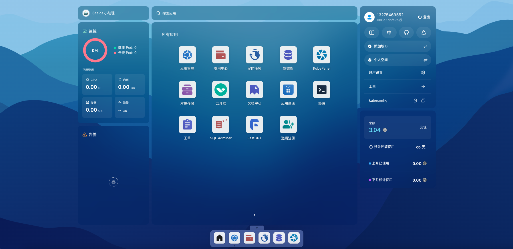
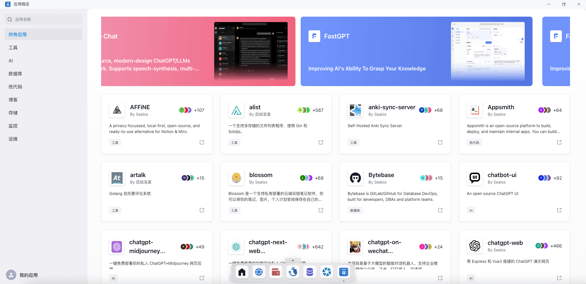
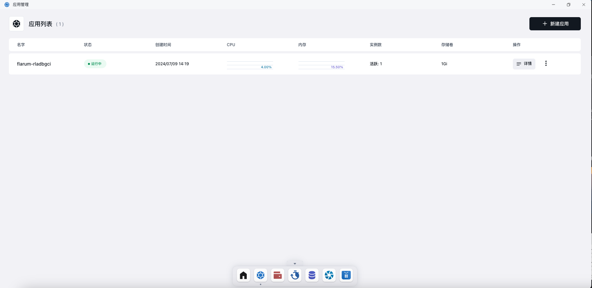
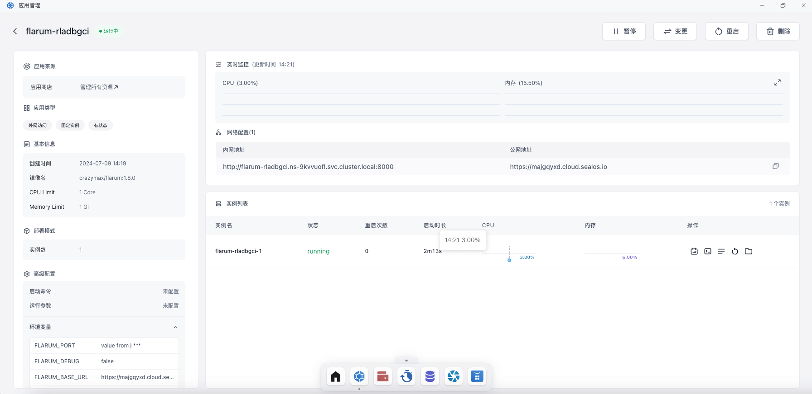
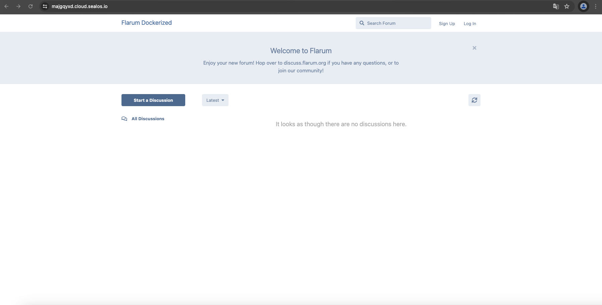

# 部署的第一个应用

Flarum是一款简洁优雅,功能强大的论坛软件。以Flarum为例，介绍如何使用Sealos来部署应用。

首先进入到Sealos公有云网站,登陆之后会看到如下图所示的桌面环境：

点击进入应用商店，就可以看到应用列表：

在右上角搜索Flarum，搜索完成之后点击进入，可以看到完整的应用信息：

点击部署应用，无需任何配置，略作等待之后就可以部署成功。

之后进入应用管理就可以看到自己刚刚部署的应用了。

点击详情可以查看每个应用的详细信息，包括实例数，CPU,存储，网络等等。

直接点击公网地址即可访问跳转。

# 部署更多强大应用

跳转 案例 部分的链接，如：

部署拔测系统（）

# 其他部分链接
