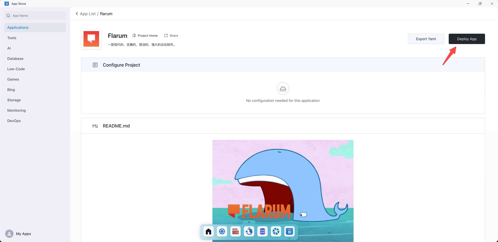

# 部署的第一个应用

flarum是一款简洁优雅,功能强大的论坛软件。

本文以flarum为例，介绍如何使用Sealos来部署应用。

首先进入到Sealos公有云网站,登陆之后会看到如下图所示的桌面环境：

点击应用商店app，就可以看到如下图所示的应用列表：

在右上角搜索flarum，搜索完成之后点击进入，可以看到如下图所示的完整应用信息：

点击部署应用，无需任何配置，略作等待之后就可以部署成功。

之后进入应用管理就可以看到自己刚刚部署的应用了。

点击详情可以查看每个应用的详细部署信息，包括实例数，CPU,存储，网络等等。

直接点击系统分类的公网链接地址就可以进行访问了。

