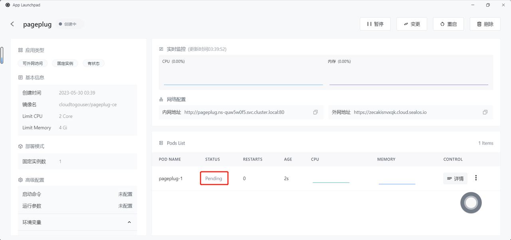

# 快速安装 PagePlug

[PagePlug](https://github.com/cloudtogo/pageplug) 是 [Appsmith](https://github.com/appsmithorg/appsmith) 的中国化项目，基于 Appsmith 做了整体性能优化及汉化，也集合了特色表单解决方案 Formily 组件、图表解决方案 Echarts 组件、低代码小程序开发等，是面向研发使用的一个开源的、声明式的、可视化的、符合开发者直觉的前端低代码框架。

## 步骤 1：在 [Sealos](https://cloud.sealos.io) 桌面环境中打开 「应用管理」 应用

## 步骤 2：新建应用

- 在 「应用管理」 中，点击「新建应用」来创建一个新的应用。

## 步骤 3：应用部署

- 基础配置：
  
  - 应用名称（自定义）：pageplug
  
  - 镜像名（默认最新版本）：cloudtogouser/pageplug-ce
  
  - CPU（推荐）：2 Core
  
  - 内存（推荐）：4 G

- 部署模式：
  
  - 实例数（自定义）：1

- 网络配置：
  
  - 容器暴露端口：80
  
  - 外网访问：开启

- 高级配置：
  
  - 自定义本地存储，持久化 PagePlug 的数据。

## 步骤 4：部署应用

- 点击「部署应用」开始部署应用。

## 步骤 5：访问应用

- 点击「详情」查看，当应用的 STATUS 由 Pending 变为 Running，则表明该应用已成功启动。

- 当 STATUS 为 Running，即可直接访问外网地址。

- 若访问出现 503 异常，等待一会重试即可。

- 访问成功！

