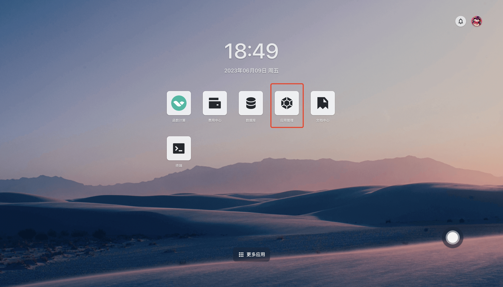
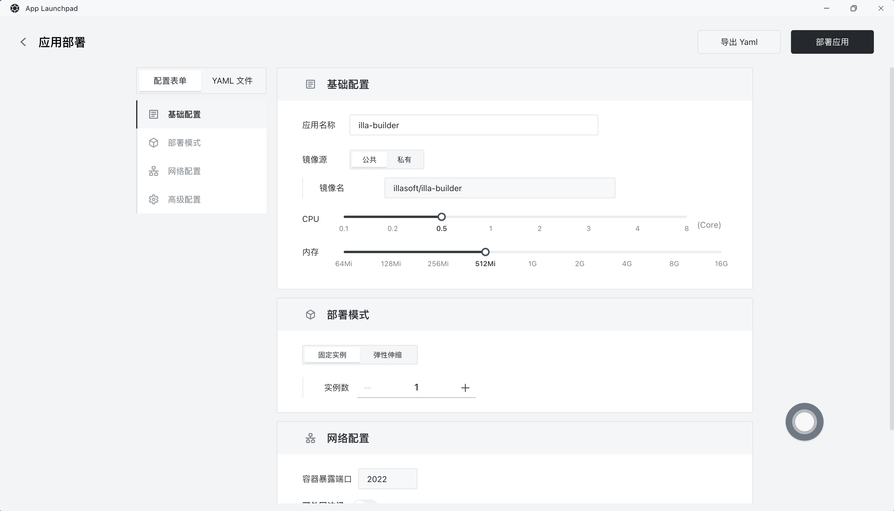
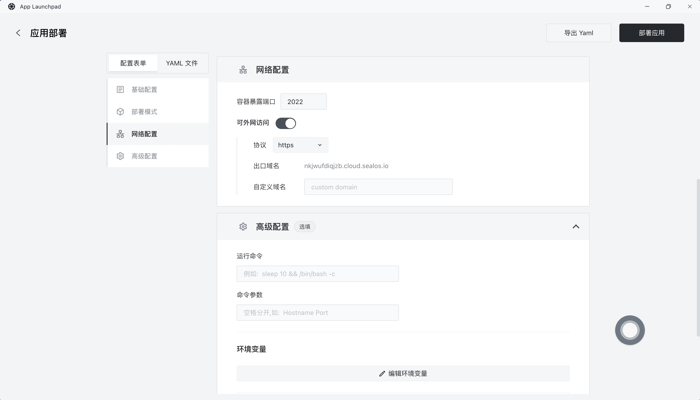
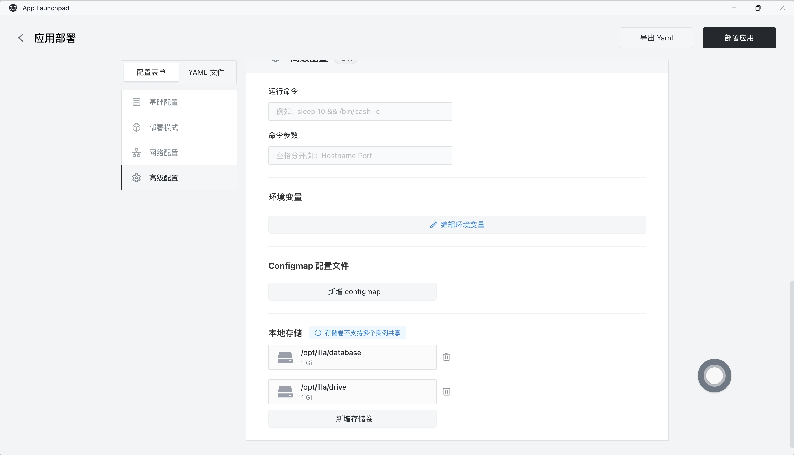
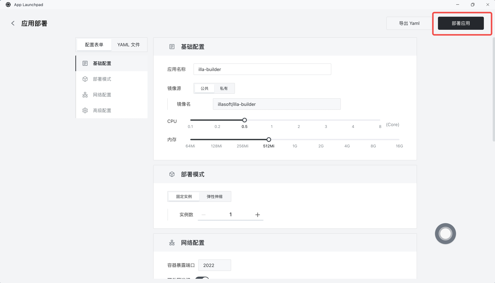
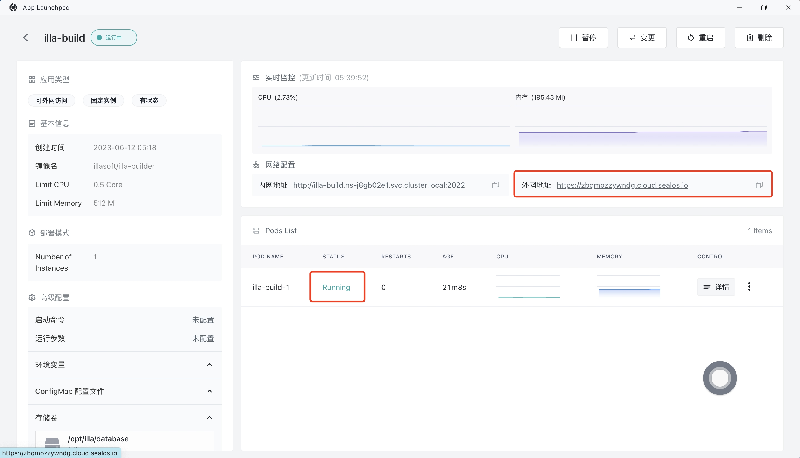

# 快速安装 ILLA Cloud

[ILLA Cloud](https://www.illacloud.com/zh) 是一个开源的低代码平台，使用户能够创建、部署和管理内部应用程序。通过 ILLA Cloud，您可以使用直观的拖放组件来灵活地构建各种应用程序，从基本的 CRUD 应用程序到更复杂的多步骤工作流程。

## 步骤 1：在 [Sealos](https://cloud.sealos.io) 桌面环境中打开 「应用管理」 应用

## 步骤 2：新建应用

- 在 「应用管理」 中，点击「新建应用」来创建一个新的应用。

## 步骤 3：应用部署

- 基础配置：

  - 应用名称（自定义）：illa-builder

  - 镜像名（默认最新版本）：illasoft/illa-builder

  - CPU（推荐）：0.5 Core

  - 内存（推荐）：512 MB

- 部署模式：

  - 实例数（自定义）：1

- 注意：我们这里使用的是最低配置，您可以根据自己的需求加大配置。

- 网络配置：

  - 容器暴露端口：2022

  - 外网访问：开启

- 注意：空白的域名可以运行 ILLA Cloud，但您也可以使用自己的域名。

- 高级配置：

  - 自定义本地数据库和磁盘（最低 1G）。

## 步骤 4：部署应用

- 点击「部署应用」开始部署应用。

## 步骤 5：访问应用

- 点击「详情」查看，当应用的 STATUS 由 Pending 变为 Running，则表明该应用已成功启动。

- 当 STATUS 为 Running，即可直接访问外网地址。

- 访问成功！

