# 快速安装 Tailchat

[Tailchat](https://tailchat.msgbyte.com/) 是一款插件化易拓展的开源 IM 应用。可拓展架构赋予 Tailchat 无限可能性。

前端微内核架构 + 后端微服务架构 使得 Tailchat 能够驾驭任何定制化/私有化的场景

面向企业与私域用户打造，高度自由的群组管理与定制化的面板展示可以让私域主能够更好的展示自己的作品，管理用户，打造自己的品牌与圈子。

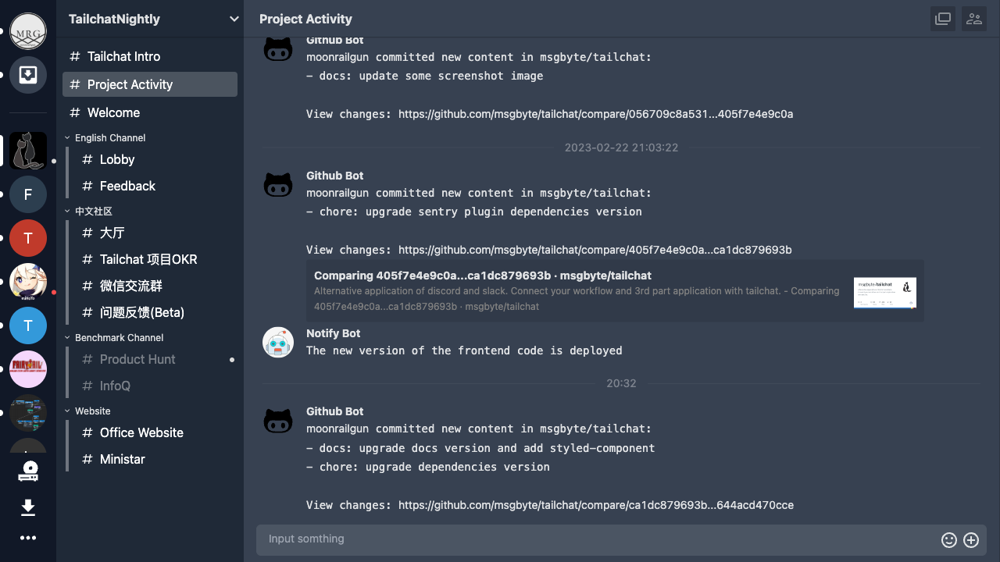


## 首先在 [Sealos](https://cloud.sealos.io) 桌面环境中打开「应用管理」

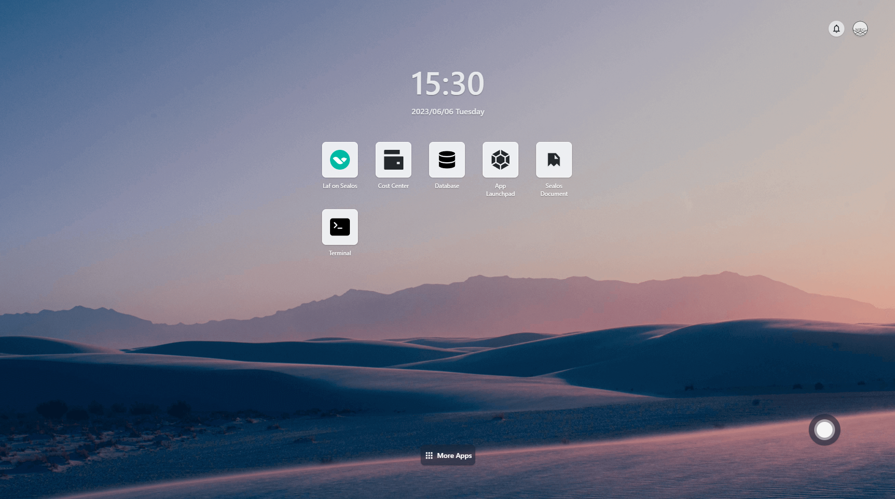

## 新建应用

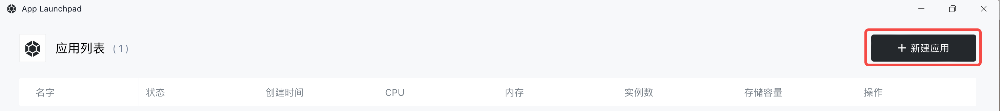

### 创建依赖

`tailchat` 作为企业级的应用，最小依赖: `mongodb`, `redis`, `minio`.

接下来让我们来一一创建。

#### mongodb

为了方便起见我们固定一个实例，并且为数据库绑定本地存储。

使用的镜像是 `mongo:4`

需要注意的是因为我没有给数据库设置密码，因此不要对外网提供网络服务。容器暴露端口填数据库默认服务端口 `27017` 即可

内容如下:

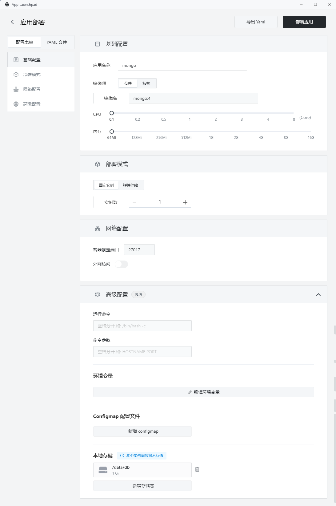

点击部署应用提交部署

耐心等待一会，就可以看到应用已经启动起来了

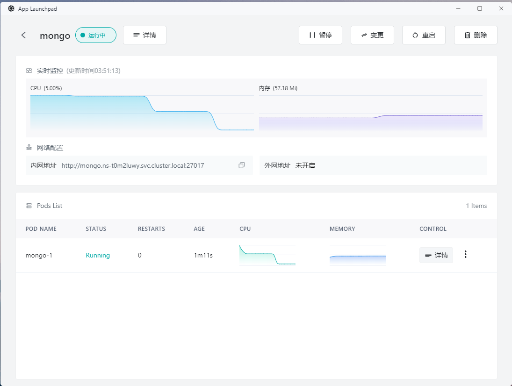

> 需要注意的是初始分配的64m对于mongodb来说实在太小了，所以通过变更应用改为了128m。可以随时分配资源大小这也是sealos/k8s很方便的一点

#### minio

接下来我们创建minio, minio是一个开源的对象存储服务。我们同样可以通过`sealos`的点点点来快速创建

使用的镜像是: `minio/minio`

需要注意的是我们要进行一些调整:

- 暴露端口: 9000
- 运行命令改为: `minio`
- 命令参数改为: `server /data`
- 设置环境变量: 
  - MINIO_ROOT_USER: tailchat
  - MINIO_ROOT_PASSWORD: com.msgbyte.tailchat
- 本地存储: `/data`

最终结果如下:

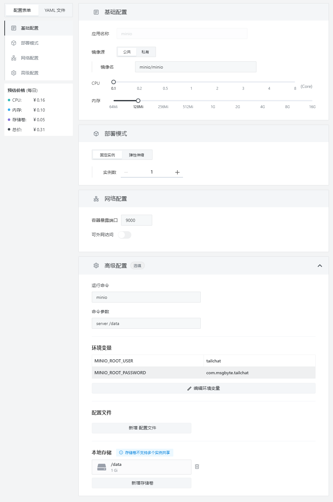

点击部署按钮同样看到服务已经正常启动起来了。

#### redis

最后我们需要部署redis作为内容缓存与信息转发。

使用镜像: `redis:alpine`

暴露端口: `6379`

最终结果如下:

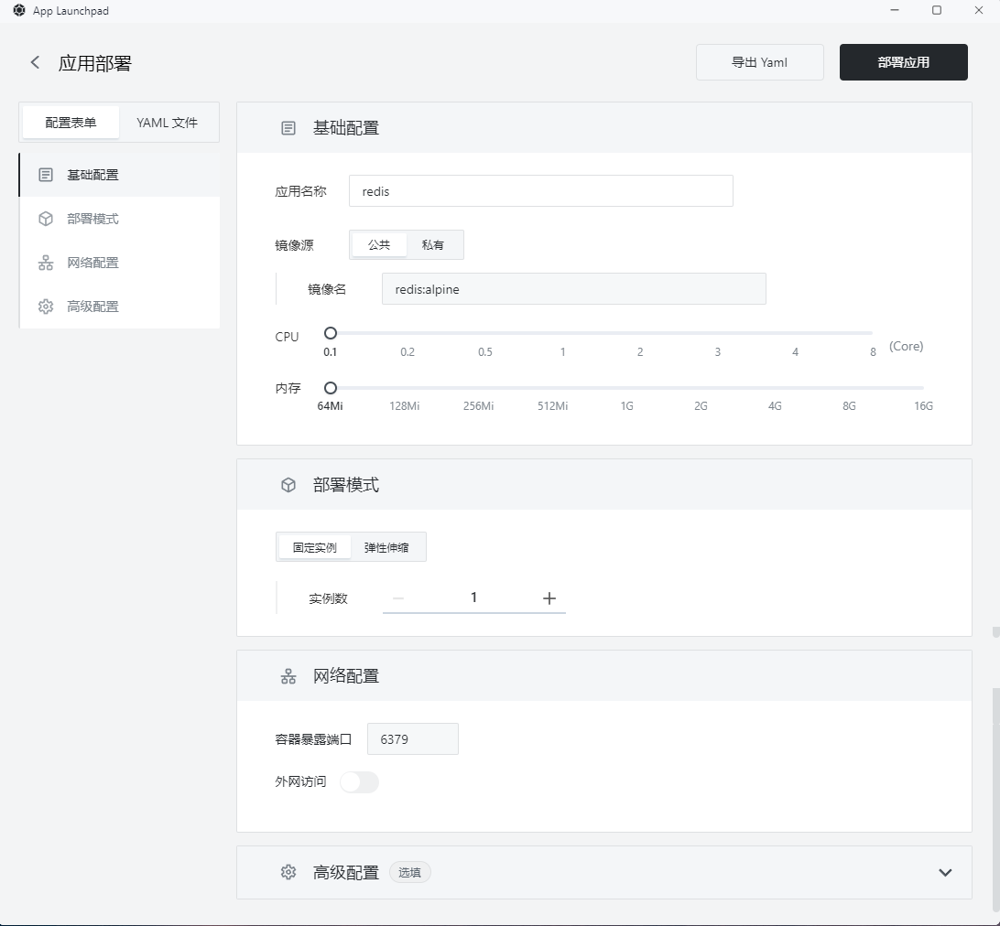


### 创建 Tailchat 本体

此时Tailchat所需要的依赖均已部署完毕，如下:

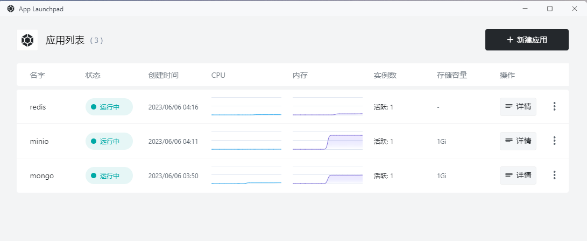

现在我们来部署 `Tailchat` 本体。

`Tailchat` 的本体会相对复杂一点，不过因为`sealos`纯UI操作也不会太过复杂。

- 使用镜像: `moonrailgun/tailchat`
- 暴露端口: `11000`(记得要打开外网访问)
- 配置环境变量如下:
  ```
  SERVICEDIR=services,plugins
  TRANSPORTER=redis://redis:6379
  REDIS_URL=redis://redis:6379
  MONGO_URL=mongodb://mongo/tailchat
  MINIO_URL=minio:9000
  MINIO_USER=tailchat
  MINIO_PASS=com.msgbyte.tailchat
  ```

最终效果如下:

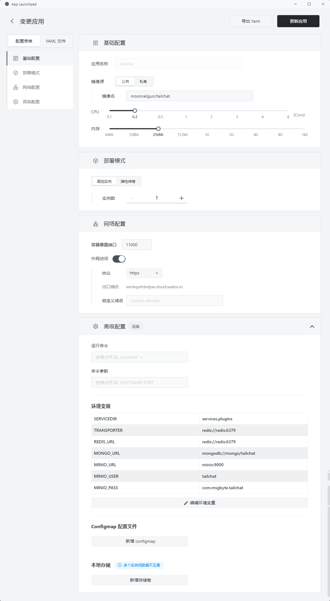

耐心等待一段时间后可以看到`Tailchat` 服务已经启动起来了

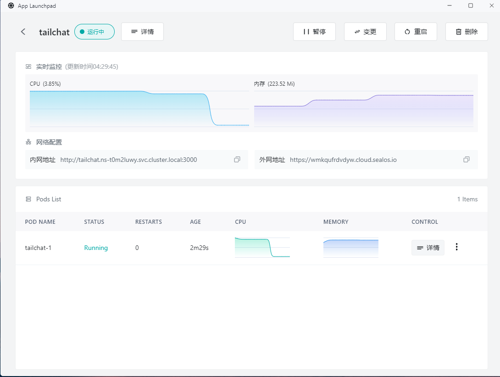

## 预览服务

首先我们可以先检查一下`Tailchat`服务的可用性，可以通过外网地址提供的服务后面加上 `/health` 来检查服务可用性, 如: `https://<xxxxxxxxxx>.cloud.sealos.io/health`

当启动完毕后，Tailchat服务会返回如下内容:

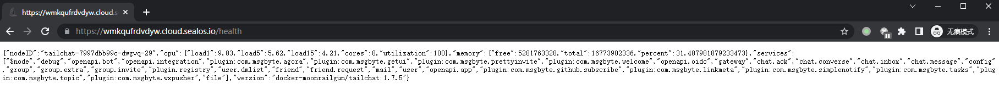

这段json字符串中包含了使用的镜像版本，节点名称，系统占用，微服务加载情况。

这里我们可以看到我的常见的服务, 如`user`/`chat.message`以及一些带有插件前缀的服务如`plugin.registry`都已经正常启动起来了，说明我们的服务端是正常运行的。

现在我们可以直接访问我们的外网地址，可以看到经过短暂的加载后，页面正常打开自动跳转到了登录界面。

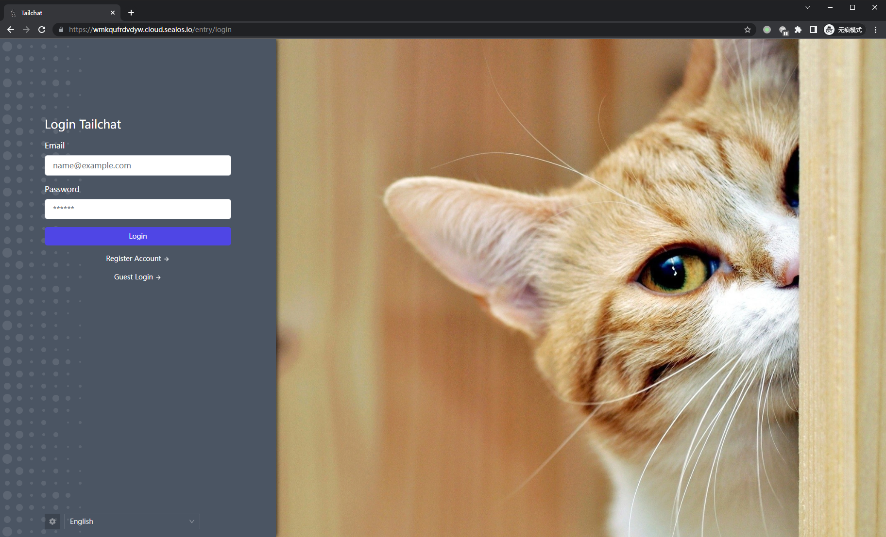

随便注册一个账号，可以看到我们可以正常进入Tailchat的主界面, 如下图:

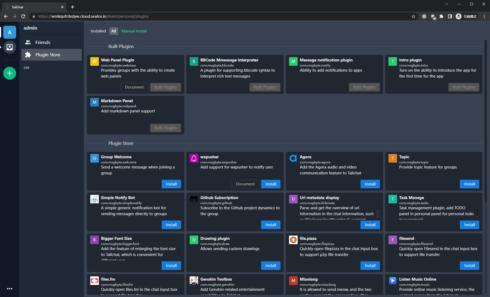

至此我们的服务已经成功在 sealos 中落地了。

## 扩容服务

当然，作为一个分布式架构的系统，`Tailchat` 天然是支持水平扩容的。而在 `sealos` 想要实现扩容也非常简单, 只需要通过变更操作修改实例数即可:

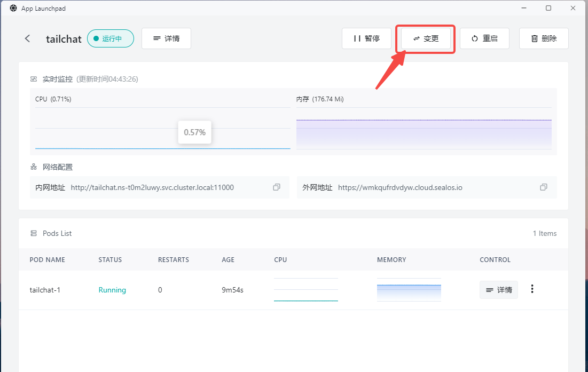

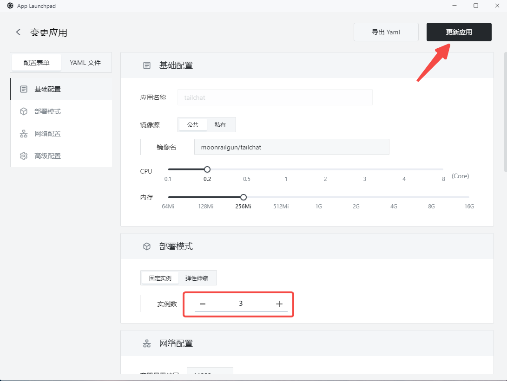

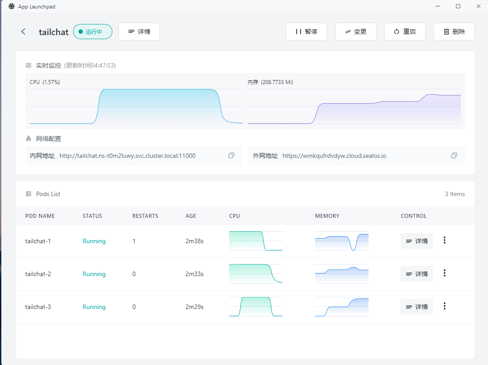

此时当我们访问 `https://<xxxxxxxxxx>.cloud.sealos.io/health` 可以看到我们可以访问到不同的节点

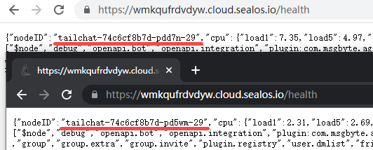

## 添加 Tailchat 入口到桌面

打开 Terminal, 输入`vim app.yml`创建并编辑一个配置文件

输入以下内容，注意url要换成自己部署的网址

```yml
apiVersion: app.sealos.io/v1
kind: App
metadata:
  name: tailchat-app-entry
spec:
  name: Tailchat
  icon:
  type: iframe
  data:
    url: <Your url>
    desc:
  icon: https://tailchat.msgbyte.com/img/logo.svg
  menuData:
  displayType: normal
```

按`esc`退出编辑模式, 按`:wq`保存并退出vim

输入`kubectl apply -f app.yml`启动配置。

完毕后刷新页面，此时我们可以看到我们的入口就出现在`sealos`的桌面上了

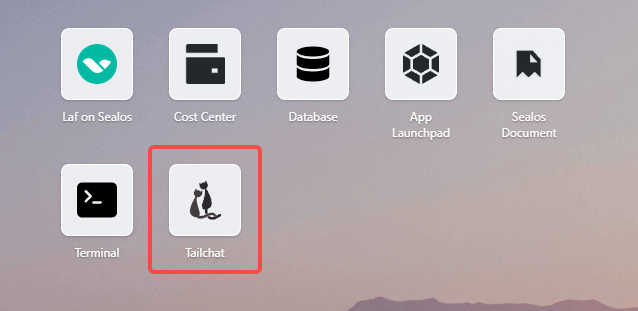
