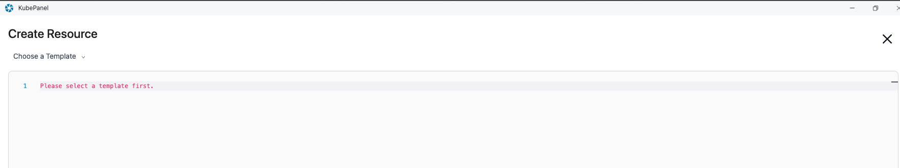

# Kubepanel

kubepanel是一款可视化的kubernetes管理面板。熟悉k8s的用户可以在其中直接查看和管理各种kubernetes资源。

## 快速开始

### 进入kubepanel

直接点击桌面上的kubepanel app就可以直接进入kubepanel页面。

可以在其中看到部署信息，资源概览，与发生事件等信息。

## 部署资源

进入kubepanel后，点击左下角加号，即可使用其部署资源。

部署资源直接使用yml文件，可以自己编写或者导入，也可以点击左上角choose a template选择您所需要的模版然后进行修改。

修改完成配置文件之后，点击右下角的create即可开始部署，等待部署完成即可。
