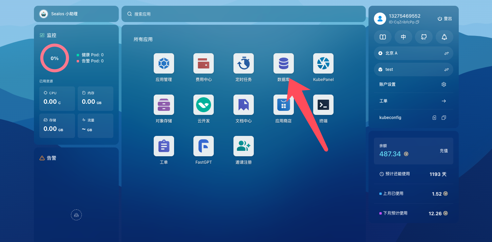
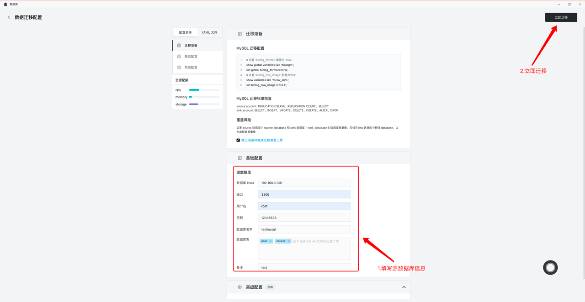
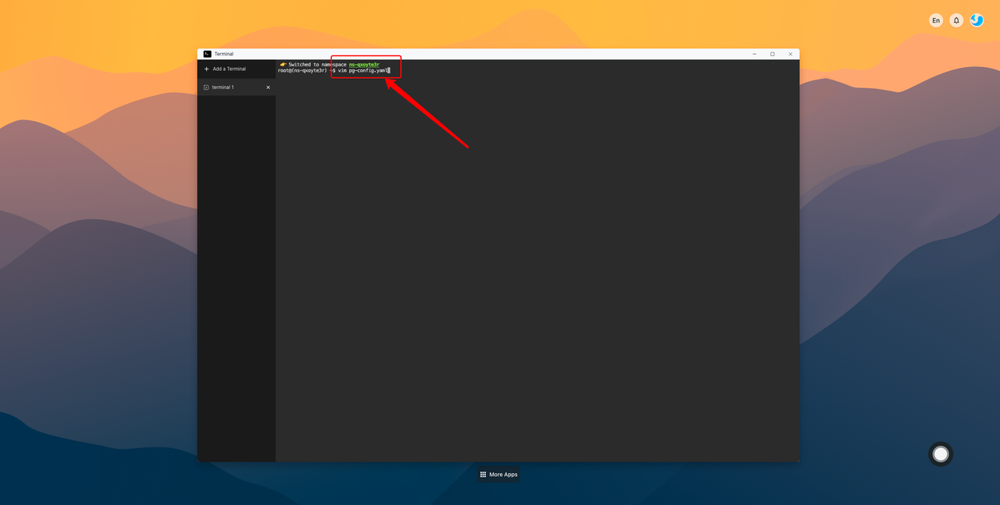

# 数据库

**数据库**是一个应用的核心组成部分，Sealos自带的数据库应用，提供了一个数据库集群部署管理工具，可以帮助你快速部署和管理数据库集群。目前支持 MySQL、PostgreSQL、MongoDB、Redis、Kafka等主流数据库。

目前数据库支持如下特性：

+ 弹性伸缩
+ 支持多版本、多类型 数据库
+ 数据库 连接：一键连接、外网访问
+ 数据库 连接：手动备份、自动备份
+ 数据库 监控：资源、状态、性能监控
+ 数据库 迁移：公网迁移、文件迁移
+ 数据库 高可用：支持多个 数据库 实例
+ 可视化 数据库 管理：新建、删除、更新 、暂停、重启 数据库


## 快速开始

以部署一个 PostgreSQL 数据库为例，体验 **数据库** 的便捷性。

在Sealos桌面进入数据库应用：



进入后点击新建数据库：


填写数据库名并选择对应的数据库和参数：


填写完参数之后，点击右上角部署即可完成数据库部署。

部署成功之后，可以数据库主页面看到自己的部署情况。


点击每个数据库的详情，可以查看具体的配置信息。


## 数据库连接

### 内网一键连接

进入对应的数据库详情页面，在页面左侧包含连接信息，点击连接，即可使用系统自带的终端应用现场连接数据库。


连接成功后，在终端操作数据库：


### 外网访问

外网访问默认是关闭的，需要手动开启。

进入数据库详情页 ，点击链接信息右侧的外网访问按钮。


外网访问需要额外的网络计费，确认开启之后即可开启。


开启之后，数据库的连接信息会哦出现外网地址一栏，通过这些信息即可使用数据库连接工具进行连接。


## 数据库备份

数据库提供有手动备份和自动备份两种备份方式，可以根据需要自由选择。

### 手动备份
在数据库详情页面，点击进入备份列表，右上角备份按钮。


填写备份信息，开始备份：


查看备份状态：


### 自动备份
在数据库详情页面，点击进入备份列表，右上角备份按钮。


开启自动备份，填写备份信息：


## 数据库迁移

以 MySQL 数据库为例，介绍数据库迁移的过程。

### 公网迁移

公网迁移涉及两个数据库：源数据库、目标数据库。源数据库是迁移的数据来源，目标数据库是迁移的数据目的地。

以下介绍中以本地数据库做为源数据库进行演示。

进入目标数据库，使用终端连接：


在终端界面中创建对应的database（如果已经存在对应的database，则跳过这一步）


```bash
# 创建数据库sql语句，示例：
create database testmysql;
```

进入目标数据库公网迁移界面，点击迁移按钮：


查看迁移配置信息，并勾选我已知晓。


复制迁移配置信息，如下：
```bash
# 设置配置信息sql语句，示例：
$ set global binlog_format=ROW;
$ set binlog_row_image ='FULL';
```

5. 在源数据库中执行设置配置信息（MySQL、Postgres需要手动配置信息，Mongo不需要进行配置）：
```bash
# 设置配置信息sql语句，示例：
$ set global binlog_format=ROW;
$ set binlog_row_image ='FULL';
```


进入目标数据库，填写源数据库的迁移信息，要迁移哪些表，并填写要迁移到目标数据库中哪个database：



如果需要持续从源数据库迁移数据，可开启高级配置中的持续迁移，如下：


查看迁移任务信息：


进入目标数据库，连接目标数据库，检查迁移数据是否完整：


### 文件迁移

进入目标数据库，使用终端连接。


在终端界面中创建对应的database（如果已经存在对应的database，则跳过这一步）

```bash
# 创建数据库sql语句，示例：
$ create database testmysql;
```


点击数据库中的文件导入，进入文件导入页面，开始迁移：


文件迁移中，等待迁移结果


连接数据库，检查迁移数据是否完整


## 更新数据库配置

由于数据库的某些参数在修改后无法立即生效，因此需要通过应用yaml来实现修改参数并重启数据库通过yaml修改参数会导致数据库**重启**，整个过程大概会持续**20s**左右。这里以**Postgres**数据库的参数修改为例，具体操作步骤如下。

首先进入桌面上的终端应用。


进入之后，使用vim编辑pg-config.yaml

```bash
vim pg-config.yaml
```



复制下方的yaml到pg-config.yaml中，并保存。


```yaml
apiVersion: apps.kubeblocks.io/v1alpha1
kind: OpsRequest
metadata:
  name: test
spec:
  clusterRef: test-pg  #修改为自己的数据库名
  reconfigure:
    componentName: postgresql
    configurations: #以下配置仅供参考，只需保留要修改的部分即可，并修改对应的参数的值
      - keys:
          - key: postgresql.conf
            parameters:
              - key: max_connections #设置可以同时与数据库建立的最大连接数
                value: "1000"
        name: postgresql-configuration
  ttlSecondsAfterSucceed: 0
  type: Reconfiguring
```

**常见的postgres参数**：

| 参数名               | 描述                                        |
| -------------------- | ------------------------------------------- |
| max_connections      | 设置可以同时与数据库建立<br/>的最大连接数   |
| max_wal_size         | 设置WAL文件的最大大小                       |
| min_wal_size         | 设置WAL文件的最小大小                       |
| max_worker_processes | 设置PostgreSQL可以启动<br/>的最大后台进程数 |
| shared_buffers       | 设置PostgreSQL可以启动<br/>的最大后台进程数 |

**常见的mysql参数**：

| 参数名                  | 描述                   |
| ----------------------- | ---------------------- |
| innodb_buffer_pool_size | 设置InnoDB缓冲池的大小 |
| max_connections         | 允许的最大并发连接数   |
| query_cache_size        | 查询缓存的大小         |
| thread_cache_size       | 线程缓存的大小         |
| max_allowed_packet      | 最大数据包大小         |
| innodb_log_file_size    | InnoDB日志文件的大小   |

**常见的mongo参数**：

| 参数名                  | 描述             |
| ----------------------- | ---------------- |
| storage.dbPath          | 数据文件存放路径 |
| storage.journal.enabled | 启用日志         |
| net.port                | 服务器端口       |
| net.bindIp              | 绑定的IP地址     |

**常见的redis参数**：

| 参数名           | 描述             |
| ---------------- | ---------------- |
| maxclients       | 最大客户端连接数 |
| maxmemory        | 最大内存使用量   |
| maxmemory-policy | 内存淘汰策略     |
| appendonly       | AOF持久化开关    |
| appendfsync      | AOF文件刷新频率  |

使用如下命令应用pg-config.yaml

```bash
kubectl apply -f pg-config.yaml
```


应用命令之后，可以使用如下命令检查pg-config.yaml是否应用成功

```bash
# OpsRequest中对应的状态为Succeed且pod对应的状态为Running则说明配置应用成功
kubectl get OpsRequest
kubectl get pod
```


进入数据库查看配置是否生效：

```bash
show max_connections;
```


