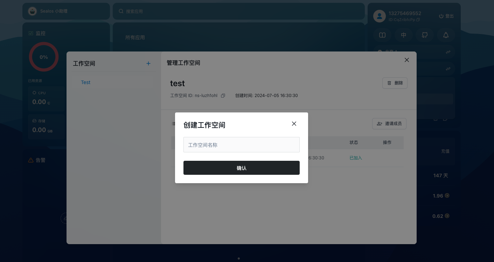
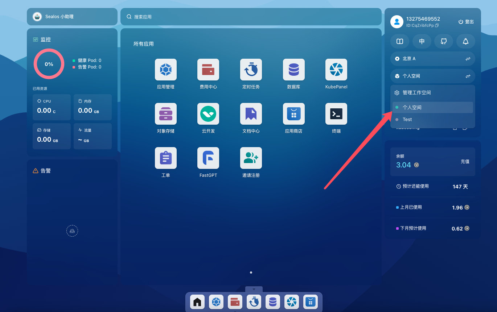
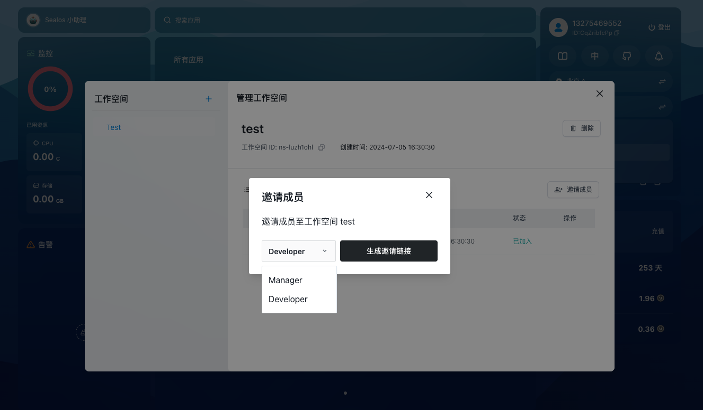
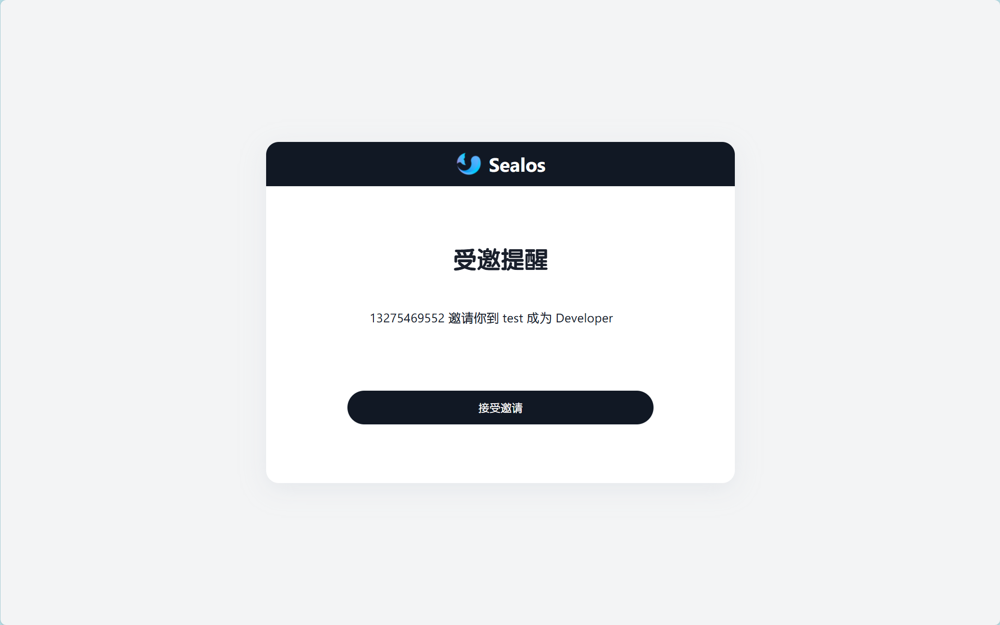

# 工作空间

工作空间是一种多租户的资源隔离机制，可以将一个kubernetes集群划分为多个工作空间，每个工作空间都有自己的资源配额和权限，您可以使用工作空间实现团队协作与资源分配的功能。

个人空间（personal workspace）是工作空间的一种特殊形式，每个用户都有一个个人空间，个人空间的名称与用户的用户名相同，个人空间的资源配额和权限与普通工作空间相同，但是个人空间无法删除，也无法将其他用户加入到个人空间中。

## 快速开始

### 创建工作空间

在sealos主界面右上方，可用区下方有工作空间选项，点击可以管理和切换工作空间。

点击进入管理工作空间之后，点击左上方加号即可创建新的工作空间。

### 切换工作空间

在主界面点击工作空间名称即可切换工作空间。

### 邀请用户加入工作空间

通过用户id邀请用户加入工作空间，被邀请的用户可以选择接受或拒绝邀请，如果接受邀请，被邀请的用户将成为工作空间的成员，拥有工作空间中的资源权限。

在管理用户空间中，选择特定的工作空间，点击右上方邀请就可以邀请别人加入你的用户空间了。在邀请时，可以选择邀请的身份为开发者/管理者。

邀请后，会生成邀请链接到粘贴板，发送链接给想要邀请的用户即可。

### 接受邀请

当用户点击邀请链接后，会出现一个页面邀请用户加入，点击接受邀请即可加入该工作空间。

加入工作空间后，即可进入到主界面切换到加入的工作空间中。

## 权限说明

工作空间中的用户可以拥有不同的角色，不同的角色拥有不同的权限，目前 Sealos 云操作系统中的角色有以下几种：
所有者（owner）、管理员（manager）、开发者（developer）。

+ 所有者（owner）：拥有工作空间的所有权限，包括删除工作空间、查看/创建/修改工作空间中的所有资源、邀请用户以管理员/开发者身份加入工作空间等。
+ 管理员（manager）：拥有工作空间的管理权限，包括查看/创建/修改工作空间中的所有资源、邀请用户以开发者身份加入工作空间等。
+ 开发者（developer）：拥有工作空间的开发权限，包括查看工作空间中的资源状态。