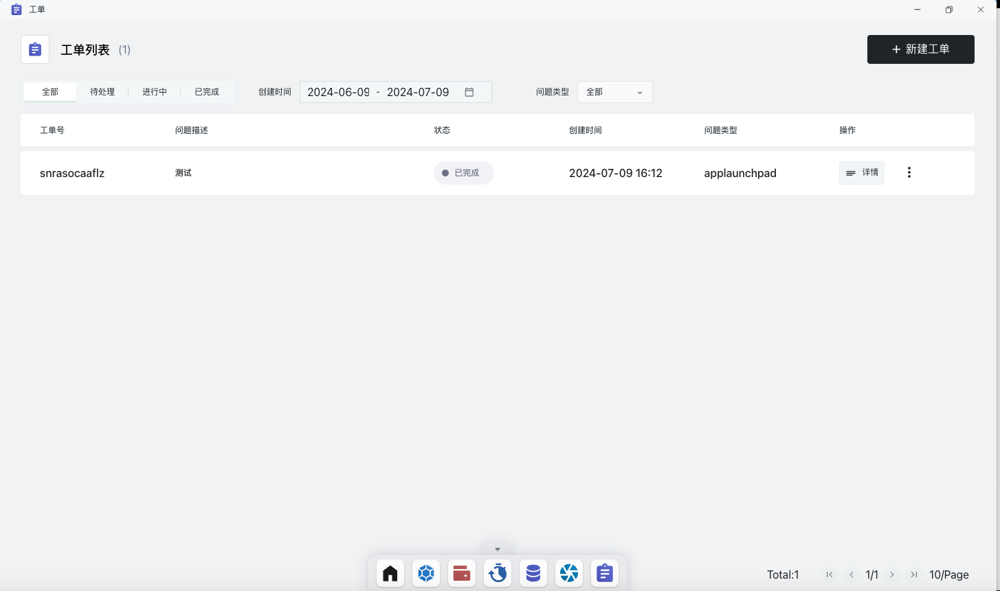

# 工单

当您在使用Sealos的过程中，遇到任何问题，都可以使用工单提出您的疑问和反馈，我们会在第一时间为您处理。

## 快速开始

工单位于主界面，工作空间部分的下方，点击即可进入工单系统。

主页面可以查看工单的列表，当前状态等信息。

点击详情可以看到工单的详细情况。

点击右上角-新建工单，即可进入新建工单页面，选择工单的类型，详细描述与添加附件（不必须）之后就可以创建工单了。

