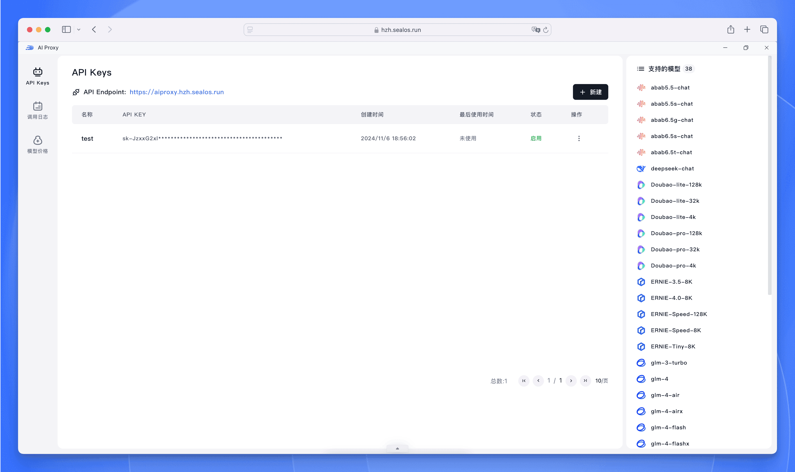
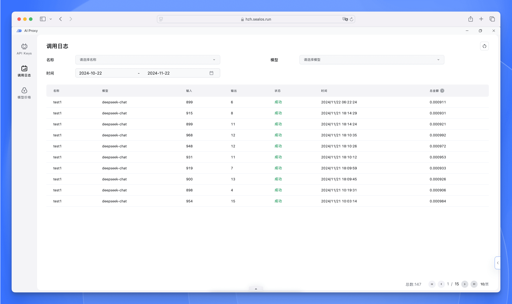

# AI Proxy 使用指南

## 简介

AI Proxy 是 [Sealos 平台](/docs/5.0/introduction/what-is-sealos.md)提供的一站式 AI 模型调用解决方案，让开发者能够在统一的平台中轻松调用和管理各类 AI 模型。无论是通义千问、文心一言还是其他 AI 模型，都可以通过统一的接口进行调用。

### 为什么选择 AI Proxy？

- 🔑 **一键获取多平台密钥** - 无需分别注册各个 AI 平台
- 💰 **统一计费更省心** - 告别多平台充值的烦恼
- 📊 **集中管理更高效** - 一站式监控所有调用情况

## 功能特点

### 统一的 API 访问

- 提供标准化的 API 接口，支持多家主流 AI 模型厂商
- 兼容 OpenAI API 格式，便于快速迁移和集成
- 持续扩充支持的模型类型

### 简化的密钥管理



- 一键获取多平台 API Key
- 无需分别注册各个 AI 平台
- 统一的密钥管理界面

### 集中化计费与监控



- 使用 Sealos 平台统一结算
- 透明的按量计费模式
- 详细的费用明细和账单查询
- 详细的调用日志记录

## 快速开始

### 1. 获取 API Key

1. 访问 [Sealos Cloud](https://hzh.sealos.run)
2. 打开 AI Proxy 应用
3. 点击【新建】按钮创建新的 API Key
4. 复制生成的 API Endpoint 和 API Key

### 2. API 调用示例

#### 使用 JavaScript 调用

```javascript
async function main() {
  const apiKey = 'your-api-key'
  const apiUrl = 'https://aiproxy.hzh.sealos.run/v1/chat/completions'
  
  const response = await fetch(apiUrl, {
      method: 'POST',
      headers: {
          'Content-Type': 'application/json',
          'Authorization': `Bearer ${apiKey}`
      },
      body: JSON.stringify({
          model: 'Doubao-lite-4k',
          messages: [
              { role: 'system', content: 'You are a helpful assistant.' },
              { role: 'user', content: '你好，请介绍一下你自己。' }
          ],
          max_tokens: 2048,
          temperature: 0.7,
      }),
  })
  
  const data = await response.json()
  console.log(data.choices[0].message.content)
}
```

### 3. 请求参数说明

| 参数 | 类型 | 说明 | 示例值 |
|------|------|------|--------|
| model | string | 要使用的模型名称 | 'Doubao-lite-4k' |
| messages | array | 对话消息列表 | [{"role": "user"}] |
| max_tokens | number | 最大生成的 token 数量 | 2048 |
| temperature | number | 生成文本的随机性，范围 0-1 | 0.7 |

## 费用管理

### 查看费用明细

1. 在 AI Proxy 界面中点击【费用明细】
2. 可查看各模型的调用次数和费用统计
3. 支持按时间范围筛选费用记录

### 余额充值
1. 进入 Sealos 费用中心
2. 选择充值金额
3. 完成支付后即可使用充值金额调用模型

## 调用日志

### 日志查看

- 支持查看详细的 API 调用记录
- 包含调用时间、模型名称、输入输出 token 数量等信息

### 日志筛选

- 按时间范围筛选
- 按模型类型筛选
- 按 Token 筛选

## 最佳实践

### 开发建议

1. 合理设置 `max_tokens` 参数，避免生成过长的无效内容
2. 根据场景调整 `temperature` 参数，对话场景建议使用较高的值
3. 在生产环境中做好异常处理和重试机制

### 成本优化

1. 选择适合业务场景的模型
2. 合理设置上下文长度，避免无效的 token 消耗

## 常见问题

### API 调用失败

- 检查 API Key 是否正确
- 确认账户余额是否充足
- 查看具体的错误信息进行排查

### 费用相关

- 费用按实际调用量计费
- 不同模型的计费标准不同
- 支持查看详细的计费规则
