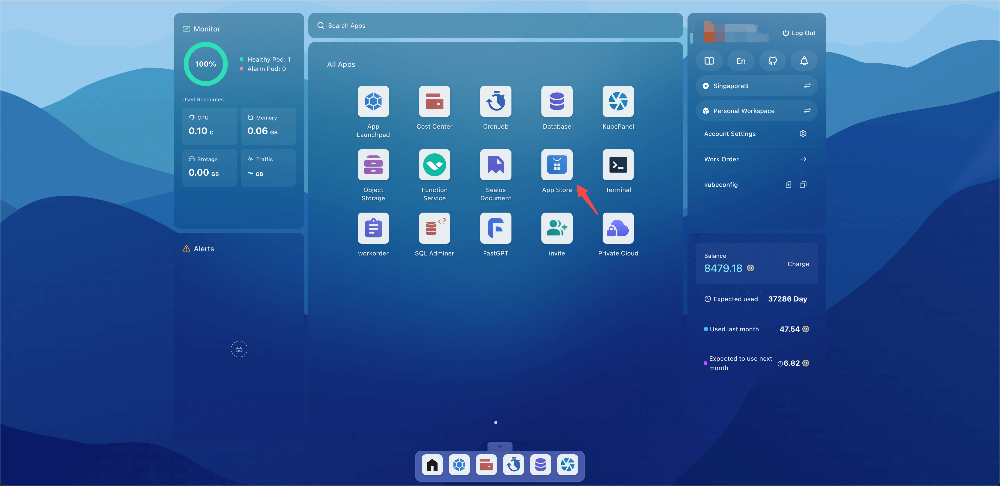
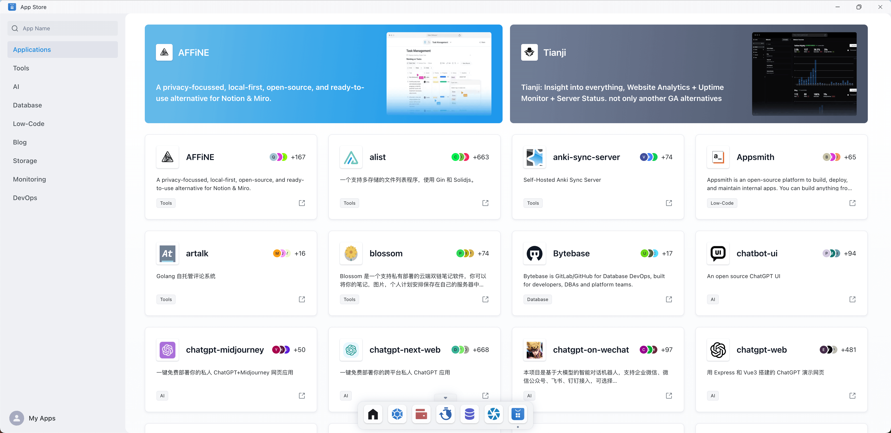
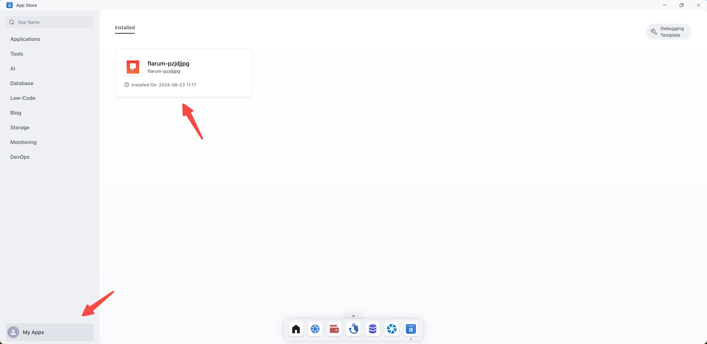
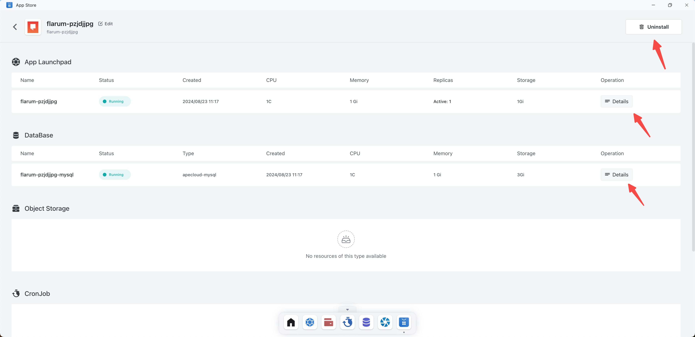

# App Store

The App Store provides a series of pre-made application templates to support the rapid creation and deployment of
various websites and applications. These templates include Blog applications,
AI Applications, low-code applications, storage applications, instant messaging applications, middleware, etc. are
designed to simplify the development process so that developers do not need to build projects from scratch or deal with
dependencies between applications.

## Quick Start

Open the Sealos desktop and click App Store.

There are many applications displayed in the app store, and the search box is supported to quickly find applications.

### View/uninstall apps

Shows all apps deployed from the app store.

Click on the corresponding application to see the detailed information of the application. It also supports uninstalling
the application. (Note: Apps deployed from the app store need to uninstall the app from the app store to completely
uninstall the app)

