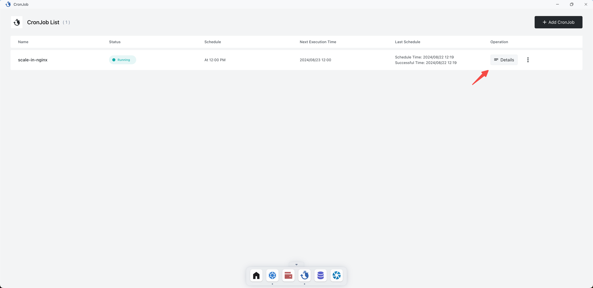
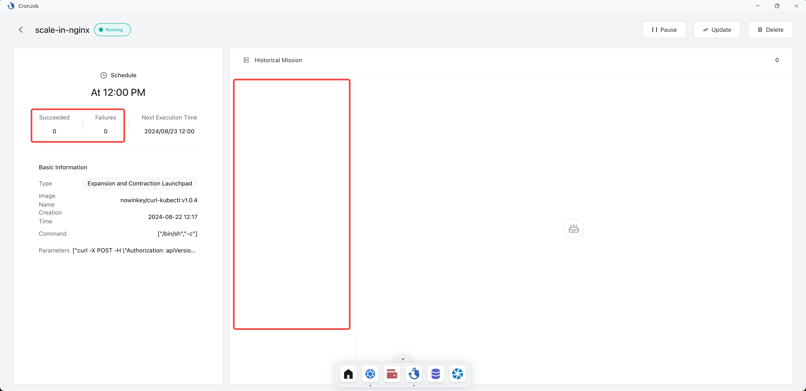

# CronJob

CronJobs are used to execute tasks periodically according to a specified timetable.

## Quick Start

Open the Sealos desktop and click on CronJob.

Click Add CronJob.

Here, a CronJob is set up to set the number of instances of the nginx deployment to 0 every day at 12 PM.

Enter a custom Job name, set the time using a Cron expression, choose the Expansion and Contraction Launchpad type,
select nginx (the running nginx deployment) for the App name, set the replicas count to 0, and click Deploy.

After successfully adding the CronJob, you can click Details to view the execution status of the job.

The details page shows the number of successful and failed jobs, as well as the execution history of the jobs.

