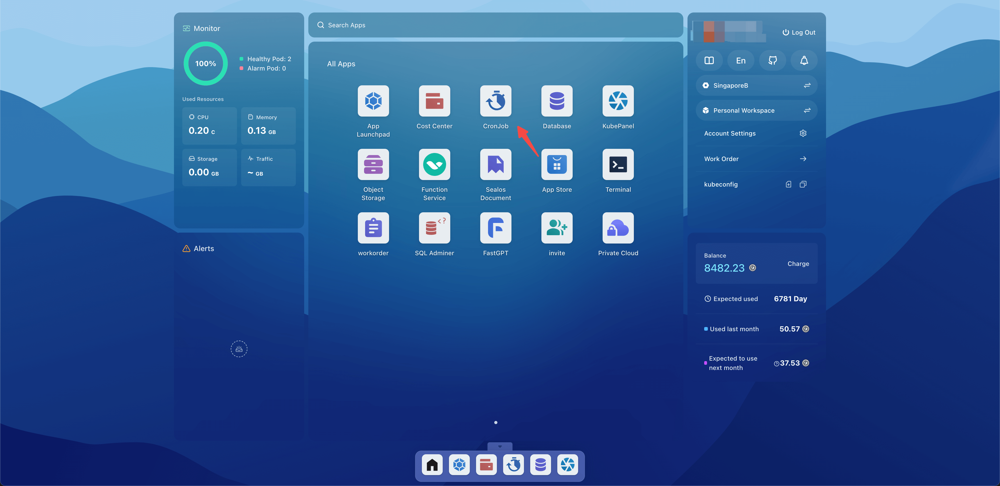
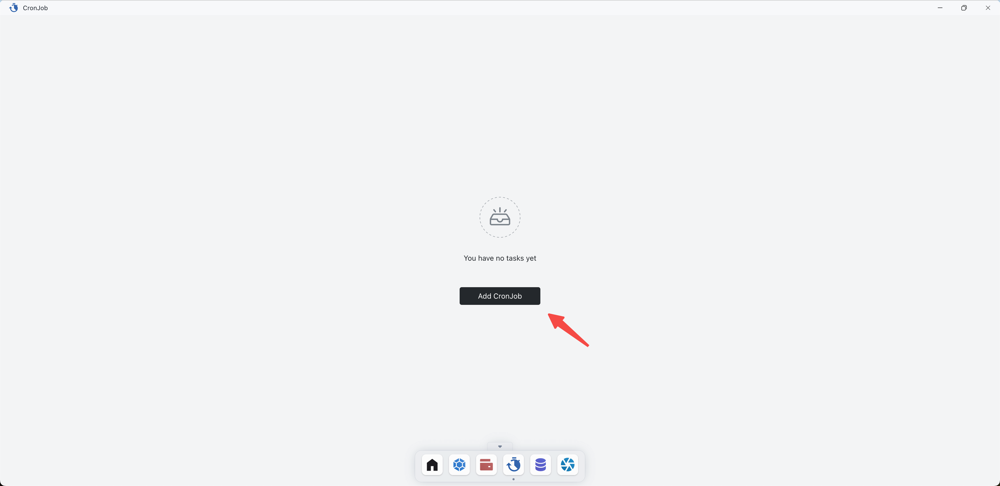

# 定时任务

定时任务顾名思义，可以定时的帮助您完成一些工作。Sealos 提供了的定时任务 app 可以让您快速的完成任务的配置，并查看具体任务的执行情况。

## 快速开始

### 创建定时任务

进入 Sealos 桌面，点击定时任务，进入到定时任务的创建页面。

#### cron表达式

配置中的 cron 表达式是一种配置定时任务的特殊语法，如果不熟悉该语法的具体规则可以点击更多示例查看文档。

#### 类型

当前 Sealos 的定时任务支持三种类型：

- 访问 URL：访问某个特定的URL
- 扩缩容 Launchpad：对某个应用做扩缩容操作
- 执行命令：使用某个应用程序执行某个命令，可以看做使用GUI直接配置 Kubernetes中的 cronjob

配置好各项参数之后，点击右上角部署即可完成定时任务的部署。

## 查看任务详情

部署任务之后，点击定时任务app会出现任务列表：

点击详情，可以查看任务具体的执行情况与日志。

