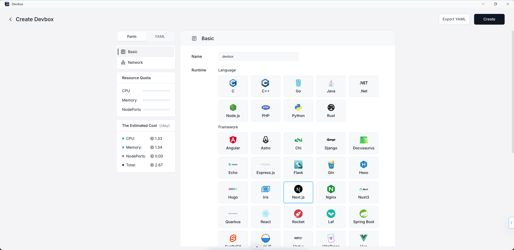

# Devbox

## Overview

> A platform for instant collaborative development, seamless deployment, and strict environment isolation. Streamline your workflow with our all-in-one solution.

Sealos Devbox is an all-in-one platform designed for integrated online development, testing, and production. It offers a seamless solution for creating environments and database dependencies with just a single click. This innovative platform allows developers to work locally using their preferred IDEs while streamlining setup processes and enabling automatic application deployment.

### Key Features and Advantages

#### Instant collaborative environments

Sealos Devbox provides quick and easy setup of development environments for a wide range of programming languages and frameworks, including less common ones. This feature enables teams to start collaborating instantly, regardless of the technology stack they're using.

#### Cloud development environment

One of the primary advantages of Sealos Devbox is its ability to eliminate environment inconsistencies. By offering a unified cloud platform, it allows teams to share code, configurations, and test data effortlessly. This streamlined approach accelerates development processes, enhances efficiency, and promotes seamless collaboration within a single, harmonious environment.

#### Headless development experience

Sealos Devbox simplifies the development process by unifying development, testing, and production environments. It automates environment creation and integrates smoothly with local IDEs, providing a hassle-free setup experience for developers.

#### Effortless continuous delivery

With Sealos Devbox, teams can deliver applications smoothly without requiring expertise in Docker or Kubernetes. Developers simply need to specify the version, and Devbox handles all the complex tasks, including building containers.

#### Strict environment isolation

Sealos Devbox offers isolated development environments, helping teams avoid dependency conflicts. Each project can have its own consistent and reproducible workspace, allowing developers to focus on relevant tasks without worrying about environmental inconsistencies.

#### Access from any network

Sealos Devbox provides access to applications from both internal networks and the Internet, with automatic TLS configuration. This feature ensures secure and flexible development capabilities, allowing teams to work from any network, anywhere in the world.