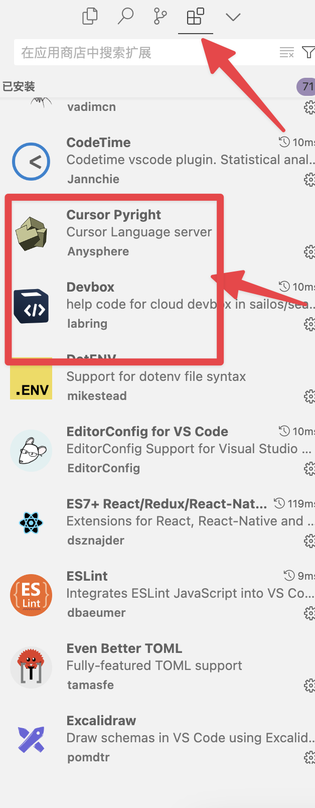

# Devbox

## Supportive Environment

System: Windows, MacOS (there is no difference in operation between the two), Editor: VSCode, Cursor, VSCode Insider.

## Some concepts

Devbox: It is a cloud sandbox, which refers to a remote editor environment + a remote running environment as a whole.

## 1. Create your first Devbox

Log in to [Usw Sailos](usw.sailos.io) or [Hzh Sealos](hzh.sealos.run) and click Devbox.


Create a new project.


Fill in your Devbox configuration.

- Enter the project name;

- Select the operating environment and version you want;

- Select the CPU and memory;

- Configure the network configuration (optional).

   - **When to use: When you want to access the service running in your Devbox through the domain name**, for example:

   - You run `npm run dev` in the nextjs runtime environment, and your service is likely to run on port 3000 (you should
     know which ports your service runs on).

   - Case 1: You know what is in a in advance, so you fill in the container exposure port 3000 when **creating**, **and
     open public network access** (you don’t need to do the custom domain name later, at this time
     sealos assigns you a fixed random address for this port).

   - Case 2: After running the service, you think of opening this port. At this time, open the port in **change** (I
     will talk about how to enter the change below).

   - At this time, after you open the public network access of the port, you have a corresponding relationship between a
     domain name and your port. At this time, you visit `qnedemdulyat.usw.sailos.io`
     (assuming it is this), and you can see your page on the web page.

The following is the picture I chose:


Click Create in the upper right corner.

## 2. Enter your remote environment

Enter your editor environment on the list page: You can choose any of vscode, cursor, vscode Insider. Here I choose
Cursor (the very useful AI version of VSCode).


Clicking the button will jump to the Cursor.


If you don't have the Devbox plugin installed, it will automatically install the plugin for you and open the remote
environment.


Successfully enter the remote environment.


## 3. Encode and view the results

Coding: I won’t change the code here.

Run the development environment: Open the terminal and run `npm run dev`.


At this time, there are two ways to view your development environment results.

Local port forwarding: The pop-up window in the lower left corner is the local port forwarding that comes with vscode (
Cursor also has it). You can directly click to open it in the browser or set up port forwarding yourself (there is a
port in the lower right corner of the above picture, just to the right of the terminal). Local forwarding means
forwarding the port of the remote environment to the same port of your localhost.


Sealos public network port forwarding: Remember the port settings I asked you to add when you created it? (Don’t worry
if you didn’t create it, I will talk about changing the configuration right away). Now we re-enter the Devbox in the
Sealos desktop and click to enter the details page.


Click the external network address (this address corresponds to the port 3000 we just created. You can see the port of
the internal network address on the left, and you can see that this line is the port 3000 we created).


Mission accomplished!


## About Update

There are two ways to enter Update:

The item list has an Update button.。


The details page also has an Update button.


Update is the same as create, but only limited items can be changed: CPU, memory, and network configuration (most
important).

We can add new ports here to adapt to our development environment.


## 4. Release the version and go online

### Things you need to know before going live

Each remote project has a special file `entrypoint.sh`. Its function is to help you automatically execute some
instructions when going online, generally running commands for building packages.

**Interpret the current document:**

- `cd /home/sealos/project` (required): Enter your project directory (**We stipulate that your project is in a directory
  in the container, do not change**).
- `pnpm run start` (required): Run your production version (**This involves a problem, you need to package your
  application in advance when you want to release it online**).


### Release Process

Package the project in the development environment in advance (see **Things you need to know before going online**) and
make sure the `entrypoint.sh` file meets the requirements for running the production version service.


Go to the details page and click Release.


After filling in the form, click Publish (note that the machine will be temporarily shut down after publishing, which
will cause the vscode connection to be disconnected and reconnected. At this time, you only need to wait until the
publishing is completed and then reopen the vscode window).


Wait for a short while. (Publishing time is slightly longer)


Click Go Online.


When you go online, you will be redirected to the application deployment page of application management, and most
parameters will be automatically passed from the Devbox to here.

I just changed the application name and clicked on it. You can adjust other things. Here are two small points: From the
advanced configuration, you can see the function of your `entrypoint.sh` file, which is actually the command used to
start the image container. Note that the name should not be the same as the devbox name, otherwise there will be a
conflict.


After successfully going online, jump to the application management details page and click the public network address to
see the page.


## 5. Other tips and points to note

- Connect to the remote environment directly via ssh: The cloud sandbox details page provides downloads for the SSH
  connection string and private key. After downloading the private key, replace the address of the private key file with
  yourPrivateKeyPath after the connection string -i.

- Deleting Devbox after publishing will not delete the version you have already published. So when you create a new
  Devbox with the same name later, you can still see the original version history.

- It is not currently supported to create and open a Devbox from scratch on the plugin side (we will complete this part
  in the second issue). You must enter the editor IDE on the web side to enter the remote environment.

- 

- The more button in the Devbox list has some convenient ways to do things, such as: release, terminal (just like the
  terminal of other sealos applications, enter a web page terminal) and common control items (restart, shut down, start
  up, delete).


## FAQ

### 1. Cursor connection problem but VSCode can connect

Cursor Since the plugin version synchronization with VSCode is slow, outdated versions may cause connection problems.

Solution: Manually install the Devbox plugin.

1. Download the vsix file of the [Devbox](https://marketplace.visualstudio.com/items?itemName=labring.devbox-aio) plugin
   from the VSCode plugin market.


2. Open the Cursor's extension window.

3. Drag the downloaded file into the extension window.



### 2. Cursor and VSCode cannot connect

First, understand the principle of the Devbox plugin: add remote environment information by modifying the ssh config
file, and connect to the remote environment through the Remote-SSH plugin. The plugin first writes the following line of
code in `~/.ssh/config` (some older versions may write other similar content):

```bash
Include ~/.ssh/sealos/devbox_config
```

This line of code imports the contents of the file `~/.ssh/sealos/devbox_config` into the current file. And
`devbox_config` contains normal SSH configuration content, for example:

```config
Host usw.sailos.io_ns-rqtny6y6_devbox1234
  HostName usw.sailos.io
  User devbox
  Port 40911
  IdentityFile ~/.ssh/sealos/usw.sailos.io_ns-rqtny6y6_devbox1234
  IdentitiesOnly yes
  StrictHostKeyChecking no
```

So if there is a problem, it is most likely a plugin bug that causes errors in reading and writing files. You can
feedback this to us or try to adjust the SSH file yourself.

### 3. Always stuck in downloading vscode-server or keep retrying

Cause: Due to some operation (such as restarting Devbox during this process), the download cursor is suspended, and
re-downloading causes conflicts.

Solution:

1. Enter the web terminal and delete the `.cursor-server` folder.
   1. Click "Terminal" in the operation button on the right side of the Devbox webpage list item.
   2. Enter the terminal and go to the user directory first, `cd ..`, then use `ls -a ` to view all files and you can
      see `.cursor-server`.
   3. Remove `rm -rf .cursor-server`.
   4. Just retry the connection.
2. If there is no content in the newly created Devbox, you can directly delete it and rebuild it.

### 4. Report the following error

```bash
upstream connect error or disconnect/reset before headers. retried and the latest reset reason: remote connection failure, transport failure reason: delayed connect error: 111
```

First of all, you should understand that your current environment is a development environment. The URL you are
connecting to is a test URL, which is only used in the development environment. This URL corresponds to the port of the
development environment. In other words, you must run the development environment, such as `npm run dev` to run your
program first, before you can see the content through the URL, otherwise this error will be reported.